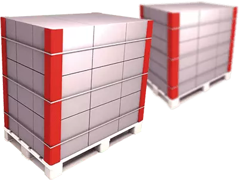
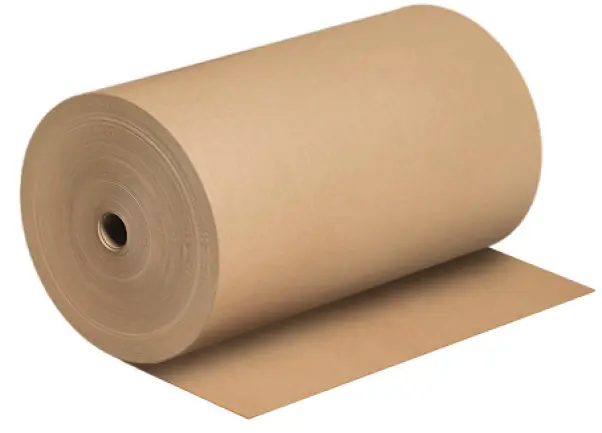

This file is a merged representation of the entire codebase, combined into a single document by Repomix.

# File Summary

## Purpose
This file contains a packed representation of the entire repository's contents.
It is designed to be easily consumable by AI systems for analysis, code review,
or other automated processes.

## File Format
The content is organized as follows:
1. This summary section
2. Repository information
3. Directory structure
4. Repository files (if enabled)
5. Multiple file entries, each consisting of:
  a. A header with the file path (## File: path/to/file)
  b. The full contents of the file in a code block

## Usage Guidelines
- This file should be treated as read-only. Any changes should be made to the
  original repository files, not this packed version.
- When processing this file, use the file path to distinguish
  between different files in the repository.
- Be aware that this file may contain sensitive information. Handle it with
  the same level of security as you would the original repository.

## Notes
- Some files may have been excluded based on .gitignore rules and Repomix's configuration
- Binary files are not included in this packed representation. Please refer to the Repository Structure section for a complete list of file paths, including binary files
- Files matching patterns in .gitignore are excluded
- Files matching default ignore patterns are excluded
- Files are sorted by Git change count (files with more changes are at the bottom)

# Directory Structure
````
css/
  animations.css
  base.css
  buttons.css
  cards.css
  dev-mode.css
  floating.css
  footer.css
  forms.css
  header.css
  hero.css
  layout.css
  responsive.css
  style.css
  tables.css
  variables.css
docs/
  00_Проект.md
  01_Архитектура.md
  02_Дизайн-система.md
  03_Компоненты.md
  04_SEO.md
  05_Контент.md
  06_Разработка.md
  07_Changelog.md
  08_Изображения.md
  08_Темы.md
  README.md
images/
  documents/
    card-company.pdf
    price_list_papir_market.pdf
  glavnaya/
    hero-bg.webp
    kart-optimized.webp
    KARTON.webp
    kraft.webp
  obshie/
    001.png
    002.jpg
    003.webp
    004.webp
    ero-bg.webp
  produkciya/
    karton/
      KARTON.webp
    kraft-bumaga/
      kraft.webp
    ugolki/
      100х100х3-2-optimized.webp
      100х100х4-2-optimized.webp
      100х100х5-2-optimized.webp
      100х100х6-optimized.webp
      35x35x3.webp
      35x35x4.webp
      35x35x5.webp
      40х40х3-optimized.webp
      40х40х4-optimized.webp
      40х40х5-optimized.webp
      50х50х3-2-optimized.webp
      50х50х4-2-optimized.webp
      50х50х5-2-optimized.webp
      60x60x3.webp
      60x60x4.webp
      60x60x5.webp
      70x70x3.webp
      70x70x4.webp
      70x70x5.webp
      80x80x3.webp
      80x80x4.webp
      80x80x5.webp
      90x90x3.webp
      90x90x4.webp
      90x90x5.webp
js/
  animations.js
  calculator.js
  catalog.js
  dev-mode.js
  forms.js
  main.js
  menu.js
  price.js
  product.js
.htaccess.txt
404.html
agreement.html
calculator.html
catalog.html
contacts.html
data.js
delivery.html
docs.html
find-us.html
index.html
policy.html
price.html
product.html
ROADMAP.md
robots.txt
sitemap.html
sitemap.xml
````

# Files

## File: docs/00_Проект.md
````markdown
# Проект «ПАПИР-МАРКЕТ»

## Цель сайта
Продажа защитных картонных уголков, картона и крафт-бумаги напрямую от производителя. Привлечение оптовых клиентов из ЮФО и других регионов России.

## Заказчик
ООО «ПАПИР-МАРКЕТ» (ИНН 2372025383, ОГРН 1192375033674).

## Целевая аудитория
- Промышленные предприятия.
- Сельскохозяйственные производители.
- Мебельные фабрики.
- Строительные компании.
- Производители упаковки.

## Что продаём
- Защитные картонные уголки (размеры от 35×35×3 до 100×100×6 мм).
- Бумага для гофрирования (флютинг), плотность 70–140 г/м².
- Картон товарный в рулонах, плотность 80–150 г/м².

## Основные преимущества
- Собственное производство (с 2019 года).
- Изготовление под заказ по размерам клиента.
- Доставка по всей России.
- Гибкие объёмы — от 100 п.м.

## Техническая информация
- Домен: papir-market.ru.
- Хостинг: определяется.
- Язык: русский.
- Кодировка: UTF-8.

## Контакты для связи
- Телефон: +7 918 326-88-72.
- Email: papir-market.sale@mail.ru.
- WhatsApp: 79183268872.
- Telegram: @in4707.
- Адрес: 352244, Краснодарский край, г. Новокубанск, ул. Новаторов, д. 1/10.
- Режим работы: Пн–Пт 9:00 – 18:00.
````

## File: docs/01_Архитектура.md
````markdown
```markdown
# Архитектура сайта «ПАПИР-МАРКЕТ»

## Дерево страниц
```
index.html              — Главная
catalog.html            — Каталог продукции
product.html            — Карточка товара (динамическая)
price.html              — Прайс-лист
calculator.html         — Калькулятор стоимости
contacts.html           — Контакты
delivery.html           — Доставка
find-us.html            — Как нас найти
docs.html               — Документы и реквизиты
policy.html             — Политика конфиденциальности
agreement.html          — Пользовательское соглашение
sitemap.html            — Карта сайта
```

## Структура каталогов
```
/css        — Стили
/js         — Скрипты
/images     — Изображения
/docs       — Документация проекта
/data       — Данные (data.js лежит в корне)
```

## Источник данных
- `data.js` — единый источник данных о компании и товарах.
- Все страницы получают данные через глобальный объект `data`.
- Изменение `data.js` автоматически обновляет каталог, прайс-лист, калькулятор и карточки товаров.

### Структура объекта data
```
data.company        — реквизиты, контакты, адрес, банк
data.products.corner — массив защитных уголков
data.products.fluting — массив «Бумага для гофрирования»
data.products.karton  — массив «Картон товарный в рулонах»
```

### Поля товара (уголки)
```
id, article, title, width, thickness, image,
priceTo100, priceTo500, priceTo1000, priceTo3000, priceOver3000, priceMin,
description, application
```

## Подключение стилей и скриптов
- Все страницы подключают `css/style.css`.
- Все страницы подключают `data.js` и `js/main.js`.
- Дополнительные модули JS будут подключаться по мере внедрения.

## Принцип работы каталога
- `catalog.html` принимает параметр `?category=corner|fluting|karton`.
- Фильтры скрывают/показывают товары через JavaScript без перезагрузки.
- Карточка товара открывается через `product.html?id=...`.

## Принцип работы форм
- Все формы отправляют данные в WhatsApp через ссылку `wa.me`.
- Перед отправкой проверяется согласие на обработку ПД (152-ФЗ).

## Мобильная версия
- Шапка сворачивается в бургер-меню при ширине экрана ≤ 768px.
- Карточки товаров перестраиваются в одну колонку.
- Кнопка «Получить расчёт» в шапке скрывается на мобильных.
- Номер телефона скрывается на планшетах (≤ 992px).
```
````

## File: docs/02_Дизайн-система.md
````markdown
# Дизайн-система «ПАПИР-МАРКЕТ»

## Цвета

| Назначение | Переменная | Значение |
|---|---|---|
| Основной акцентный | `--primary` | `#C62828` |
| Основной при наведении | `--primary-hover` | `#A51D1D` |
| Светлый акцентный фон | `--primary-light` | `#FEF2F2` |
| Крафтовый акцент | `--craft` | `#8B6F47` |
| Крафтовый светлый | `--craft-light` | `#A68B63` |
| Крафтовый тёмный | `--craft-dark` | `#6B5234` |
| Фон body | `--bg-body` | `#F8F7F3` |
| Фон карточек | `--bg-card` | `#FFFFFF` |
| Фон серый | `--bg-gray` | `#F0EFEB` |
| Фон футера | `--bg-footer` | `#1E252B` |
| Фон хедера | `--bg-header` | `rgba(255,255,255,0.94)` |
| Оверлей Hero | `--bg-hero-overlay` | `rgba(20,22,25,0.55)` |
| Текст основной | `--text-primary` | `#1E252B` |
| Текст вторичный | `--text-secondary` | `#4B5359` |
| Текст приглушённый | `--text-muted` | `#7A8388` |
| Текст светлый | `--text-light` | `#FFFFFF` |
| Текст футера | `--text-footer` | `#A0AAB2` |
| Граница | `--border-color` | `#E0DDD4` |
| Граница светлая | `--border-light` | `#EAE8DF` |
| Тень карточек | `--shadow-card` | `0 4px 24px rgba(0,0,0,0.04)` |
| Тень при наведении | `--shadow-card-hover` | `0 16px 48px rgba(0,0,0,0.08)` |
| Ошибка | `--danger` | `#C62828` |
| Успех | `--success` | `#2E7D32` |

## Типографика

| Элемент | Шрифт | Размер | Вес | Межстрочный |
|---|---|---|---|---|
| Hero H1 | Inter | 3.5rem | 700 | 1.1 |
| Hero subtitle | Inter | 1.4rem | 400 | 1.4 |
| Section title | Inter | 2.8rem | 700 | 1.2 |
| Card title | Inter | 1.25rem | 600 | 1.2 |
| Body | Inter | 1rem | 400 | 1.6 |
| Small | Inter | 0.85rem | 400 | 1.4 |

## Сетка и контейнер

| Параметр | Значение |
|---|---|
| Максимальная ширина контейнера | `1360px` |
| Боковые отступы контейнера | `32px` (декстоп), `16px` (мобильные) |
| Сетка карточек | 3 колонки → 2 → 1 |
| Зазор между карточками | `30px` |

## Отступы секций

| Секция | Отступ |
|---|---|
| Стандартная | `100px 0` |
| Мобильная | `70px 0` |

## Кнопки

| Тип | padding | font-size | border-radius | weight |
|---|---|---|---|---|
| Стандартная | `16px 34px` | `17px` | `12px` | `600` |
| Маленькая | `8px 20px` | `15px` | `12px` | `600` |
| Большая | `20px 44px` | `19px` | `12px` | `600` |

## Карточки товаров

| Параметр | Значение |
|---|---|
| Скругление | `16px` |
| Высота изображения | `280px` (декстоп), `220px` (мобильные) |
| Тень | `0 4px 24px rgba(0,0,0,0.04)` |
| Подъём при наведении | `translateY(-6px)` |

## Скругления

| Элемент | Значение |
|---|---|
| Кнопки | `12px` |
| Карточки | `16px` |
| Поля ввода | `8px` |
| Модальные окна, формы | `16px` |
| Плавающие кнопки | `50%` (круг) |

## Поля ввода

| Параметр | Значение |
|---|---|
| padding | `14px` |
| border-radius | `8px` |
| border | `1px solid #E0DDD4` |
| Фокус | `border-color: #C62828` |

## Breakpoints (адаптив)

| Точка | Ширина |
|---|---|
| Десктоп | `> 1200px` |
| Ноутбук | `≤ 1200px` |
| Планшет | `≤ 992px` |
| Мобильные | `≤ 768px` |
| Маленькие мобильные | `≤ 480px` |

## Иконки
В проекте используются эмодзи-символы (📞, 📧, 📍, 🕒, 💬, ✈️ и т.д.). Они не требуют дополнительных шрифтов и корректно отображаются на всех устройствах.

---

## Правила использования цветов

### Основной красный (`--primary: #C62828`)
Используется для:
- CTA-кнопок (главное действие)
- Активных пунктов меню
- Цен
- Hover-состояний ссылок
- Акцентов в карточках (бейджи)

### Крафтовый (`--craft: #8B6F47`)
Используется для:
- Вторичных кнопок
- Декоративных элементов
- Иконок (опционально)

### Светлый акцентный (`--primary-light: #FEF2F2`)
Используется для:
- Фона секций с калькулятором
- Плашек с информацией
- Фона результата расчёта

---

## Вертикальный ритм

Базовый шаг: **8px**.

Допустимые значения отступов:
8, 16, 24, 32, 48, 64, 80, 100, 120 px.

Все вертикальные отступы между блоками и внутри компонентов должны быть кратны базовому шагу.

---

## Анимации

| Событие | Длительность | Функция |
|---|---|---|
| Hover на кнопках | 0.25s | ease |
| Hover на карточках | 0.3s | ease |
| Появление секций (fade-in) | 0.6s | ease |
| Раскрытие мобильного меню | 0.3s | ease-in-out |

Единая функция плавности для всех элементов: `ease`.

---

## Размеры изображений

| Тип | Рекомендуемый размер |
|---|---|
| Hero-фон | 1920×1080 px |
| Карточка товара | 800×800 px |
| Галерея производства | 1200×900 px |
| Open Graph (og:image) | 1200×630 px |

---

## Система теней

| Уровень | Переменная | Значение |
|---|---|---|
| XS | — | `0 2px 8px rgba(0,0,0,0.04)` |
| S | `--shadow-card` | `0 4px 24px rgba(0,0,0,0.04)` |
| M | `--shadow-card-hover` | `0 16px 48px rgba(0,0,0,0.08)` |
| L | — | `0 24px 64px rgba(0,0,0,0.12)` |

---

## Z-index

| Элемент | Значение |
|---|---|
| Контент по умолчанию | 0 |
| Header | 1000 |
| Мобильное меню (открытое) | 999 |
| Плавающие кнопки (WhatsApp/Telegram) | 999 |
| Оверлей Hero | 1 |
| Оверлей контактов | 1 |

---

## Правила именования CSS

Проект использует подход **component-based**:

- Блок: `.block`
- Элемент: `.block__element`
- Модификатор: `.block--modifier`

Примеры:
- `.product-card` — блок
- `.product-card__image` — элемент
- `.product-card--featured` — модификатор

---

## Принципы дизайна

- Минимализм.
- Крупная типографика.
- Много свободного пространства (воздух).
- Фотографии производства.
- Крупные CTA-кнопки.
- Минимум декоративных элементов.
- Акцент на доверии (сертификаты, реквизиты, фото).
````

## File: docs/03_Компоненты.md
````markdown
# Компоненты «ПАПИР-МАРКЕТ»

## 1. Header (Шапка)

**Назначение:** навигация по сайту, контакты, быстрый доступ к калькулятору.

**Состав:**
- Логотип (название + подпись)
- Меню (8 пунктов)
- Телефон (кликабельный `tel:`)
- Кнопка «Получить расчёт»
- Бургер-иконка (мобильные)

**Состояния:**
- Десктоп: все элементы в одну строку
- Планшет (≤ 992px): телефон скрыт
- Мобильные (≤ 768px): меню → бургер, кнопка скрыта

**Расположение:** `position: sticky; top: 0; z-index: 1000`

---

## 2. Hero (Первый экран)

**Назначение:** главный оффер, захват внимания, призыв к действию.

**Состав:**
- Фоновое изображение (1920×1080)
- Оверлей (55% затемнение)
- Заголовок H1
- Подзаголовок
- Две CTA-кнопки

**Варианты кнопок:**
- Основная: «Получить цену» (красная, `btn-primary btn-large`)
- Вторичная: «Получить образцы» (прозрачная с белой рамкой, `btn-outline-light btn-large`)

---

## 3. Buttons (Кнопки)

**Типы:**
- `btn-primary` — основное действие, красный фон
- `btn-outline` — второстепенное, красная рамка
- `btn-outline-light` — для тёмных фонов, белая рамка
- `btn-secondary` — светло-красный фон
- `btn-craft` — крафтовый акцент

**Размеры:**
- `btn-sm` — маленькая (8px 20px, 15px)
- Стандартная (16px 34px, 17px)
- `btn-large` — большая (20px 44px, 19px)

**Hover:** подъём на 3px, усиление тени.

---

## 4. Product Card (Карточка товара)

**Назначение:** отображение товара в каталоге и на главной.

**Состав:**
- Изображение (280px высота)
- Бейдж категории (опционально)
- Название товара (h3)
- Описание
- Цена (красный, жирный)
- Кнопка действия

**Модификаторы:**
- `.product-card--featured` — основной продукт, красная рамка, бейдж «★»

**Hover:** подъём на 6px, усиление тени.

---

## 5. Category Card (Карточка преимущества)

**Назначение:** блоки «Почему выбирают нас» на главной.

**Состав:**
- Заголовок с иконкой (эмодзи)
- Описание

**Отличие от Product Card:** нет изображения и цены.

---

## 6. Calculator (Калькулятор)

**Назначение:** быстрый расчёт стоимости на главной и отдельной странице.

**Состав:**
- Select выбора товара (заполняется из `data.js`)
- Поле количества (п.м.)
- Поле города
- Поле телефона
- Чекбокс согласия на обработку ПД
- Кнопка отправки
- Блок результата (скрыт по умолчанию)

**Отправка:** через WhatsApp (`wa.me`).

---

## 7. Price Table (Таблица прайс-листа)

**Назначение:** отображение всех цен на странице прайс-листа.

**Состав:**
- Шапка таблицы (название, диапазоны объёмов)
- Строки с товарами (генерируются из `data.js`)
- Кнопка «Рассчитать» в каждой строке

**Адаптив:** горизонтальный скролл на мобильных.

---

## 8. FAQ (Часто задаваемые вопросы)

**Назначение:** ответы на частые вопросы, снятие возражений.

**Состав:**
- Сетка 2×3 (6 вопросов)
- Каждый вопрос — карточка с заголовком и ответом

**Адаптив:** 1 колонка на планшетах.

---

## 9. Contact Form (Форма обратной связи)

**Назначение:** сбор заявок с сайта.

**Состав:**
- Поле имени
- Поле телефона
- Поле email (опционально)
- Текстовое поле сообщения
- Чекбокс согласия на обработку ПД
- Кнопка отправки

**Отправка:** через WhatsApp (`wa.me`).

---

## 10. Samples Form (Форма запроса образцов)

**Назначение:** запрос тестовых образцов продукции.

**Состав:**
- Поле имени
- Поле компании (опционально)
- Поле телефона
- Select выбора типа продукции
- Текстовое поле комментария
- Чекбокс согласия на обработку ПД
- Кнопка отправки

---

## 11. Contacts Block (Контактная информация)

**Назначение:** блок с контактами на главной и странице контактов.

**Состав:**
- Телефон (кликабельный)
- Email (кликабельный)
- Адрес
- Режим работы
- Ссылки на WhatsApp и Telegram
- Форма обратной связи (рядом)

**Фон:** изображение с оверлеем.

---

## 12. Footer (Подвал)

**Назначение:** дублирование навигации, реквизиты, копирайт.

**Состав:**
- Название компании и описание
- ИНН, ОГРН, адрес
- Меню (дубль шапки)
- Информационные ссылки (политика, соглашение, карта сайта)
- Контакты (телефон, email, адрес)

**Сетка:** 4 колонки → 2 → 1.

---

## 13. Floating Buttons (Плавающие кнопки)

**Назначение:** быстрый переход в мессенджеры.

**Состав:**
- Кнопка WhatsApp (зелёный круг)
- Кнопка Telegram (синий круг)

**Позиция:** `fixed`,右下角, z-index: 999.

---

## 14. Mobile Menu (Мобильное меню)

**Назначение:** навигация на мобильных устройствах.

**Состав:**
- Список из 8 пунктов меню
- Открывается по клику на бургер
- Занимает всю ширину экрана
- Фон: белый, тень

**Анимация:** раскрытие 0.3s ease-in-out.
````

## File: docs/05_Контент.md
````markdown
# Контент-правила «ПАПИР-МАРКЕТ»

## Тональность

- Деловая, но не сухая.
- Без маркетинговых преувеличений («лучший», «номер один»).
- Акцент на факты: производство с 2019 года, объёмы, доставка.
- Уважение к клиенту — без давления.

## Правила написания заголовков

- Заголовок H1 — один на страницу.
- Длина: 3–7 слов.
- Содержит ключевое слово.
- Пример: «Защитные картонные уголки», а не «Наша замечательная продукция».

### Заголовки секций (h2)

- Начинаются с ключевого слова.
- Длина: 2–5 слов.
- Примеры:
  - «Наша продукция»
  - «Рассчитайте стоимость»
  - «Часто задаваемые вопросы»
  - «Тестовые образцы»

## Правила описаний товаров

### Структура описания (поле description)
- 1–2 предложения.
- Первое предложение: что это.
- Второе предложение (опционально): главное преимущество.

### Примеры

**Уголок 35x35x3 мм:**
> Компактный защитный уголок для лёгких и средних грузов.

**Уголок 100x100x6 мм:**
> Сверхпрочный уголок для особо тяжёлых грузов и металлопроката.

**Картон товарный в рулонах:**
> Картон товарный в рулонах — это универсальный упаковочный материал, поставляемый в рулонном виде для удобства транспортировки и использования.

### Поле application (область применения)
Единый текст для всех уголков:
> Применяются для упаковки сельскохозяйственной продукции, пищевых товаров, мебели, строительных материалов и промышленной продукции.

## Призывы к действию (CTA)

| Ситуация | Текст |
|---|---|
| Основной оффер | Получить цену |
| Вторичный оффер | Получить образцы |
| Расчёт стоимости | Получить точный расчёт |
| Коммерческое предложение | Получить коммерческое предложение |
| Заявка с формы | Отправить |
| Переход в каталог | Все размеры / Подробнее |

### Правила CTA
- Глагол в начале.
- Длина: 1–3 слова.
- Без «кликайте сюда», «жмите».

## FAQ (Часто задаваемые вопросы)

### Структура ответа
- 1–2 предложения.
- Конкретно, без воды.
- Если ответ — «да», объяснить как.

### Актуальные вопросы
1. Какой минимальный заказ? → От 100 п.м.
2. Можно ли изготовить нестандартный размер? → Да, по чертежам.
3. Как быстро отгружаете? → 3–5 рабочих дней.
4. Даёте образцы? → Да, отправляем.
5. Доставка в мой город? → По всей России через ТК.
6. Способы оплаты? → Безналичный расчёт для юрлиц.

## Требования к изображениям

### Форматы
- Приоритет: WebP.
- Допустимы: JPG, PNG.

### Размеры (см. Дизайн-систему)
- Hero: 1920×1080 px.
- Карточка товара: 800×800 px.
- Галерея: 1200×900 px.

### Правила
- Все изображения должны иметь атрибут `alt`.
- Для изображений ниже первого экрана — `loading="lazy"`.
- При ошибке загрузки — заглушка `images/zaglushki/no-image.webp`.

### Именование файлов
- Продукция: `[размер]-optimized.webp` (например, `35x35x3.webp`).
- Галерея производства: порядковые номера (`001.png`, `002.jpg`, `003.webp`).
- Общие изображения: описательные названия на русском.

## Контактные данные (везде должны совпадать)

- Телефон: +7 918 326-88-72.
- Email: papir-market.sale@mail.ru.
- Адрес: 352244, Краснодарский край, г. Новокубанск, ул. Новаторов, д. 1/10.
- Режим работы: Пн–Пт 9:00 – 18:00.

## Чек-лист контента

- [ ] Все заголовки H1 уникальны
- [ ] Все описания товаров по шаблону
- [ ] Все CTA — глагол в начале
- [ ] FAQ — конкретные ответы
- [ ] Контакты едины на всех страницах
- [ ] Alt у всех изображений
- [ ] Lazy loading для изображений ниже экрана
````

## File: docs/06_Разработка.md
````markdown
# Технические правила разработки «ПАПИР-МАРКЕТ»

## Используемые технологии

- HTML5
- CSS3 (кастомные свойства, flexbox, grid)
- JavaScript (ES6+, без фреймворков)
- Google Fonts: Inter (подключается через `<link>`)

## Структура файлов
````

## File: docs/08_Изображения.md
````markdown
# Изображения «ПАПИР-МАРКЕТ»

## Структура папки `images/`
````

## File: docs/08_Темы.md
````markdown
# Темы и Dev Mode «ПАПИР-МАРКЕТ»

## Светлая тема (основная)

Используется по умолчанию для всех посетителей.

Все цвета заданы через CSS-переменные в `:root` (файл `css/variables.css`).

## Тёмная тема (Dev Mode)

Режим разработчика. Включается сочетанием клавиш **Ctrl+Shift+D**.

Возможности Dev Mode:
- Тёмный фон (`#1a1a2e`)
- Светлый текст (`#e0e0e0`)
- Границы всех блоков (красная пунктирная линия)
- Подписи секций (название + высота)
- Подсветка отступов
- Сетка для выравнивания

## Правило для всех компонентов

**Запрещено** использовать «захардкоженные» цвета (например, `color: #333`).

Все цвета — **только через CSS-переменные**:
- `var(--text-primary)`
- `var(--bg-card)`
- `var(--primary)`
- и т.д.

Это гарантирует, что Dev Mode будет работать на всех страницах без дополнительных правок.

## Добавление новой темы

1. Создать набор переменных (например, `[data-theme="christmas"]`).
2. Переопределить нужные переменные.
3. Тема переключается через JavaScript: `document.documentElement.setAttribute('data-theme', '...')`.

## Файлы, отвечающие за темы

| Файл | Назначение |
|---|---|
| `css/variables.css` | Базовые переменные светлой темы |
| `css/dev-mode.css` | Стили Dev Mode (тёмный фон, границы, подписи) |
| `js/dev-mode.js` | Логика переключения (Ctrl+Shift+D) |
````

## File: css/animations.css
````css
/* ================================================================
   UI Kit — Animations (Анимации)
   Версия: 1.0
   ================================================================ */

/* --- Плавное появление при скролле --- */

.fade-in {
    opacity: 0;
    transform: translateY(30px);
    transition: opacity 0.6s ease, transform 0.6s ease;
}

.fade-in--visible {
    opacity: 1;
    transform: translateY(0);
}

/* --- Задержки для каскадного появления --- */

.fade-in--delay-1 { transition-delay: 0.1s; }
.fade-in--delay-2 { transition-delay: 0.2s; }
.fade-in--delay-3 { transition-delay: 0.3s; }
.fade-in--delay-4 { transition-delay: 0.4s; }
.fade-in--delay-5 { transition-delay: 0.5s; }
````

## File: css/base.css
````css
/* ================================================================
   UI Kit — Base (Сброс и базовые стили)
   Версия: 1.0
   ================================================================ */

*,
*::before,
*::after {
    margin: 0;
    padding: 0;
    box-sizing: border-box;
}

body {
    font-family: 'Inter', 'Segoe UI', 'Roboto', sans-serif;
    line-height: 1.6;
    color: var(--text-primary);
    background: var(--bg-body);
    -webkit-font-smoothing: antialiased;
    -moz-osx-font-smoothing: grayscale;
}

a {
    text-decoration: none;
    color: inherit;
}

img {
    max-width: 100%;
    display: block;
    height: auto;
}

h1, h2, h3, h4, h5, h6 {
    font-weight: 600;
    color: var(--text-primary);
    line-height: 1.2;
}

ul, ol {
    list-style: none;
}

button {
    font-family: inherit;
    cursor: pointer;
}

input, select, textarea {
    font-family: inherit;
}
````

## File: css/buttons.css
````css
/* ================================================================
   UI Kit — Buttons (Кнопки) v2.0 – новая цветовая система
   ================================================================ */

.btn {
    display: inline-block;
    padding: 14px 32px;
    border: none;
    border-radius: var(--radius-btn);
    font-family: inherit;
    font-size: 1rem;
    font-weight: 600;
    cursor: pointer;
    transition: all 0.25s ease;
    text-align: center;
    line-height: 1.2;
    text-decoration: none;
    white-space: nowrap;
}

/* Размеры */
.btn--small {
    padding: 8px 20px;
    font-size: 0.9rem;
}

.btn--large {
    padding: 18px 40px;
    font-size: 1.1rem;
}

/* Основная синяя */
.btn--primary {
    background: var(--primary);
    color: #fff;
    box-shadow: 0 4px 12px rgba(0, 132, 214, 0.25);
}
.btn--primary:hover {
    background: var(--primary-hover);
    transform: translateY(-2px);
    box-shadow: 0 8px 24px rgba(0, 132, 214, 0.35);
}

/* Outline синяя */
.btn--outline {
    background: transparent;
    border: 1px solid var(--primary);
    color: var(--primary);
}
.btn--outline:hover {
    background: var(--primary);
    color: #fff;
    transform: translateY(-2px);
}

/* Зелёная (особое действие) */
.btn--green {
    background: var(--green-accent);
    color: #fff;
    box-shadow: 0 4px 12px rgba(54, 162, 105, 0.25);
}
.btn--green:hover {
    background: #2d8a58;
    transform: translateY(-2px);
    box-shadow: 0 8px 24px rgba(54, 162, 105, 0.35);
}

/* Белая на тёмном фоне (для футера или тёмных секций) */
.btn--light {
    background: #fff;
    color: var(--primary);
}
.btn--light:hover {
    background: var(--bg-light-blue);
    transform: translateY(-2px);
}

/* Заблокированная */
.btn:disabled {
    opacity: 0.5;
    cursor: not-allowed;
    pointer-events: none;
}

.btn--full {
    width: 100%;
}
````

## File: css/cards.css
````css
/* ================================================================
   UI Kit — Cards (Карточки) v2.0 – новый стиль
   ================================================================ */

.card-grid {
    display: grid;
    grid-template-columns: repeat(3, 1fr);
    gap: 30px;
}

.card {
    background: var(--bg-card);
    border-radius: var(--radius-card);
    box-shadow: var(--shadow-card);
    overflow: hidden;
    display: flex;
    flex-direction: column;
    transition: transform 0.3s ease, box-shadow 0.3s ease;
    border: none;
}

.card:hover {
    transform: translateY(-4px);
    box-shadow: var(--shadow-card-hover);
}

.card__image {
    width: 100%;
    height: auto;
    aspect-ratio: 1 / 1;
    object-fit: contain;
    background: var(--bg-body);
    padding: 16px;
}

.card__body {
    padding: 20px;
    flex: 1;
    display: flex;
    flex-direction: column;
}

.card__title {
    font-size: 1.2rem;
    font-weight: 600;
    color: var(--text-primary);
    line-height: 1.2;
    margin-bottom: 8px;
}

.card__text {
    color: var(--text-secondary);
    font-size: 0.95rem;
    flex: 1;
    margin-bottom: 12px;
}

.card__price {
    font-weight: 700;
    color: var(--primary);
    font-size: 1.1rem;
    margin-bottom: 16px;
}

.card__actions {
    display: flex;
    gap: 12px;
    flex-wrap: wrap;
}

.card__badge {
    display: inline-block;
    background: var(--primary);
    color: #fff;
    font-size: 0.7rem;
    font-weight: 600;
    padding: 4px 14px;
    border-radius: 20px;
    letter-spacing: 0.3px;
    align-self: flex-start;
    margin: 15px 15px 0;
    position: relative;
    z-index: 2;
}

/* Убираем красные рамки и выделения */
.card--featured {
    border: 2px solid var(--primary);
}

/* Простая карточка (без изображения) */
.card--simple {
    padding: 24px;
}

.card--simple .card__title {
    margin-bottom: 6px;
}

/* Адаптив */
@media (max-width: 992px) {
    .card-grid {
        grid-template-columns: repeat(2, 1fr);
        gap: 20px;
    }
}

@media (max-width: 768px) {
    .card-grid {
        grid-template-columns: 1fr;
    }
    .card__image {
        aspect-ratio: 1 / 1;
    }
}
````

## File: css/dev-mode.css
````css
/* ================================================================
   Dev Mode — Режим разработчика
   Включается по Ctrl+Shift+D
   Версия: 1.0
   ================================================================ */

/* --- Тёмная тема --- */

[data-theme="dev"] {
    --bg-body: #1a1a2e;
    --bg-white: #16213e;
    --bg-gray: #0f3460;
    --bg-card: #16213e;
    --bg-input: #1a1a2e;
    --bg-footer: #0a0a1a;
    --bg-header: rgba(22, 33, 62, 0.95);
    --bg-hero-overlay: rgba(10, 10, 26, 0.7);
    --bg-contacts-overlay: rgba(10, 10, 26, 0.75);

    --text-primary: #e0e0e0;
    --text-secondary: #b0b0b0;
    --text-muted: #808080;
    --text-light: #ffffff;
    --text-footer: #a0a0b0;

    --border-color: #333355;
    --border-light: #2a2a4a;
    --shadow-card: 0 4px 24px rgba(0, 0, 0, 0.3);
    --shadow-card-hover: 0 16px 48px rgba(0, 0, 0, 0.5);

    --primary: #ff6b6b;
    --primary-hover: #ff4444;
    --primary-light: #2a1a1a;
}

/* --- Границы блоков --- */

[data-theme="dev"] .section {
    outline: 2px dashed var(--primary);
    outline-offset: -2px;
    position: relative;
}

[data-theme="dev"] .card {
    outline: 1px dashed #ff6b6b;
}

[data-theme="dev"] .btn {
    outline: 1px dotted #ff6b6b;
}

/* --- Подписи секций --- */

[data-theme="dev"] .section::before {
    content: attr(data-section-name);
    position: absolute;
    top: 4px;
    left: 8px;
    background: var(--primary);
    color: #fff;
    font-size: 11px;
    font-weight: 700;
    padding: 2px 8px;
    border-radius: 4px;
    z-index: 10;
    font-family: monospace;
    pointer-events: none;
}

/* --- Сетка --- */

[data-theme="dev"] .container {
    background-image:
        linear-gradient(rgba(255, 107, 107, 0.1) 1px, transparent 1px),
        linear-gradient(90deg, rgba(255, 107, 107, 0.1) 1px, transparent 1px);
    background-size: 32px 32px;
}

/* --- Информационная панель --- */

.dev-panel {
    display: none;
    position: fixed;
    bottom: 10px;
    left: 10px;
    background: rgba(0, 0, 0, 0.85);
    color: #0f0;
    font-family: monospace;
    font-size: 12px;
    padding: 8px 12px;
    border-radius: 6px;
    z-index: 9999;
    line-height: 1.6;
    pointer-events: none;
}

[data-theme="dev"] .dev-panel {
    display: block;
}
````

## File: css/floating.css
````css
/* ================================================================
   UI Kit — Floating Buttons (Плавающие кнопки)
   Версия: 1.0
   ================================================================ */

.floating {
    position: fixed;
    bottom: 30px;
    right: 20px;
    display: flex;
    flex-direction: column;
    gap: 12px;
    z-index: 999;
}

.floating__btn {
    width: 58px;
    height: 58px;
    border-radius: 50%;
    color: #fff;
    font-size: 1.8rem;
    display: flex;
    align-items: center;
    justify-content: center;
    box-shadow: 0 6px 20px rgba(0, 0, 0, 0.12);
    transition: transform 0.3s ease;
    text-decoration: none;
    line-height: 1;
}

.floating__btn:hover {
    transform: scale(1.1);
}

.floating__btn--whatsapp {
    background: #25d366;
}

.floating__btn--telegram {
    background: #0088cc;
}
````

## File: css/footer.css
````css
/* ================================================================
   UI Kit — Footer (Подвал) v2.0 – новый цвет
   ================================================================ */

.footer {
    background: var(--bg-footer);
    color: var(--text-footer);
    padding: 50px 0 25px;
}

.footer__grid {
    display: grid;
    grid-template-columns: 2fr 1fr 1fr 1fr;
    gap: 40px;
    margin-bottom: 30px;
}

.footer__col-title {
    color: var(--text-footer-heading);
    margin-bottom: 15px;
    font-weight: 600;
    font-size: 1.1rem;
}

.footer__text {
    font-size: 0.9rem;
    margin-bottom: 6px;
}

.footer__links {
    list-style: none;
    padding: 0;
    margin: 0;
}

.footer__links li {
    margin-bottom: 8px;
}

.footer__links a {
    color: var(--text-footer);
    text-decoration: none;
    transition: color 0.3s;
    font-size: 0.95rem;
}

.footer__links a:hover {
    color: #fff;
}

.footer__bottom {
    border-top: 1px solid rgba(255, 255, 255, 0.08);
    padding-top: 20px;
    text-align: center;
    font-size: 0.9rem;
}

.footer__contact-link {
    color: var(--text-footer);
    text-decoration: none;
}

.footer__contact-link:hover {
    color: #fff;
}

/* Адаптив */
@media (max-width: 992px) {
    .footer__grid {
        grid-template-columns: 1fr 1fr;
        gap: 30px;
    }
}

@media (max-width: 768px) {
    .footer {
        padding: 40px 0 20px;
    }
    .footer__grid {
        grid-template-columns: 1fr;
        gap: 30px;
    }
}
````

## File: css/forms.css
````css
/* ================================================================
   UI Kit — Forms (Поля ввода и формы) v2.0
   ================================================================ */

.form-container {
    max-width: 600px;
    margin: 0 auto;
    background: var(--bg-card);
    padding: 36px;
    border-radius: var(--radius-modal);
    box-shadow: var(--shadow-card);
    border: 1px solid var(--border-color);
}

.form-label {
    font-weight: 600;
    display: block;
    margin-top: 20px;
    margin-bottom: 6px;
    font-size: 1rem;
    color: var(--text-primary);
}

.form-input,
.form-select,
.form-textarea {
    width: 100%;
    padding: 14px;
    border: 1px solid var(--border-color);
    border-radius: var(--radius-input);
    background: var(--bg-input);
    color: var(--text-primary);
    font-size: 1rem;
    font-family: inherit;
    transition: border-color 0.25s ease;
    box-sizing: border-box;
}

.form-input:focus,
.form-select:focus,
.form-textarea:focus {
    outline: none;
    border-color: var(--primary);
}

.form-textarea {
    resize: vertical;
    min-height: 80px;
}

.form-consent {
    display: flex;
    align-items: flex-start;
    gap: 8px;
    font-size: 0.9rem;
    color: var(--text-secondary);
    margin: 15px 0 5px;
}

.form-consent input[type="checkbox"] {
    width: 18px;
    height: 18px;
    margin-top: 2px;
    flex-shrink: 0;
    accent-color: var(--primary);
}

.form-consent a {
    color: var(--primary);
    text-decoration: underline;
}

.form-consent a:hover {
    color: var(--primary-hover);
}

.form-submit {
    width: 100%;
    margin-top: 20px;
}

.form-result {
    margin-top: 24px;
    padding: 20px;
    background: var(--bg-light-blue);
    border-radius: var(--radius-card);
    text-align: center;
    font-size: 1.1rem;
    color: var(--text-primary);
    display: none;
}

.form-result--visible {
    display: block;
}

.form-result__price {
    color: var(--primary);
    font-weight: 700;
    font-size: 1.8rem;
}

.form-disclaimer {
    color: var(--text-muted);
    font-size: 0.85rem;
    margin-top: 15px;
    text-align: center;
}

@media (max-width: 768px) {
    .form-container {
        padding: 24px;
    }
}
````

## File: css/header.css
````css
/* ================================================================
   UI Kit — Header (Шапка) v3.0 – новая цветовая система
   ================================================================ */

.header {
    background: var(--bg-header);
    padding: 12px 0;
    border-bottom: 1px solid var(--border-color);
    position: sticky;
    top: 0;
    z-index: 1000;
}

.header__container {
    display: flex;
    align-items: center;
    justify-content: space-between;
    flex-wrap: nowrap;
    gap: 15px;
}

/* Логотип */
.header__logo {
    flex-shrink: 0;
}

.header__logo-link {
    display: flex;
    align-items: center;
    gap: 6px;
    text-decoration: none;
}

.header__logo-text {
    font-size: 1.4rem;
    font-weight: 700;
    color: var(--text-primary);
    letter-spacing: -0.5px;
}

.header__logo-sub {
    font-size: 0.65rem;
    font-weight: 400;
    color: var(--text-muted);
    white-space: nowrap;
}

/* Навигация */
.header__nav {
    flex-shrink: 1;
}

.header__menu {
    display: flex;
    list-style: none;
    gap: 24px;
    margin: 0;
    padding: 0;
}

.header__menu-link {
    font-weight: 500;
    font-size: 0.95rem;
    color: var(--text-secondary);
    padding: 6px 0;
    transition: color 0.2s;
    text-decoration: none;
    white-space: nowrap;
}

.header__menu-link:hover,
.header__menu-link--active {
    color: var(--primary);
}

/* Выпадающие подменю */
.header__submenu {
    display: none;
    position: absolute;
    top: 100%;
    left: 0;
    background: var(--bg-white);
    border-radius: var(--radius-card);
    box-shadow: var(--shadow-card-hover);
    border: 1px solid var(--border-color);
    padding: 8px 0;
    min-width: 200px;
    z-index: 1001;
}

.header__menu-item {
    position: relative;
}

.header__menu-item:hover .header__submenu {
    display: block;
}

.header__submenu-link {
    display: block;
    padding: 10px 20px;
    font-size: 0.9rem;
    color: var(--text-secondary);
    text-decoration: none;
    transition: background 0.2s, color 0.2s;
}

.header__submenu-link:hover {
    background: var(--bg-light-blue);
    color: var(--primary);
}

/* Правая часть */
.header__right {
    display: flex;
    align-items: center;
    gap: 12px;
    flex-shrink: 0;
}

.header__contact-btn {
    position: relative;
}

.header__contact-toggle {
    padding: 8px 20px;
    font-size: 0.9rem;
    font-weight: 600;
    background: transparent;
    border: 1px solid var(--primary);
    color: var(--primary);
    border-radius: var(--radius-btn);
    transition: all 0.2s;
    cursor: pointer;
}

.header__contact-toggle:hover {
    background: var(--primary);
    color: #fff;
}

.header__contact-dropdown {
    display: none;
    position: absolute;
    top: 100%;
    right: 0;
    background: var(--bg-white);
    border-radius: var(--radius-card);
    box-shadow: var(--shadow-card-hover);
    border: 1px solid var(--border-color);
    padding: 8px 0;
    min-width: 200px;
    z-index: 1001;
    list-style: none;
}

.header__contact-dropdown--open {
    display: block;
}

.header__contact-link {
    display: flex;
    align-items: center;
    gap: 10px;
    padding: 10px 20px;
    font-size: 0.95rem;
    color: var(--text-primary);
    text-decoration: none;
    transition: background 0.2s;
}

.header__contact-link:hover {
    background: var(--bg-light-blue);
}

/* Бургер */
.header__burger {
    display: none;
    font-size: 2rem;
    cursor: pointer;
    background: none;
    border: none;
    color: var(--text-primary);
}

/* Мобильное меню */
.mobile-menu {
    display: none;
    position: fixed;
    top: 0;
    left: 0;
    width: 100%;
    height: 100%;
    background: var(--bg-white);
    z-index: 2000;
    flex-direction: column;
    padding: 20px;
    overflow-y: auto;
}

.mobile-menu--open {
    display: flex;
}

.mobile-menu__header {
    display: flex;
    justify-content: space-between;
    align-items: center;
    margin-bottom: 30px;
    padding-bottom: 15px;
    border-bottom: 1px solid var(--border-color);
}

.mobile-menu__logo {
    font-size: 1.4rem;
    font-weight: 700;
    color: var(--text-primary);
}

.mobile-menu__close {
    font-size: 2rem;
    background: none;
    border: none;
    color: var(--text-primary);
    cursor: pointer;
}

.mobile-menu__list {
    list-style: none;
    padding: 0;
    margin: 0;
}

.mobile-menu__item {
    margin-bottom: 5px;
}

.mobile-menu__link {
    display: block;
    padding: 14px 0;
    font-size: 1.2rem;
    font-weight: 600;
    color: var(--text-primary);
    text-decoration: none;
    border-bottom: 1px solid var(--border-light);
}

.mobile-menu__sublist {
    list-style: none;
    padding: 0 0 10px 15px;
    margin: 0;
}

.mobile-menu__sublink {
    display: block;
    padding: 10px 0;
    font-size: 1rem;
    color: var(--text-secondary);
    text-decoration: none;
}

.mobile-menu__cta {
    margin-top: auto;
    padding-top: 20px;
}

.mobile-menu__contacts {
    margin-top: 20px;
    padding-top: 20px;
    border-top: 1px solid var(--border-color);
}

.mobile-menu__contacts a {
    display: flex;
    align-items: center;
    gap: 10px;
    padding: 10px 0;
    font-size: 1rem;
    color: var(--text-primary);
    text-decoration: none;
}

/* Адаптив */
@media (max-width: 1200px) {
    .header__logo-sub {
        display: none;
    }
    .header__menu {
        gap: 16px;
    }
    .header__menu-link {
        font-size: 0.85rem;
    }
}

@media (max-width: 992px) {
    .header__menu {
        gap: 12px;
    }
    .header__menu-link {
        font-size: 0.8rem;
    }
    .header__contact-toggle {
        padding: 6px 14px;
        font-size: 0.8rem;
    }
}

@media (max-width: 768px) {
    .header__container {
        flex-wrap: wrap;
        gap: 10px;
    }
    .header__logo {
        flex: 1;
    }
    .header__nav {
        display: none;
    }
    .header__right .btn--primary {
        display: none;
    }
    .header__contact-btn {
        display: none;
    }
    .header__burger {
        display: block;
    }
}

@media (max-width: 480px) {
    .header {
        padding: 8px 0;
    }
    .header__logo-text {
        font-size: 1.2rem;
    }
}
````

## File: css/hero.css
````css
/* ================================================================
   UI Kit — Hero (Первый экран) v2.0 – новый стиль
   ================================================================ */

.hero {
    padding: 80px 0;
    background: var(--bg-body);
    text-align: center;
}

.hero__content {
    max-width: 800px;
    margin: 0 auto;
    padding: 0 20px;
}

.hero__title {
    font-size: 3.2rem;
    font-weight: 700;
    line-height: 1.1;
    color: var(--text-primary);
    margin-bottom: 16px;
}

.hero__subtitle {
    font-size: 1.3rem;
    color: var(--text-secondary);
    margin-bottom: 32px;
    font-weight: 400;
}

.hero__actions {
    display: flex;
    gap: 16px;
    justify-content: center;
    flex-wrap: wrap;
}

/* Адаптив */
@media (max-width: 768px) {
    .hero {
        padding: 60px 0;
    }
    .hero__title {
        font-size: 2.2rem;
    }
    .hero__subtitle {
        font-size: 1.1rem;
    }
    .hero__actions {
        flex-direction: column;
        align-items: center;
    }
}

@media (max-width: 480px) {
    .hero__title {
        font-size: 1.8rem;
    }
}
````

## File: css/layout.css
````css
/* ================================================================
   UI Kit — Layout (Контейнер, секции, сетка)
   Версия: 2.0 (с новыми фонами)
   ================================================================ */

.container {
    max-width: 1360px;
    margin: 0 auto;
    padding: 0 32px;
}

.section {
    padding: 100px 0;
}

/* Фоны секций */
.section--light {
    background: var(--bg-body);
}

.section--white {
    background: var(--bg-white);
}

.section--blue {
    background: var(--bg-light-blue);
}

.section--dark {
    background: var(--bg-footer);
    color: var(--text-footer);
}

.section--dark .section__title {
    color: #fff;
}

.section__title {
    font-size: 2.8rem;
    font-weight: 700;
    text-align: center;
    margin-bottom: 60px;
    color: var(--text-primary);
    letter-spacing: -0.5px;
    line-height: 1.2;
}

/* Адаптив */
@media (max-width: 768px) {
    .container {
        padding: 0 16px;
    }
    .section {
        padding: 70px 0;
    }
    .section__title {
        font-size: 2.2rem;
        margin-bottom: 40px;
    }
}
````

## File: css/responsive.css
````css
/* ================================================================
   UI Kit — Responsive (Адаптивность)
   Версия: 1.0
   ================================================================ */

/* --- Ноутбуки (≤ 1200px) --- */

@media (max-width: 1200px) {
    .hero__title {
        font-size: 3.2rem;
    }
    .header__logo-sub {
        display: none;
    }
    .header__menu {
        gap: 12px;
    }
    .header__menu-link {
        font-size: 0.85rem;
    }
}

/* --- Планшеты (≤ 992px) --- */

@media (max-width: 992px) {
    .header__phone {
        display: none;
    }
    .header__menu {
        gap: 10px;
    }
    .header__menu-link {
        font-size: 0.8rem;
    }
    .card-grid {
        grid-template-columns: repeat(2, 1fr);
        gap: 20px;
    }
    .footer__grid {
        grid-template-columns: 1fr 1fr;
        gap: 30px;
    }
}

/* --- Мобильные (≤ 768px) --- */

@media (max-width: 768px) {
    .container {
        padding: 0 16px;
    }
    .section {
        padding: 70px 0;
    }
    .section__title {
        font-size: 2.2rem;
        margin-bottom: 40px;
    }

    .hero {
        min-height: 100vh;
        padding-top: 80px;
    }
    .hero__title {
        font-size: 2rem;
    }
    .hero__subtitle {
        font-size: 1.1rem;
    }
    .hero__actions {
        flex-direction: column;
        align-items: center;
    }

    .header__container {
        flex-wrap: wrap;
        gap: 10px;
    }
    .header__logo {
        flex: 1;
    }
    .header__burger {
        display: block;
    }
    .header__menu {
        display: none;
        flex-direction: column;
        position: absolute;
        top: 60px;
        left: 0;
        width: 100%;
        background: var(--bg-white);
        padding: 20px;
        box-shadow: var(--shadow-card);
        gap: 12px;
        border-bottom: 1px solid var(--border-light);
        z-index: 999;
    }
    .header__menu--open {
        display: flex;
    }
    .header__menu-link {
        font-size: 1rem;
    }
    .header__right .btn {
        display: none;
    }

    .card-grid {
        grid-template-columns: 1fr;
    }
    .card__image {
        height: 220px;
    }
    .card--featured {
        transform: none;
    }

    .form-container {
        padding: 24px;
    }

    .footer {
        padding: 40px 0 20px;
    }
    .footer__grid {
        grid-template-columns: 1fr;
        gap: 30px;
    }

    .table {
        min-width: 600px;
        font-size: 0.8rem;
    }
    .table th,
    .table td {
        padding: 8px 6px;
    }
}

/* --- Маленькие мобильные (≤ 480px) --- */

@media (max-width: 480px) {
    .hero__title {
        font-size: 1.6rem;
    }
    .header {
        padding: 8px 0;
    }
    .header__logo-text {
        font-size: 1.2rem;
    }
}
````

## File: css/style.css
````css
/* ================================================================
   PAPER MARKET 2.0 — Главный файл стилей
   Импортирует все модули UI Kit
   Версия: 2.0
   ================================================================ */

/* --- Переменные и сброс --- */
@import 'variables.css';
@import 'base.css';

/* --- Компоненты UI Kit --- */
@import 'layout.css';
@import 'header.css';
@import 'hero.css';
@import 'buttons.css';
@import 'cards.css';
@import 'forms.css';
@import 'tables.css';
@import 'footer.css';
@import 'floating.css';
@import 'gallery.css';
@import 'animations.css';

/* --- Dev Mode --- */
@import 'dev-mode.css';

/* --- Адаптивность --- */
@import 'responsive.css';
````

## File: css/tables.css
````css
/* ================================================================
   UI Kit — Tables (Таблицы)
   Версия: 1.0
   ================================================================ */

.table-wrap {
    overflow-x: auto;
    background: var(--bg-card);
    border-radius: 16px;
    box-shadow: var(--shadow-card);
    padding: 20px;
    border: 1px solid var(--border-light);
}

.table {
    width: 100%;
    border-collapse: collapse;
    font-size: 0.95rem;
    min-width: 700px;
}

.table th,
.table td {
    padding: 12px 14px;
    text-align: center;
    border-bottom: 1px solid var(--border-light);
}

.table th {
    background: var(--bg-gray);
    font-weight: 600;
    color: var(--text-primary);
    font-size: 0.9rem;
}

.table tr:nth-child(even) {
    background: var(--bg-gray);
}

.table__name {
    text-align: left;
    font-weight: 500;
}

.table__price {
    font-weight: 600;
    color: var(--primary);
}

.table__action {
    display: inline-block;
    background: var(--primary);
    color: #fff;
    padding: 6px 16px;
    border-radius: 8px;
    font-size: 0.85rem;
    text-decoration: none;
    transition: background 0.3s;
}

.table__action:hover {
    background: var(--primary-hover);
}

/* --- Адаптив --- */

@media (max-width: 768px) {
    .table {
        min-width: 600px;
        font-size: 0.8rem;
    }
    .table th,
    .table td {
        padding: 8px 6px;
    }
}
````

## File: css/variables.css
````css
/* ================================================================
   UI Kit — Variables (CSS-переменные)
   Новая цветовая система по ТЗ от 2026-08-19
   ================================================================ */

:root {
    /* --- Основные фоны --- */
    --bg-body: #F4F6F5;          /* основной фон страницы */
    --bg-white: #FFFFFF;          /* белые карточки, поля */
    --bg-light-blue: #EAF4F8;     /* светло-голубые секции, модалки */
    --bg-card: #FFFFFF;           /* фон карточек */
    --bg-input: #FFFFFF;          /* фон полей ввода */
    --bg-footer: #073B5C;         /* тёмно-синий футер */
    --bg-header: #FFFFFF;         /* белая шапка */

    /* --- Тексты --- */
    --text-primary: #252525;      /* основной текст */
    --text-secondary: #667078;    /* вторичный текст */
    --text-muted: #8A9AA5;        /* приглушённый текст */
    --text-light: #FFFFFF;        /* светлый текст на тёмном */
    --text-footer: #D8E7EF;       /* текст в футере */
    --text-footer-heading: #FFFFFF;

    /* --- Границы и тени --- */
    --border-color: #E2E8EB;      /* основные границы */
    --border-light: #E2E8EB;      /* светлые границы */
    --shadow-card: 0 4px 16px rgba(0, 0, 0, 0.08);
    --shadow-card-hover: 0 8px 24px rgba(0, 0, 0, 0.12);
    --shadow-modal: 0 16px 48px rgba(7, 59, 92, 0.15);

    /* --- Акцентные цвета --- */
    --primary: #0084D6;           /* основной синий */
    --primary-hover: #0075BE;     /* синий при наведении */
    --primary-light: #EAF4F8;     /* светло-голубой (используется как фон) */
    --dark-blue: #073B5C;         /* тёмно-синий для футера и акцентов */
    --green-accent: #36A269;      /* зелёный для особого CTA */

    /* --- Скругления --- */
    --radius-btn: 8px;
    --radius-card: 12px;
    --radius-modal: 16px;
    --radius-input: 8px;

    /* --- Статусы (оставлены для совместимости) --- */
    --danger: #C62828;
    --success: #36A269;

    /* --- Оверлей --- */
    --overlay-color: rgba(7, 59, 92, 0.45);
}
````

## File: docs/04_SEO.md
````markdown
# SEO-требования «ПАПИР-МАРКЕТ»

## Базовые мета-теги (для всех страниц)

```html
<meta charset="UTF-8">
<meta name="viewport" content="width=device-width, initial-scale=1.0">
<meta name="description" content="...">
<title>...</title>
````

## File: docs/07_Changelog.md
````markdown
# История изменений «ПАПИР-МАРКЕТ»

## 2026-08-06 (Header 2.0)
### Добавлено
- Header 2.0: компактное меню (5 пунктов), выпадающие подменю «О компании» и «Контакты».
- Кнопка «Связаться» с выпадающим списком (Позвонить, WhatsApp, Telegram, E-mail).
- Полноэкранное мобильное меню с крупными кнопками, затемнением фона, блокировкой прокрутки.
- Закрытие мобильного меню по крестику, клику вне меню и клавише Escape.
- Новые размеры уголков: 60×60×3 мм, 60×60×4 мм, 60×60×5 мм.
- Обновлены изображения уголков (400×400 px, ~22 КБ).

### Изменено
- `css/header.css` — переписан под Header 2.0.
- `js/menu.js` — логика выпадашек и мобильного меню.
- `css/cards.css` — aspect-ratio 1:1, object-fit contain, padding 10px.
- `data.js` — добавлены 3 новых уголка 60×60, обновлены артикулы.
- `price.html` — добавлены размеры 60×60 в селект.
- Все 12 HTML-страниц — новая шапка Header 2.0.
- `ROADMAP.md` — отмечены выполненные задачи.

### Удалено
- «Как нас найти» из главного меню → перенесено в подменю «Контакты».
- «Документы» из главного меню → перенесено в подменю «О компании».
- Отдельный телефон из шапки → заменён на кнопку «Связаться».

---

## 2026-08-05 (Dev Mode)
### Добавлено
- Dev Mode: тёмная тема, границы блоков, подписи секций, сетка, информационная панель.
- Переключение по Ctrl+Shift+D, состояние сохраняется в localStorage.
- Файл `css/dev-mode.css` — стили Dev Mode.
- Файл `js/dev-mode.js` — логика переключения.
- Документация `docs/08_Темы.md`.
- `data-section-name` на всех секциях для подписей в Dev Mode.
- `js/dev-mode.js` подключён на всех 12 страницах.

### Изменено
- `css/style.css` — добавлен импорт `dev-mode.css`.
- `css/variables.css` — подтверждено: все цвета только через переменные.
- `ROADMAP.md` — отмечен Dev Mode.

---

## 2026-08-05 (Оптимизация)
### Добавлено
- Сжатие `70x70x3.webp`: 2 МБ → 107 КБ.
- Конвертация `40х40х3-optimized.jpg` в WebP: 94 КБ → 8 КБ.
- Файл `.htaccess` с кэшированием и gzip.
- Атрибуты `width` и `height` у статических изображений на главной.

### Удалено
- 5 неиспользуемых изображений (1,4 МБ).

---

## 2026-08-05 (SEO)
### Добавлено
- Open Graph для всех 12 страниц.
- Канонические URL для всех 12 страниц.
- Микроразметка BreadcrumbList на всех страницах.

---

## 2026-08-05 (Рефакторинг)
### Добавлено
- UI Kit: 12 CSS-модулей, JS-модули, документация 9 файлов.
- Все HTML-страницы переведены на компонентную систему.

### Удалено
- Старая логика из `js/main.js`, дублирующиеся стили, устаревшие классы.
- Этап «Усиление доверия» из ROADMAP.

---

## 2026-08-04
### Добавлено
- Редизайн в стиле Sardiko: красный акцент, крупная типографика.
- Новые размеры уголков: 35×35×4–5, 70, 80, 90 мм.

### Удалено
- Зелёный цвет, упоминания «лайнер».

---

## 2026-07-26
### Добавлено
- Страницы: delivery, docs, find-us, policy, agreement, sitemap.
- sitemap.xml, микроразметка Schema.org.

---

## 2026-07-20
### Добавлено
- Первая версия сайта с полным циклом страниц.
````

## File: docs/README.md
````markdown
# Документация проекта «ПАПИР-МАРКЕТ»

## Навигация

| Файл | Описание |
|---|---|
| [00_Проект.md](00_Проект.md) | Цель, заказчик, аудитория, контакты |
| [01_Архитектура.md](01_Архитектура.md) | Дерево страниц, структура каталогов, источник данных |
| [02_Дизайн-система.md](02_Дизайн-система.md) | Цвета, типографика, сетка, кнопки, тени, анимации |
| [03_Компоненты.md](03_Компоненты.md) | Описание каждого UI-компонента |
| [04_SEO.md](04_SEO.md) | Мета-теги, Schema.org, robots.txt, sitemap |
| [05_Контент.md](05_Контент.md) | Правила текстов, CTA, FAQ, изображения |
| [06_Разработка.md](06_Разработка.md) | Технические правила, что можно/нельзя менять |
| [07_Changelog.md](07_Changelog.md) | История всех изменений |
| [08_Изображения.md](08_Изображения.md) | Структура папки `images/`, правила именования, форматы |

## Как пользоваться

1. Перед любым изменением — прочитай соответствующий раздел документации.
2. После изменения — обнови `07_Changelog.md`.
3. Раз в месяц — актуализируй `ROADMAP.md`.

## Принцип проекта

> Сначала документация, затем код.

Это гарантирует, что документация всегда отражает текущее состояние проекта и служит надёжной основой для разработки.

## Контакты разработки

- Проект: papir-market.ru
- Дата старта документации: август 2026
````

## File: js/animations.js
````javascript
/* ================================================================
   Модуль: Анимации при скролле
   Версия: 1.0
   ================================================================ */

function initAnimations() {
    var fadeElements = document.querySelectorAll('.fade-in');

    if (fadeElements.length === 0) return;

    // Проверка поддержки Intersection Observer
    if (!('IntersectionObserver' in window)) {
        // Если браузер не поддерживает — показываем все элементы сразу
        fadeElements.forEach(function (el) {
            el.classList.add('fade-in--visible');
        });
        return;
    }

    var observer = new IntersectionObserver(function (entries) {
        entries.forEach(function (entry) {
            if (entry.isIntersecting) {
                entry.target.classList.add('fade-in--visible');
                observer.unobserve(entry.target); // анимируем только один раз
            }
        });
    }, {
        threshold: 0.1
    });

    fadeElements.forEach(function (el) {
        observer.observe(el);
    });
}

// Автозапуск
document.addEventListener('DOMContentLoaded', initAnimations);
````

## File: js/calculator.js
````javascript
/* ================================================================
   Модуль: Калькулятор (calculator.html)
   Версия: 1.0
   ================================================================ */

function initCalculator() {
    if (typeof data === 'undefined' || !data.products || !data.products.corner) return;

    var select = document.getElementById('productSelect');
    var calcBtn = document.getElementById('calcBtn');
    var quantityInput = document.getElementById('quantity');
    var totalPrice = document.getElementById('totalPrice');
    var unitPrice = document.getElementById('unitPrice');
    var orderBtn = document.getElementById('orderBtn');

    if (!select || !calcBtn) return;

    var corners = data.products.corner;

    // Заполнение селекта
    corners.forEach(function (p) {
        var opt = document.createElement('option');
        opt.value = p.id;
        opt.textContent = p.title + ' (от ' + p.priceMin.toFixed(2) + ' ₽/п.м.)';
        select.appendChild(opt);
    });

    // Кнопка «Рассчитать»
    calcBtn.addEventListener('click', function () {
        var id = parseInt(select.value);
        var qty = parseInt(quantityInput ? quantityInput.value : 0) || 0;

        var product = null;
        for (var i = 0; i < corners.length; i++) {
            if (corners[i].id === id) {
                product = corners[i];
                break;
            }
        }

        if (!product || qty < 1) {
            if (totalPrice) totalPrice.textContent = '0';
            if (unitPrice) unitPrice.textContent = '0';
            return;
        }

        var pricePerUnit = product.priceOver3000;
        if (qty <= 100) pricePerUnit = product.priceTo100;
        else if (qty <= 500) pricePerUnit = product.priceTo500;
        else if (qty <= 1000) pricePerUnit = product.priceTo1000;
        else if (qty <= 3000) pricePerUnit = product.priceTo3000;

        var total = pricePerUnit * qty;

        if (totalPrice) totalPrice.textContent = total.toFixed(2);
        if (unitPrice) unitPrice.textContent = pricePerUnit.toFixed(2);
    });

    // Кнопка «Заказать»
    if (orderBtn) {
        orderBtn.addEventListener('click', function () {
            if (orderBtn.disabled) return;

            var consent = document.querySelector('#contactForm input[type="checkbox"]');
            if (consent && !consent.checked) {
                alert('Дайте согласие на обработку персональных данных.');
                return;
            }

            orderBtn.disabled = true;
            orderBtn.textContent = 'Отправка...';

            var id = parseInt(select.value);
            var qty = parseInt(quantityInput ? quantityInput.value : 0) || 0;
            var total = totalPrice ? totalPrice.textContent : '0';

            var product = null;
            for (var i = 0; i < corners.length; i++) {
                if (corners[i].id === id) {
                    product = corners[i];
                    break;
                }
            }

            if (!product || qty < 1) {
                alert('Выберите товар и укажите количество.');
                orderBtn.disabled = false;
                orderBtn.textContent = 'Отправить заявку';
                return;
            }

            var whatsapp = (typeof data !== 'undefined' && data.company && data.company.whatsapp)
                ? data.company.whatsapp
                : '79183268872';

            var msg = 'Здравствуйте! Хочу заказать ' + product.title +
                ' в количестве ' + qty + ' п.м. Общая стоимость: ' + total + ' ₽.';

            window.open('https://wa.me/' + whatsapp + '?text=' + encodeURIComponent(msg), '_blank');

            setTimeout(function () {
                orderBtn.disabled = false;
                orderBtn.textContent = 'Отправить заявку';
            }, 3000);
        });
    }
}

// Автозапуск
document.addEventListener('DOMContentLoaded', initCalculator);
````

## File: js/catalog.js
````javascript
/* ================================================================
   Модуль: Каталог (заполнение селектов, фильтры)
   Версия: 1.0
   ================================================================ */

function initCatalog() {
    if (typeof data === 'undefined' || !data.products) return;

    // --- Заполнение селекта на главной и в калькуляторе ---
    var productSelects = document.querySelectorAll('#indexProductSelect, #productSelect');

    productSelects.forEach(function (select) {
        if (!select || select.options.length > 1) return; // уже заполнен

        data.products.corner.forEach(function (p) {
            var opt = document.createElement('option');
            opt.value = p.id;
            opt.textContent = p.title + ' (от ' + p.priceMin.toFixed(2) + ' ₽/п.м.)';
            select.appendChild(opt);
        });
    });

    // --- Каталог с фильтрами ---
    var filterButtons = document.querySelectorAll('#filterButtons .filter-btn');
    var productGrid = document.getElementById('productGrid');

    if (filterButtons.length === 0 || !productGrid) return;

    function getCategoryFromURL() {
        var params = new URLSearchParams(window.location.search);
        return params.get('category') || 'all';
    }

    function renderProducts(category) {
        productGrid.innerHTML = '';
        var products = [];

        if (category === 'all' || category === 'corner') {
            data.products.corner.forEach(function (p) {
                products.push({
                    id: p.id,
                    article: p.article,
                    title: p.title,
                    image: p.image,
                    description: p.description,
                    priceMin: p.priceMin,
                    catName: 'Защитный уголок'
                });
            });
        }
        if (category === 'all' || category === 'fluting') {
            data.products.fluting.forEach(function (p) {
                products.push({
                    id: p.id,
                    title: p.title,
                    image: p.image,
                    description: p.description,
                    priceMin: p.priceMin,
                    catName: 'Крафт-бумага'
                });
            });
        }
        if (category === 'all' || category === 'karton') {
            data.products.karton.forEach(function (p) {
                products.push({
                    id: p.id,
                    title: p.title,
                    image: p.image,
                    description: p.description,
                    priceMin: p.priceMin,
                    catName: 'Картон'
                });
            });
        }

        if (products.length === 0) {
            productGrid.innerHTML = '<p>Товары не найдены.</p>';
            return;
        }

        products.forEach(function (p) {
            var card = document.createElement('div');
            card.className = 'card';

            var imgSrc = p.image || 'images/zaglushki/no-image.webp';
            var priceText = (p.priceMin && p.priceMin > 0)
                ? 'от ' + p.priceMin.toFixed(2) + ' ₽/п.м.'
                : 'Цена по запросу';

            card.innerHTML =
                '' +
                '<div class="card__body">' +
                    '<span class="card__badge" style="font-size:0.75rem;background:var(--primary-light);color:var(--primary);padding:4px 12px;border-radius:20px;display:inline-block;margin-bottom:8px;">' + p.catName + '</span>' +
                    '<h3 class="card__title">' + p.title + '</h3>' +
                    '<p class="card__text">' + (p.description || '') + '</p>' +
                    '<div class="card__price">' + priceText + '</div>' +
                    '<a href="product.html?id=' + (p.id || p.article) + '" class="btn btn--primary">Подробнее</a>' +
                '</div>';

            productGrid.appendChild(card);
        });
    }

    function setActiveFilter(category) {
        filterButtons.forEach(function (btn) {
            if (btn.dataset.category === category) {
                btn.classList.add('active');
            } else {
                btn.classList.remove('active');
            }
        });
    }

    filterButtons.forEach(function (btn) {
        btn.addEventListener('click', function () {
            var cat = this.dataset.category;
            setActiveFilter(cat);
            renderProducts(cat);
            if (history.pushState) {
                var url = new URL(window.location);
                if (cat === 'all') {
                    url.searchParams.delete('category');
                } else {
                    url.searchParams.set('category', cat);
                }
                window.history.pushState({}, '', url);
            }
        });
    });

    var initialCategory = getCategoryFromURL();
    setActiveFilter(initialCategory);
    renderProducts(initialCategory);
}

// Автозапуск
document.addEventListener('DOMContentLoaded', initCatalog);
````

## File: js/dev-mode.js
````javascript
/* ================================================================
   Модуль: Dev Mode (режим разработчика)
   Включение:
     - ПК: Ctrl+Shift+D
     - Телефон: добавить #dev-on в адресную строку и обновить
   Версия: 1.1
   ================================================================ */

(function () {
    'use strict';

    var DEV_KEY = 'dev-mode';

    // Проверка при загрузке: localStorage или хеш #dev-on
    var isDev = localStorage.getItem(DEV_KEY) === 'on' || window.location.hash === '#dev-on';

    if (isDev) {
        document.documentElement.setAttribute('data-theme', 'dev');
        localStorage.setItem(DEV_KEY, 'on');
    }

    // Создание информационной панели
    var panel = document.createElement('div');
    panel.className = 'dev-panel';
    panel.id = 'devPanel';
    document.body.appendChild(panel);

    function updatePanel() {
        if (!isDev) return;
        var w = window.innerWidth;
        var h = window.innerHeight;
        panel.innerHTML =
            'DEV MODE ON<br>' +
            'Viewport: ' + w + ' × ' + h + '<br>' +
            'Breakpoint: ' + getBreakpoint(w) + '<br>' +
            'Ctrl+Shift+D — выключить';
    }

    function getBreakpoint(width) {
        if (width <= 480) return 'xs (≤480)';
        if (width <= 768) return 'sm (≤768)';
        if (width <= 992) return 'md (≤992)';
        if (width <= 1200) return 'lg (≤1200)';
        return 'xl (>1200)';
    }

    // Переключение Dev Mode
    function toggleDev() {
        isDev = !isDev;

        if (isDev) {
            document.documentElement.setAttribute('data-theme', 'dev');
            localStorage.setItem(DEV_KEY, 'on');
        } else {
            document.documentElement.removeAttribute('data-theme');
            localStorage.removeItem(DEV_KEY);
            // Убираем хеш из адреса
            if (window.location.hash === '#dev-on') {
                history.replaceState(null, '', window.location.pathname + window.location.search);
            }
        }

        updatePanel();
    }

    // Клавиатурное переключение (ПК)
    document.addEventListener('keydown', function (e) {
        if (e.ctrlKey && e.shiftKey && e.key === 'D') {
            e.preventDefault();
            toggleDev();
        }
    });

    // Обновление панели при ресайзе
    window.addEventListener('resize', updatePanel);
    updatePanel();

    // Расстановка data-section-name для подписей секций
    function labelSections() {
        var sections = document.querySelectorAll('.section');
        sections.forEach(function (sec, i) {
            if (sec.hasAttribute('data-section-name')) return;
            var title = sec.querySelector('.section__title');
            var name = title ? title.textContent.trim() : 'Секция ' + (i + 1);
            sec.setAttribute('data-section-name', name);
        });

        // Также метим main, если у него есть data-section-name
        var main = document.querySelector('main[data-section-name]');
        if (main) {
            main.classList.add('section'); // чтобы подхватился стилями dev-mode
        }
    }

    document.addEventListener('DOMContentLoaded', labelSections);
})();
````

## File: js/forms.js
````javascript
/* ================================================================
   Модуль: Формы (калькулятор, образцы, обратная связь)
   Версия: 1.0
   ================================================================ */

function initForms() {
    const whatsapp = (typeof data !== 'undefined' && data.company && data.company.whatsapp)
        ? data.company.whatsapp
        : '79183268872';

    // --- Калькулятор на главной ---
    const calcForm = document.getElementById('calcForm');
    const calcResult = document.getElementById('indexResult');

    if (calcForm) {
        calcForm.addEventListener('submit', function (e) {
            e.preventDefault();

            const consent = this.querySelector('input[type="checkbox"]');
            if (consent && !consent.checked) {
                alert('Дайте согласие на обработку персональных данных.');
                return;
            }

            const productSelect = document.getElementById('indexProductSelect');
            const quantity = document.getElementById('indexQuantity').value;
            const city = document.getElementById('indexCity').value;
            const phone = document.getElementById('indexPhone').value;

            if (!productSelect.value || !quantity || !city || !phone) {
                alert('Заполните все поля.');
                return;
            }

            let productName = '';
            if (typeof data !== 'undefined' && data.products && data.products.corner) {
                const found = data.products.corner.find(p => p.id == productSelect.value);
                if (found) productName = found.title;
            }

            const msg = 'Здравствуйте! Хочу получить расчёт:\n' +
                'Товар: ' + productName + '\n' +
                'Количество: ' + quantity + ' п.м.\n' +
                'Город: ' + city + '\n' +
                'Телефон: ' + phone;

            window.open('https://wa.me/' + whatsapp + '?text=' + encodeURIComponent(msg), '_blank');

            if (calcResult) {
                calcResult.style.display = 'block';
                calcResult.innerHTML = '<p>✅ Спасибо! Запрос отправлен.</p>';
            }
            this.reset();
            setTimeout(function () {
                if (calcResult) calcResult.style.display = 'none';
            }, 10000);
        });
    }

    // --- Форма тестовых образцов ---
    const samplesForm = document.getElementById('samplesForm');
    const samplesResult = document.getElementById('samplesResult');

    if (samplesForm) {
        samplesForm.addEventListener('submit', function (e) {
            e.preventDefault();

            const consent = this.querySelector('input[type="checkbox"]');
            if (consent && !consent.checked) {
                alert('Дайте согласие на обработку персональных данных.');
                return;
            }

            const name = document.getElementById('samplesName').value;
            const phone = document.getElementById('samplesPhone').value;
            const product = document.getElementById('samplesProduct').value;

            if (!name || !phone || !product) {
                alert('Заполните обязательные поля.');
                return;
            }

            const msg = 'Здравствуйте! Запрос на тестовые образцы:\n' +
                'Имя: ' + name + '\n' +
                'Телефон: ' + phone + '\n' +
                'Продукт: ' + product;

            window.open('https://wa.me/' + whatsapp + '?text=' + encodeURIComponent(msg), '_blank');

            if (samplesResult) {
                samplesResult.style.display = 'block';
            }
            this.reset();
            setTimeout(function () {
                if (samplesResult) samplesResult.style.display = 'none';
            }, 10000);
        });
    }

    // --- Форма обратной связи ---
    const contactForm = document.getElementById('contactForm');

    if (contactForm) {
        contactForm.addEventListener('submit', function (e) {
            e.preventDefault();

            const consent = this.querySelector('input[type="checkbox"]');
            if (consent && !consent.checked) {
                alert('Дайте согласие на обработку персональных данных.');
                return;
            }

            const name = this.querySelector('input[name="name"]').value;
            const phone = this.querySelector('input[name="phone"]').value;
            const message = this.querySelector('textarea[name="message"]').value || '';

            if (!name || !phone) {
                alert('Заполните имя и телефон.');
                return;
            }

            const msg = 'Сообщение с сайта:\n' +
                'Имя: ' + name + '\n' +
                'Телефон: ' + phone + '\n' +
                'Сообщение: ' + message;

            window.open('https://wa.me/' + whatsapp + '?text=' + encodeURIComponent(msg), '_blank');
            this.reset();
        });
    }
}

// Автозапуск
document.addEventListener('DOMContentLoaded', initForms);
````

## File: js/main.js
````javascript
/* ================================================================
   PAPER MARKET 2.0 — Главный файл скриптов
   Импортирует все модули
   Версия: 2.0
   ================================================================ */

// Модули подключаются через отдельные теги <script> в HTML.
// Этот файл оставлен для обратной совместимости.

console.log('PAPER-MARKET 2.0 — main.js загружен');
````

## File: js/menu.js
````javascript
/* ================================================================
   Модуль: Мобильное меню и выпадающие подменю v2.0
   ================================================================ */

(function () {
    'use strict';

    document.addEventListener('DOMContentLoaded', function () {

        // --- Десктоп: выпадашка «Связаться» ---
        var contactToggle = document.getElementById('contactToggle');
        var contactDropdown = document.getElementById('contactDropdown');

        if (contactToggle && contactDropdown) {
            contactToggle.addEventListener('click', function (e) {
                e.stopPropagation();
                contactDropdown.classList.toggle('header__contact-dropdown--open');
            });

            document.addEventListener('click', function () {
                contactDropdown.classList.remove('header__contact-dropdown--open');
            });
        }

        // --- Мобильное меню ---
        var burger = document.getElementById('mobileMenuToggle');
        var mobileMenu = document.getElementById('mobileMenu');
        var mobileClose = document.getElementById('mobileMenuClose');

        if (burger && mobileMenu) {
            burger.addEventListener('click', function () {
                mobileMenu.classList.add('mobile-menu--open');
                document.body.style.overflow = 'hidden';
            });

            if (mobileClose) {
                mobileClose.addEventListener('click', function () {
                    mobileMenu.classList.remove('mobile-menu--open');
                    document.body.style.overflow = '';
                });
            }

            mobileMenu.addEventListener('click', function (e) {
                if (e.target === mobileMenu) {
                    mobileMenu.classList.remove('mobile-menu--open');
                    document.body.style.overflow = '';
                }
            });

            document.addEventListener('keydown', function (e) {
                if (e.key === 'Escape' && mobileMenu.classList.contains('mobile-menu--open')) {
                    mobileMenu.classList.remove('mobile-menu--open');
                    document.body.style.overflow = '';
                }
            });
        }
    });
})();
````

## File: js/price.js
````javascript
/* ================================================================
   Модуль: Прайс-лист (таблица и форма КП)
   Версия: 1.0
   ================================================================ */

function initPrice() {
    if (typeof data === 'undefined' || !data.products || !data.products.corner) return;

    // --- Заполнение таблицы ---
    var tbody = document.getElementById('priceTableBody');

    if (tbody) {
        tbody.innerHTML = '';

        data.products.corner.forEach(function (p) {
            var tr = document.createElement('tr');
            tr.innerHTML =
                '<td class="table__name">' + p.title + '</td>' +
                '<td class="table__price">' + p.priceTo100.toFixed(2) + '</td>' +
                '<td class="table__price">' + p.priceTo500.toFixed(2) + '</td>' +
                '<td class="table__price">' + p.priceTo1000.toFixed(2) + '</td>' +
                '<td class="table__price">' + p.priceTo3000.toFixed(2) + '</td>' +
                '<td class="table__price">' + p.priceOver3000.toFixed(2) + '</td>';
            tbody.appendChild(tr);
        });
    }

    // --- Форма запроса КП ---
    var priceForm = document.getElementById('priceRequestForm');
    var priceSuccess = document.getElementById('priceFormSuccess');

    if (priceForm) {
        priceForm.addEventListener('submit', function (e) {
            e.preventDefault();

            var consent = this.querySelector('input[type="checkbox"]');
            if (consent && !consent.checked) {
                alert('Дайте согласие на обработку персональных данных.');
                return;
            }

            var productSelect = document.getElementById('priceProduct');
            var quantity = document.getElementById('priceQuantity').value;
            var city = document.getElementById('priceCity').value;
            var name = document.getElementById('priceName').value;
            var phone = document.getElementById('pricePhone').value;
            var comment = document.getElementById('priceComment')
                ? document.getElementById('priceComment').value
                : '';

            if (!productSelect.value || !quantity || !city || !name || !phone) {
                alert('Заполните все обязательные поля.');
                return;
            }

            var productText = productSelect.options[productSelect.selectedIndex].text;
            var whatsapp = (typeof data !== 'undefined' && data.company && data.company.whatsapp)
                ? data.company.whatsapp
                : '79183268872';

            var msg = 'Здравствуйте! Запрос коммерческого предложения:\n' +
                'Товар: ' + productText + '\n' +
                'Объём: ' + quantity + ' п.м.\n' +
                'Город: ' + city + '\n' +
                'Имя: ' + name + '\n' +
                'Телефон: ' + phone;

            if (comment) {
                msg += '\nКомментарий: ' + comment;
            }

            window.open('https://wa.me/' + whatsapp + '?text=' + encodeURIComponent(msg), '_blank');

            if (priceSuccess) {
                priceSuccess.style.display = 'block';
            }
            this.reset();
            setTimeout(function () {
                if (priceSuccess) priceSuccess.style.display = 'none';
            }, 10000);
        });
    }
}

// Автозапуск
document.addEventListener('DOMContentLoaded', initPrice);
````

## File: js/product.js
````javascript
/* ================================================================
   Модуль: Карточка товара (product.html)
   Версия: 1.0
   ================================================================ */

function initProduct() {
    var container = document.getElementById('productContainer');
    if (!container || typeof data === 'undefined') return;

    var params = new URLSearchParams(window.location.search);
    var id = params.get('id');

    if (!id) {
        container.innerHTML =
            '<div style="text-align:center;padding:60px 0;">' +
                '<p style="font-size:1.2rem;">Товар не выбран.</p>' +
                '<a href="catalog.html" class="btn btn--primary" style="margin-top:15px;">Перейти в каталог</a>' +
            '</div>';
        return;
    }

    var product = findProductById(id);

    if (!product) {
        container.innerHTML =
            '<div style="text-align:center;padding:60px 0;">' +
                '<p style="font-size:1.2rem;">Товар не найден.</p>' +
                '<a href="catalog.html" class="btn btn--primary" style="margin-top:15px;">Вернуться в каталог</a>' +
            '</div>';
        return;
    }

    renderProduct(product);
}

function findProductById(id) {
    if (typeof data === 'undefined' || !data.products) return null;

    var all = [];
    if (data.products.corner) all = all.concat(data.products.corner);
    if (data.products.fluting) all = all.concat(data.products.fluting);
    if (data.products.karton) all = all.concat(data.products.karton);

    for (var i = 0; i < all.length; i++) {
        if (String(all[i].id) === String(id)) return all[i];
    }
    return null;
}

function renderProduct(product) {
    // Хлебные крошки
    var breadcrumb = document.getElementById('breadcrumbProduct');
    if (breadcrumb) {
        breadcrumb.textContent = product.title || 'Товар';
    }

    // Основная информация
    var main = document.getElementById('productMain');
    if (main) {
        var imageSrc = product.image || 'images/zaglushki/no-image.webp';
        var priceText = (product.priceMin && product.priceMin > 0)
            ? 'от ' + product.priceMin.toFixed(2) + ' ₽/п.м.'
            : 'Цена по запросу';

        var html = '<div class="product-detail" style="display:flex;flex-wrap:wrap;gap:40px;align-items:flex-start;">';
        html += '<div style="flex:1;min-width:280px;">';
        html += '';
        html += '</div>';
        html += '<div style="flex:2;min-width:280px;">';
        html += '<h1 style="font-size:2rem;margin-bottom:15px;">' + product.title + '</h1>';

        if (product.description) {
            html += '<p style="font-size:1.1rem;color:var(--text-secondary);margin-bottom:20px;">' + product.description + '</p>';
        }

        if (product.width || product.thickness || product.density || product.rollWeight) {
            html += '<table class="table" style="margin-bottom:20px;">';
            if (product.width) html += '<tr><td style="font-weight:600;background:var(--bg-gray);">Ширина</td><td>' + product.width + ' мм</td></tr>';
            if (product.thickness) html += '<tr><td style="font-weight:600;background:var(--bg-gray);">Толщина</td><td>' + product.thickness + ' мм</td></tr>';
            if (product.density) html += '<tr><td style="font-weight:600;background:var(--bg-gray);">Плотность</td><td>' + product.density + '</td></tr>';
            if (product.rollWeight) html += '<tr><td style="font-weight:600;background:var(--bg-gray);">Вес рулона</td><td>' + product.rollWeight + '</td></tr>';
            html += '</table>';
        }

        html += '<div style="font-size:2rem;font-weight:700;color:var(--primary);margin:20px 0;">' + priceText + '</div>';
        html += '<div style="display:flex;gap:15px;flex-wrap:wrap;margin:20px 0;">';
        html += '<a href="calculator.html" class="btn btn--primary">Рассчитать стоимость</a>';
        html += '<a href="contacts.html" class="btn btn--outline">Получить КП</a>';
        html += '</div>';
        html += '<p style="color:var(--text-muted);font-size:0.85rem;">Не является публичной офертой.</p>';
        html += '</div></div>';

        main.innerHTML = html;
    }

    // Применение
    var appContainer = document.getElementById('productApplication');
    if (appContainer && product.application) {
        appContainer.innerHTML =
            '<div style="background:var(--primary-light);padding:25px;border-radius:16px;margin-top:30px;border-left:4px solid var(--primary);">' +
                '<h3 style="margin-top:0;">Область применения</h3>' +
                '<p style="font-size:1.05rem;margin:10px 0 0;">' + product.application + '</p>' +
            '</div>';
    }

    // Преимущества (только для уголков)
    var benefitsContainer = document.getElementById('productBenefits');
    if (benefitsContainer && product.id && typeof product.id === 'number') {
        benefitsContainer.innerHTML =
            '<div style="background:var(--bg-card);padding:25px;border-radius:16px;margin-top:30px;border:1px solid var(--border-light);">' +
                '<h3 style="margin-top:0;">Преимущества защитных картонных уголков</h3>' +
                '<div style="display:grid;grid-template-columns:1fr 1fr;gap:12px;margin-top:15px;">' +
                    '<div style="padding:12px;background:var(--bg-gray);border-radius:8px;">✅ Надёжная защита углов груза</div>' +
                    '<div style="padding:12px;background:var(--bg-gray);border-radius:8px;">✅ Укрепление коробок и паллет</div>' +
                    '<div style="padding:12px;background:var(--bg-gray);border-radius:8px;">✅ Снижение повреждений при транспортировке</div>' +
                    '<div style="padding:12px;background:var(--bg-gray);border-radius:8px;">✅ Экологичный материал</div>' +
                '</div>' +
            '</div>';
    }

    // Запрос образцов
    var samplesContainer = document.getElementById('productSamples');
    if (samplesContainer) {
        samplesContainer.innerHTML =
            '<div style="background:var(--primary-light);padding:25px;border-radius:16px;margin-top:30px;text-align:center;">' +
                '<h3 style="margin-top:0;">🧪 Хотите проверить качество?</h3>' +
                '<p style="margin-bottom:15px;">Запросите тестовые образцы продукции.</p>' +
                '<a href="index.html#samples" class="btn btn--primary">Запросить образцы</a>' +
            '</div>';
    }

    // Похожие товары
    var relatedContainer = document.getElementById('productRelated');
    if (relatedContainer && product.id && typeof product.id === 'number' && data.products.corner) {
        var related = [];
        for (var i = 0; i < data.products.corner.length; i++) {
            if (data.products.corner[i].id !== product.id) {
                related.push(data.products.corner[i]);
                if (related.length >= 3) break;
            }
        }

        if (related.length > 0) {
            var html = '<h3 style="text-align:center;margin:50px 0 30px;">С этим товаром также заказывают</h3>';
            html += '<div class="card-grid">';

            related.forEach(function (p) {
                html +=
                    '<div class="card">' +
                        '' +
                        '<div class="card__body">' +
                            '<h3 class="card__title">' + p.title + '</h3>' +
                            '<div class="card__price">от ' + p.priceMin.toFixed(2) + ' ₽/п.м.</div>' +
                            '<a href="product.html?id=' + p.id + '" class="btn btn--secondary">Подробнее</a>' +
                        '</div>' +
                    '</div>';
            });

            html += '</div>';
            relatedContainer.innerHTML = html;
        }
    }
}

// Автозапуск
document.addEventListener('DOMContentLoaded', initProduct);
````

## File: .htaccess.txt
````
# Кэширование статики
<IfModule mod_expires.c>
    ExpiresActive On
    ExpiresByType image/webp "access plus 1 year"
    ExpiresByType image/jpeg "access plus 1 year"
    ExpiresByType image/png "access plus 1 year"
    ExpiresByType image/svg+xml "access plus 1 year"
    ExpiresByType text/css "access plus 1 month"
    ExpiresByType text/javascript "access plus 1 month"
    ExpiresByType application/javascript "access plus 1 month"
    ExpiresByType application/pdf "access plus 1 month"
    ExpiresByType text/html "access plus 1 day"
</IfModule>

# Сжатие gzip
<IfModule mod_deflate.c>
    AddOutputFilterByType DEFLATE text/html text/css text/javascript application/javascript application/json image/svg+xml
</IfModule>
````

## File: 404.html
````html
<!DOCTYPE html>
<html lang="ru">
<head>
    <meta charset="UTF-8">
    <meta name="viewport" content="width=device-width, initial-scale=1.0">
    <meta name="description" content="Страница не найдена. ООО «ПАПИР-МАРКЕТ».">
    <title>404 – Страница не найдена – ООО «ПАПИР-МАРКЕТ»</title>
    <link rel="stylesheet" href="css/style.css">
    <style>
        .error-page {
            text-align: center;
            padding: 100px 20px;
            min-height: 60vh;
            display: flex;
            flex-direction: column;
            align-items: center;
            justify-content: center;
        }
        .error-page h1 {
            font-size: 6rem;
            color: var(--accent);
            margin-bottom: 10px;
        }
        .error-page p {
            font-size: 1.2rem;
            color: var(--text-secondary);
            margin-bottom: 30px;
        }
    </style>
</head>
<body>
<header>
    <div class="container header-container">
        <div class="logo"><a href="index.html">ПАПИР-МАРКЕТ</a></div>
        <nav>
            <ul>
                <li><a href="index.html">Главная</a></li>
                <li><a href="catalog.html">Продукция</a></li>
                <li><a href="price.html">Прайс-лист</a></li>
                <li><a href="calculator.html">Калькулятор</a></li>
                <li><a href="delivery.html">Доставка</a></li>
                <li><a href="find-us.html">Как нас найти</a></li>
                <li><a href="docs.html">Документы</a></li>
                <li><a href="contacts.html">Контакты</a></li>
            </ul>
        </nav>
        <div class="header-right">
            <a href="tel:+79183268872" class="header-phone">+7 918 326-88-72</a>
            <button class="theme-toggle" id="themeToggle" aria-label="Переключить тему">🌙</button>
        </div>
        <div class="mobile-menu-toggle" id="mobileMenuToggle" aria-label="Меню">☰</div>
    </div>
</header>

<main>
    <div class="container">
        <div class="error-page">
            <h1>404</h1>
            <p>К сожалению, запрашиваемая страница не найдена.</p>
            <a href="index.html" class="btn btn-large">Вернуться на главную</a>
        </div>
    </div>
</main>

<!-- Плавающие кнопки -->
<div class="floating-buttons">
    <a href="https://wa.me/79183268872?text=Здравствуйте!%20Хочу%20заказать%20продукцию%20ООО%20ПАПИР-МАРКЕТ." target="_blank" rel="noopener noreferrer" class="floating-btn whatsapp" aria-label="Написать в WhatsApp">💬</a>
    <a href="https://t.me/in4707?text=Здравствуйте!%20Хочу%20заказать%20продукцию%20ООО%20ПАПИР-МАРКЕТ." target="_blank" rel="noopener noreferrer" class="floating-btn telegram" aria-label="Написать в Telegram">✈️</a>
</div>

<footer>
    <div class="container">
        <div class="footer-grid">
            <div>
                <h4>ООО «ПАПИР-МАРКЕТ»</h4>
                <p>Производитель защитных картонных уголков, бумаги для гофрирования и картона для плоских слоев гофрокартона.</p>
                <p><strong>ИНН:</strong> 2372025383</p>
                <p><strong>ОГРН:</strong> 1192375033674</p>
                <p><strong>Юридический адрес:</strong> 352244, Краснодарский край, Новокубанский р-н, г. Новокубанск, ул. Новаторов, д. 1/10</p>
            </div>
            <div>
                <h4>Меню</h4>
                <ul>
                    <li><a href="index.html">Главная</a></li>
                    <li><a href="catalog.html">Продукция</a></li>
                    <li><a href="price.html">Прайс-лист</a></li>
                    <li><a href="calculator.html">Калькулятор</a></li>
                    <li><a href="delivery.html">Доставка</a></li>
                    <li><a href="find-us.html">Как нас найти</a></li>
                    <li><a href="docs.html">Документы</a></li>
                    <li><a href="contacts.html">Контакты</a></li>
                </ul>
            </div>
            <div>
                <h4>Информация</h4>
                <ul>
                    <li><a href="docs.html">Документы</a></li>
                    <li><a href="policy.html">Политика конфиденциальности</a></li>
                    <li><a href="agreement.html">Пользовательское соглашение</a></li>
                    <li><a href="sitemap.html">Карта сайта</a></li>
                </ul>
            </div>
            <div>
                <h4>Контакты</h4>
                <p><a href="tel:+79183268872">+7 918 326-88-72</a></p>
                <p><a href="mailto:papir-market.sale@mail.ru">papir-market.sale@mail.ru</a></p>
                <p>352244, Краснодарский край, г. Новокубанск, ул. Новаторов, д. 1/10</p>
            </div>
        </div>
        <div class="footer-bottom">© 2026 ООО «ПАПИР-МАРКЕТ». Все права защищены.</div>
    </div>
</footer>

<script src="js/main.js"></script>
</body>
</html>
````

## File: agreement.html
````html
<!DOCTYPE html>
<html lang="ru">
<head>
    <meta charset="UTF-8">
    <meta name="viewport" content="width=device-width, initial-scale=1.0">
    <meta name="description" content="Пользовательское соглашение ООО «ПАПИР-МАРКЕТ».">
    <title>Пользовательское соглашение – ООО «ПАПИР-МАРКЕТ»</title>
    <link rel="canonical" href="https://papir-market.ru/agreement.html">
    <meta property="og:title" content="Пользовательское соглашение – ООО «ПАПИР-МАРКЕТ»">
    <meta property="og:description" content="Пользовательское соглашение ООО «ПАПИР-МАРКЕТ».">
    <meta property="og:image" content="https://papir-market.ru/images/glavnaya/kart-optimized.webp">
    <meta property="og:url" content="https://papir-market.ru/agreement.html">
    <meta property="og:type" content="website">
    <link rel="stylesheet" href="css/style.css">
    <link rel="preconnect" href="https://fonts.googleapis.com">
    <link href="https://fonts.googleapis.com/css2?family=Inter:opsz,wght@14..32,400;14..32,500;14..32,600;14..32,700&display=swap" rel="stylesheet">
</head>
<body>

<header class="header">
    <div class="container header__container">
        <div class="header__logo">
            <a href="index.html" class="header__logo-link">
                <span class="header__logo-text">ПАПИР-МАРКЕТ</span>
                <span class="header__logo-sub">Производитель упаковочных материалов</span>
            </a>
        </div>
        <nav class="header__nav">
            <ul class="header__menu">
                <li class="header__menu-item"><a href="catalog.html" class="header__menu-link">Продукция</a></li>
                <li class="header__menu-item"><a href="calculator.html" class="header__menu-link">Калькулятор</a></li>
                <li class="header__menu-item"><a href="delivery.html" class="header__menu-link">Доставка</a></li>
                <li class="header__menu-item">
                    <span class="header__menu-link">О компании</span>
                    <ul class="header__submenu">
                        <li class="header__submenu-item"><a href="docs.html" class="header__submenu-link">Документы</a></li>
                        <li class="header__submenu-item"><a href="docs.html#requisites" class="header__submenu-link">Реквизиты</a></li>
                    </ul>
                </li>
                <li class="header__menu-item">
                    <span class="header__menu-link">Контакты</span>
                    <ul class="header__submenu">
                        <li class="header__submenu-item"><a href="find-us.html" class="header__submenu-link">Как нас найти</a></li>
                        <li class="header__submenu-item"><a href="contacts.html" class="header__submenu-link">Обратная связь</a></li>
                    </ul>
                </li>
            </ul>
        </nav>
        <div class="header__right">
            <div class="header__contact-btn">
                <button class="btn btn--outline header__contact-toggle" id="contactToggle">Связаться</button>
                <ul class="header__contact-dropdown" id="contactDropdown">
                    <li class="header__contact-item"><a href="tel:+79183268872" class="header__contact-link">📞 Позвонить</a></li>
                    <li class="header__contact-item"><a href="https://wa.me/79183268872" target="_blank" class="header__contact-link">💬 WhatsApp</a></li>
                    <li class="header__contact-item"><a href="https://t.me/in4707" target="_blank" class="header__contact-link">✈️ Telegram</a></li>
                    <li class="header__contact-item"><a href="mailto:papir-market.sale@mail.ru" class="header__contact-link">✉️ E-mail</a></li>
                </ul>
            </div>
            <a href="calculator.html" class="btn btn--primary btn--small">Получить расчёт</a>
            <button class="header__burger" id="mobileMenuToggle" aria-label="Меню">☰</button>
        </div>
    </div>
</header>

<div class="mobile-menu" id="mobileMenu">
    <div class="mobile-menu__header">
        <span class="mobile-menu__logo">ПАПИР-МАРКЕТ</span>
        <button class="mobile-menu__close" id="mobileMenuClose" aria-label="Закрыть">✕</button>
    </div>
    <ul class="mobile-menu__list">
        <li class="mobile-menu__item"><a href="index.html" class="mobile-menu__link">Главная</a></li>
        <li class="mobile-menu__item"><a href="catalog.html" class="mobile-menu__link">Продукция</a></li>
        <li class="mobile-menu__item"><a href="calculator.html" class="mobile-menu__link">Калькулятор</a></li>
        <li class="mobile-menu__item"><a href="delivery.html" class="mobile-menu__link">Доставка</a></li>
        <li class="mobile-menu__item">
            <span class="mobile-menu__link" style="border-bottom:none;">О компании</span>
            <ul class="mobile-menu__sublist">
                <li><a href="docs.html" class="mobile-menu__sublink">Документы</a></li>
                <li><a href="docs.html#requisites" class="mobile-menu__sublink">Реквизиты</a></li>
            </ul>
        </li>
        <li class="mobile-menu__item">
            <span class="mobile-menu__link" style="border-bottom:none;">Контакты</span>
            <ul class="mobile-menu__sublist">
                <li><a href="find-us.html" class="mobile-menu__sublink">Как нас найти</a></li>
                <li><a href="contacts.html" class="mobile-menu__sublink">Обратная связь</a></li>
            </ul>
        </li>
    </ul>
    <div class="mobile-menu__cta">
        <a href="calculator.html" class="btn btn--primary">Получить расчёт</a>
    </div>
    <div class="mobile-menu__contacts">
        <a href="tel:+79183268872">📞 Позвонить</a>
        <a href="https://wa.me/79183268872" target="_blank">💬 WhatsApp</a>
        <a href="https://t.me/in4707" target="_blank">✈️ Telegram</a>
        <a href="mailto:papir-market.sale@mail.ru">✉️ E-mail</a>
    </div>
</div>

<main style="padding:100px 0;" data-section-name="Пользовательское соглашение">
    <div class="container" style="max-width:800px;">
        <h1>Пользовательское соглашение</h1>
        <p>Настоящее соглашение регулирует использование сайта papir-market.ru.</p>
        <p>Пользователь обязуется не нарушать законодательство РФ при использовании сайта.</p>
        <p>Все материалы сайта являются собственностью ООО «ПАПИР-МАРКЕТ».</p>
        <p>По вопросам: <a href="mailto:papir-market.sale@mail.ru" style="color:var(--primary);">papir-market.sale@mail.ru</a>.</p>
    </div>
</main>

<footer class="footer">
    <div class="container">
        <div class="footer__grid">
            <div>
                <h4 class="footer__col-title">ООО «ПАПИР-МАРКЕТ»</h4>
                <p class="footer__text">Производитель упаковочных материалов.</p>
            </div>
            <div>
                <h4 class="footer__col-title">Меню</h4>
                <ul class="footer__links">
                    <li><a href="index.html">Главная</a></li>
                    <li><a href="catalog.html">Продукция</a></li>
                    <li><a href="contacts.html">Контакты</a></li>
                </ul>
            </div>
            <div>
                <h4 class="footer__col-title">Информация</h4>
                <ul class="footer__links">
                    <li><a href="policy.html">Политика</a></li>
                    <li><a href="agreement.html">Соглашение</a></li>
                </ul>
            </div>
            <div>
                <h4 class="footer__col-title">Контакты</h4>
                <p><a href="tel:+79183268872" class="footer__contact-link">+7 918 326-88-72</a></p>
            </div>
        </div>
        <div class="footer__bottom">© 2026 ООО «ПАПИР-МАРКЕТ». Все права защищены.</div>
    </div>
</footer>

<script src="js/menu.js"></script>
<script src="js/dev-mode.js"></script>

</body>
</html>
````

## File: calculator.html
````html
<!DOCTYPE html>
<html lang="ru">
<head>
    <meta charset="UTF-8">
    <meta name="viewport" content="width=device-width, initial-scale=1.0">
    <meta name="description" content="Рассчитайте стоимость защитных картонных уголков от ООО «ПАПИР-МАРКЕТ». Онлайн-калькулятор цены.">
    <title>Калькулятор стоимости – ООО «ПАПИР-МАРКЕТ»</title>
    <link rel="canonical" href="https://papir-market.ru/calculator.html">
    <meta property="og:title" content="Калькулятор стоимости – ООО «ПАПИР-МАРКЕТ»">
    <meta property="og:description" content="Рассчитайте стоимость защитных картонных уголков онлайн. Калькулятор цены от производителя.">
    <meta property="og:image" content="https://papir-market.ru/images/glavnaya/kart-optimized.webp">
    <meta property="og:url" content="https://papir-market.ru/calculator.html">
    <meta property="og:type" content="website">
    <link rel="stylesheet" href="css/style.css">
    <link rel="preconnect" href="https://fonts.googleapis.com">
    <link href="https://fonts.googleapis.com/css2?family=Inter:opsz,wght@14..32,400;14..32,500;14..32,600;14..32,700&display=swap" rel="stylesheet">
    <script type="application/ld+json">
    {
        "@context": "https://schema.org",
        "@type": "BreadcrumbList",
        "itemListElement": [
            { "@type": "ListItem", "position": 1, "name": "Главная", "item": "https://papir-market.ru/" },
            { "@type": "ListItem", "position": 2, "name": "Калькулятор", "item": "https://papir-market.ru/calculator.html" }
        ]
    }
    </script>
</head>
<body>

<header class="header">
    <div class="container header__container">
        <div class="header__logo">
            <a href="index.html" class="header__logo-link">
                <span class="header__logo-text">ПАПИР-МАРКЕТ</span>
                <span class="header__logo-sub">Производитель упаковочных материалов</span>
            </a>
        </div>
        <nav class="header__nav">
            <ul class="header__menu">
                <li class="header__menu-item"><a href="catalog.html" class="header__menu-link">Продукция</a></li>
                <li class="header__menu-item"><a href="calculator.html" class="header__menu-link header__menu-link--active">Калькулятор</a></li>
                <li class="header__menu-item"><a href="delivery.html" class="header__menu-link">Доставка</a></li>
                <li class="header__menu-item">
                    <span class="header__menu-link">О компании</span>
                    <ul class="header__submenu">
                        <li class="header__submenu-item"><a href="docs.html" class="header__submenu-link">Документы</a></li>
                        <li class="header__submenu-item"><a href="docs.html#requisites" class="header__submenu-link">Реквизиты</a></li>
                    </ul>
                </li>
                <li class="header__menu-item">
                    <span class="header__menu-link">Контакты</span>
                    <ul class="header__submenu">
                        <li class="header__submenu-item"><a href="find-us.html" class="header__submenu-link">Как нас найти</a></li>
                        <li class="header__submenu-item"><a href="contacts.html" class="header__submenu-link">Обратная связь</a></li>
                    </ul>
                </li>
            </ul>
        </nav>
        <div class="header__right">
            <div class="header__contact-btn">
                <button class="btn btn--outline header__contact-toggle" id="contactToggle">Связаться</button>
                <ul class="header__contact-dropdown" id="contactDropdown">
                    <li class="header__contact-item"><a href="tel:+79183268872" class="header__contact-link">📞 Позвонить</a></li>
                    <li class="header__contact-item"><a href="https://wa.me/79183268872" target="_blank" class="header__contact-link">💬 WhatsApp</a></li>
                    <li class="header__contact-item"><a href="https://t.me/in4707" target="_blank" class="header__contact-link">✈️ Telegram</a></li>
                    <li class="header__contact-item"><a href="mailto:papir-market.sale@mail.ru" class="header__contact-link">✉️ E-mail</a></li>
                </ul>
            </div>
            <a href="calculator.html" class="btn btn--primary btn--small">Получить расчёт</a>
            <button class="header__burger" id="mobileMenuToggle" aria-label="Меню">☰</button>
        </div>
    </div>
</header>

<div class="mobile-menu" id="mobileMenu">
    <div class="mobile-menu__header">
        <span class="mobile-menu__logo">ПАПИР-МАРКЕТ</span>
        <button class="mobile-menu__close" id="mobileMenuClose" aria-label="Закрыть">✕</button>
    </div>
    <ul class="mobile-menu__list">
        <li class="mobile-menu__item"><a href="index.html" class="mobile-menu__link">Главная</a></li>
        <li class="mobile-menu__item"><a href="catalog.html" class="mobile-menu__link">Продукция</a></li>
        <li class="mobile-menu__item"><a href="calculator.html" class="mobile-menu__link">Калькулятор</a></li>
        <li class="mobile-menu__item"><a href="delivery.html" class="mobile-menu__link">Доставка</a></li>
        <li class="mobile-menu__item">
            <span class="mobile-menu__link" style="border-bottom:none;">О компании</span>
            <ul class="mobile-menu__sublist">
                <li><a href="docs.html" class="mobile-menu__sublink">Документы</a></li>
                <li><a href="docs.html#requisites" class="mobile-menu__sublink">Реквизиты</a></li>
            </ul>
        </li>
        <li class="mobile-menu__item">
            <span class="mobile-menu__link" style="border-bottom:none;">Контакты</span>
            <ul class="mobile-menu__sublist">
                <li><a href="find-us.html" class="mobile-menu__sublink">Как нас найти</a></li>
                <li><a href="contacts.html" class="mobile-menu__sublink">Обратная связь</a></li>
            </ul>
        </li>
    </ul>
    <div class="mobile-menu__cta">
        <a href="calculator.html" class="btn btn--primary">Получить расчёт</a>
    </div>
    <div class="mobile-menu__contacts">
        <a href="tel:+79183268872">📞 Позвонить</a>
        <a href="https://wa.me/79183268872" target="_blank">💬 WhatsApp</a>
        <a href="https://t.me/in4707" target="_blank">✈️ Telegram</a>
        <a href="mailto:papir-market.sale@mail.ru">✉️ E-mail</a>
    </div>
</div>

<main style="padding:100px 0;" data-section-name="Калькулятор">
    <div class="container">
        <h1 style="text-align:center; margin-bottom:40px;">Калькулятор стоимости уголков</h1>

        <div class="form-container">
            <form id="calcForm">
                <label class="form-label" for="productSelect">Выберите товар:</label>
                <select id="productSelect" class="form-select" required>
                    <option value="">— Выберите продукцию —</option>
                </select>

                <label class="form-label" for="quantity">Количество (п.м.):</label>
                <input type="number" id="quantity" class="form-input" value="100" min="1" step="1" required>

                <button type="button" id="calcBtn" class="btn btn--primary form-submit">Рассчитать</button>
            </form>

            <div class="form-result form-result--visible" style="margin-top:24px;">
                <p>Цена за п.м.: <strong id="unitPrice" style="color:var(--primary);">—</strong> ₽</p>
                <p>Общая стоимость: <strong id="totalPrice" class="form-result__price">—</strong> ₽</p>
            </div>

            <button id="orderBtn" class="btn btn--primary form-submit" style="margin-top:15px;">Заказать по WhatsApp</button>
        </div>
    </div>
</main>

<footer class="footer">
    <div class="container">
        <div class="footer__grid">
            <div>
                <h4 class="footer__col-title">ООО «ПАПИР-МАРКЕТ»</h4>
                <p class="footer__text">Производитель упаковочных материалов.</p>
            </div>
            <div>
                <h4 class="footer__col-title">Меню</h4>
                <ul class="footer__links">
                    <li><a href="index.html">Главная</a></li>
                    <li><a href="catalog.html">Продукция</a></li>
                    <li><a href="contacts.html">Контакты</a></li>
                </ul>
            </div>
            <div>
                <h4 class="footer__col-title">Информация</h4>
                <ul class="footer__links">
                    <li><a href="docs.html">Документы</a></li>
                    <li><a href="policy.html">Политика</a></li>
                </ul>
            </div>
            <div>
                <h4 class="footer__col-title">Контакты</h4>
                <p><a href="tel:+79183268872" class="footer__contact-link">+7 918 326-88-72</a></p>
            </div>
        </div>
        <div class="footer__bottom">© 2026 ООО «ПАПИР-МАРКЕТ». Все права защищены.</div>
    </div>
</footer>

<div class="floating">
    <a href="https://wa.me/79183268872" target="_blank" class="floating__btn floating__btn--whatsapp" aria-label="WhatsApp">💬</a>
    <a href="https://t.me/in4707" target="_blank" class="floating__btn floating__btn--telegram" aria-label="Telegram">✈️</a>
</div>

<script src="data.js"></script>
<script src="js/menu.js"></script>
<script src="js/catalog.js"></script>
<script src="js/calculator.js"></script>
<script src="js/dev-mode.js"></script>

</body>
</html>
````

## File: catalog.html
````html
<!DOCTYPE html>
<html lang="ru">
<head>
    <meta charset="UTF-8">
    <meta name="viewport" content="width=device-width, initial-scale=1.0">
    <meta name="description" content="Каталог продукции ООО «ПАПИР-МАРКЕТ»: защитные картонные уголки, картон для гофрокартона, крафт-бумага.">
    <title>Каталог продукции – ООО «ПАПИР-МАРКЕТ»</title>
    <link rel="canonical" href="https://papir-market.ru/catalog.html">
    <meta property="og:title" content="Каталог продукции – ООО «ПАПИР-МАРКЕТ»">
    <meta property="og:description" content="Каталог продукции ООО «ПАПИР-МАРКЕТ»: защитные картонные уголки, картон для гофрокартона, крафт-бумага.">
    <meta property="og:image" content="https://papir-market.ru/images/glavnaya/kart-optimized.webp">
    <meta property="og:url" content="https://papir-market.ru/catalog.html">
    <meta property="og:type" content="website">
    <link rel="stylesheet" href="css/style.css">
    <link rel="preconnect" href="https://fonts.googleapis.com">
    <link href="https://fonts.googleapis.com/css2?family=Inter:opsz,wght@14..32,400;14..32,500;14..32,600;14..32,700&display=swap" rel="stylesheet">
    <script type="application/ld+json">
    {
        "@context": "https://schema.org",
        "@type": "BreadcrumbList",
        "itemListElement": [
            { "@type": "ListItem", "position": 1, "name": "Главная", "item": "https://papir-market.ru/" },
            { "@type": "ListItem", "position": 2, "name": "Каталог", "item": "https://papir-market.ru/catalog.html" }
        ]
    }
    </script>
    <style>
        .catalog-filters {
            display: flex;
            gap: 15px;
            margin-bottom: 30px;
            flex-wrap: wrap;
        }
        .catalog-filters .filter-btn {
            padding: 12px 24px;
            border-radius: 12px;
            background: var(--bg-card);
            border: 1px solid var(--border-light);
            cursor: pointer;
            font-weight: 500;
            font-size: 0.95rem;
            transition: all 0.25s ease;
        }
        .catalog-filters .filter-btn.active {
            background: var(--primary);
            color: #fff;
            border-color: var(--primary);
        }
    </style>
</head>
<body>

<header class="header">
    <div class="container header__container">
        <div class="header__logo">
            <a href="index.html" class="header__logo-link">
                <span class="header__logo-text">ПАПИР-МАРКЕТ</span>
                <span class="header__logo-sub">Производитель упаковочных материалов</span>
            </a>
        </div>
        <nav class="header__nav">
            <ul class="header__menu">
                <li class="header__menu-item"><a href="catalog.html" class="header__menu-link header__menu-link--active">Продукция</a></li>
                <li class="header__menu-item"><a href="calculator.html" class="header__menu-link">Калькулятор</a></li>
                <li class="header__menu-item"><a href="delivery.html" class="header__menu-link">Доставка</a></li>
                <li class="header__menu-item">
                    <span class="header__menu-link">О компании</span>
                    <ul class="header__submenu">
                        <li class="header__submenu-item"><a href="docs.html" class="header__submenu-link">Документы</a></li>
                        <li class="header__submenu-item"><a href="docs.html#requisites" class="header__submenu-link">Реквизиты</a></li>
                    </ul>
                </li>
                <li class="header__menu-item">
                    <span class="header__menu-link">Контакты</span>
                    <ul class="header__submenu">
                        <li class="header__submenu-item"><a href="find-us.html" class="header__submenu-link">Как нас найти</a></li>
                        <li class="header__submenu-item"><a href="contacts.html" class="header__submenu-link">Обратная связь</a></li>
                    </ul>
                </li>
            </ul>
        </nav>
        <div class="header__right">
            <div class="header__contact-btn">
                <button class="btn btn--outline header__contact-toggle" id="contactToggle">Связаться</button>
                <ul class="header__contact-dropdown" id="contactDropdown">
                    <li class="header__contact-item"><a href="tel:+79183268872" class="header__contact-link">📞 Позвонить</a></li>
                    <li class="header__contact-item"><a href="https://wa.me/79183268872" target="_blank" class="header__contact-link">💬 WhatsApp</a></li>
                    <li class="header__contact-item"><a href="https://t.me/in4707" target="_blank" class="header__contact-link">✈️ Telegram</a></li>
                    <li class="header__contact-item"><a href="mailto:papir-market.sale@mail.ru" class="header__contact-link">✉️ E-mail</a></li>
                </ul>
            </div>
            <a href="calculator.html" class="btn btn--primary btn--small">Получить расчёт</a>
            <button class="header__burger" id="mobileMenuToggle" aria-label="Меню">☰</button>
        </div>
    </div>
</header>

<div class="mobile-menu" id="mobileMenu">
    <div class="mobile-menu__header">
        <span class="mobile-menu__logo">ПАПИР-МАРКЕТ</span>
        <button class="mobile-menu__close" id="mobileMenuClose" aria-label="Закрыть">✕</button>
    </div>
    <ul class="mobile-menu__list">
        <li class="mobile-menu__item"><a href="index.html" class="mobile-menu__link">Главная</a></li>
        <li class="mobile-menu__item"><a href="catalog.html" class="mobile-menu__link">Продукция</a></li>
        <li class="mobile-menu__item"><a href="calculator.html" class="mobile-menu__link">Калькулятор</a></li>
        <li class="mobile-menu__item"><a href="delivery.html" class="mobile-menu__link">Доставка</a></li>
        <li class="mobile-menu__item">
            <span class="mobile-menu__link" style="border-bottom:none;">О компании</span>
            <ul class="mobile-menu__sublist">
                <li><a href="docs.html" class="mobile-menu__sublink">Документы</a></li>
                <li><a href="docs.html#requisites" class="mobile-menu__sublink">Реквизиты</a></li>
            </ul>
        </li>
        <li class="mobile-menu__item">
            <span class="mobile-menu__link" style="border-bottom:none;">Контакты</span>
            <ul class="mobile-menu__sublist">
                <li><a href="find-us.html" class="mobile-menu__sublink">Как нас найти</a></li>
                <li><a href="contacts.html" class="mobile-menu__sublink">Обратная связь</a></li>
            </ul>
        </li>
    </ul>
    <div class="mobile-menu__cta">
        <a href="calculator.html" class="btn btn--primary">Получить расчёт</a>
    </div>
    <div class="mobile-menu__contacts">
        <a href="tel:+79183268872">📞 Позвонить</a>
        <a href="https://wa.me/79183268872" target="_blank">💬 WhatsApp</a>
        <a href="https://t.me/in4707" target="_blank">✈️ Telegram</a>
        <a href="mailto:papir-market.sale@mail.ru">✉️ E-mail</a>
    </div>
</div>

<main style="padding:100px 0;" data-section-name="Каталог">
    <div class="container">
        <h1 style="font-size:2.5rem; margin-bottom:20px;">Каталог продукции</h1>
        <div class="catalog-filters" id="filterButtons">
            <button class="filter-btn active" data-category="all">Вся продукция</button>
            <button class="filter-btn" data-category="corner">Защитные уголки</button>
            <button class="filter-btn" data-category="fluting">Крафт-бумага</button>
            <button class="filter-btn" data-category="karton">Картон</button>
        </div>
        <div class="card-grid" id="productGrid"></div>
    </div>
</main>

<footer class="footer">
    <div class="container">
        <div class="footer__grid">
            <div>
                <h4 class="footer__col-title">ООО «ПАПИР-МАРКЕТ»</h4>
                <p class="footer__text">Производитель защитных картонных уголков, картона для гофрокартона и крафт-бумаги.</p>
                <p class="footer__text"><strong>ИНН:</strong> 2372025383</p>
                <p class="footer__text"><strong>ОГРН:</strong> 1192375033674</p>
            </div>
            <div>
                <h4 class="footer__col-title">Меню</h4>
                <ul class="footer__links">
                    <li><a href="index.html">Главная</a></li>
                    <li><a href="catalog.html">Продукция</a></li>
                    <li><a href="price.html">Прайс-лист</a></li>
                    <li><a href="contacts.html">Контакты</a></li>
                </ul>
            </div>
            <div>
                <h4 class="footer__col-title">Информация</h4>
                <ul class="footer__links">
                    <li><a href="docs.html">Документы</a></li>
                    <li><a href="policy.html">Политика</a></li>
                </ul>
            </div>
            <div>
                <h4 class="footer__col-title">Контакты</h4>
                <p><a href="tel:+79183268872" class="footer__contact-link">+7 918 326-88-72</a></p>
            </div>
        </div>
        <div class="footer__bottom">© 2026 ООО «ПАПИР-МАРКЕТ». Все права защищены.</div>
    </div>
</footer>

<div class="floating">
    <a href="https://wa.me/79183268872" target="_blank" class="floating__btn floating__btn--whatsapp" aria-label="WhatsApp">💬</a>
    <a href="https://t.me/in4707" target="_blank" class="floating__btn floating__btn--telegram" aria-label="Telegram">✈️</a>
</div>

<script src="data.js"></script>
<script src="js/menu.js"></script>
<script src="js/catalog.js"></script>
<script src="js/dev-mode.js"></script>

</body>
</html>
````

## File: contacts.html
````html
<!DOCTYPE html>
<html lang="ru">
<head>
    <meta charset="UTF-8">
    <meta name="viewport" content="width=device-width, initial-scale=1.0">
    <meta name="description" content="Контакты ООО «ПАПИР-МАРКЕТ». Телефон, email, адрес, схема проезда.">
    <title>Контакты – ООО «ПАПИР-МАРКЕТ»</title>
    <link rel="canonical" href="https://papir-market.ru/contacts.html">
    <meta property="og:title" content="Контакты – ООО «ПАПИР-МАРКЕТ»">
    <meta property="og:description" content="Контакты ООО «ПАПИР-МАРКЕТ». Телефон, email, адрес, схема проезда. Новокубанск, ул. Новаторов, д. 1/10.">
    <meta property="og:image" content="https://papir-market.ru/images/glavnaya/kart-optimized.webp">
    <meta property="og:url" content="https://papir-market.ru/contacts.html">
    <meta property="og:type" content="website">
    <link rel="stylesheet" href="css/style.css">
    <link rel="preconnect" href="https://fonts.googleapis.com">
    <link href="https://fonts.googleapis.com/css2?family=Inter:opsz,wght@14..32,400;14..32,500;14..32,600;14..32,700&display=swap" rel="stylesheet">
    <script type="application/ld+json">
    {
        "@context": "https://schema.org",
        "@type": "BreadcrumbList",
        "itemListElement": [
            { "@type": "ListItem", "position": 1, "name": "Главная", "item": "https://papir-market.ru/" },
            { "@type": "ListItem", "position": 2, "name": "Контакты", "item": "https://papir-market.ru/contacts.html" }
        ]
    }
    </script>
</head>
<body>

<header class="header">
    <div class="container header__container">
        <div class="header__logo">
            <a href="index.html" class="header__logo-link">
                <span class="header__logo-text">ПАПИР-МАРКЕТ</span>
                <span class="header__logo-sub">Производитель упаковочных материалов</span>
            </a>
        </div>
        <nav class="header__nav">
            <ul class="header__menu">
                <li class="header__menu-item"><a href="catalog.html" class="header__menu-link">Продукция</a></li>
                <li class="header__menu-item"><a href="calculator.html" class="header__menu-link">Калькулятор</a></li>
                <li class="header__menu-item"><a href="delivery.html" class="header__menu-link">Доставка</a></li>
                <li class="header__menu-item">
                    <span class="header__menu-link">О компании</span>
                    <ul class="header__submenu">
                        <li class="header__submenu-item"><a href="docs.html" class="header__submenu-link">Документы</a></li>
                        <li class="header__submenu-item"><a href="docs.html#requisites" class="header__submenu-link">Реквизиты</a></li>
                    </ul>
                </li>
                <li class="header__menu-item">
                    <span class="header__menu-link header__menu-link--active">Контакты</span>
                    <ul class="header__submenu">
                        <li class="header__submenu-item"><a href="find-us.html" class="header__submenu-link">Как нас найти</a></li>
                        <li class="header__submenu-item"><a href="contacts.html" class="header__submenu-link">Обратная связь</a></li>
                    </ul>
                </li>
            </ul>
        </nav>
        <div class="header__right">
            <div class="header__contact-btn">
                <button class="btn btn--outline header__contact-toggle" id="contactToggle">Связаться</button>
                <ul class="header__contact-dropdown" id="contactDropdown">
                    <li class="header__contact-item"><a href="tel:+79183268872" class="header__contact-link">📞 Позвонить</a></li>
                    <li class="header__contact-item"><a href="https://wa.me/79183268872" target="_blank" class="header__contact-link">💬 WhatsApp</a></li>
                    <li class="header__contact-item"><a href="https://t.me/in4707" target="_blank" class="header__contact-link">✈️ Telegram</a></li>
                    <li class="header__contact-item"><a href="mailto:papir-market.sale@mail.ru" class="header__contact-link">✉️ E-mail</a></li>
                </ul>
            </div>
            <a href="calculator.html" class="btn btn--primary btn--small">Получить расчёт</a>
            <button class="header__burger" id="mobileMenuToggle" aria-label="Меню">☰</button>
        </div>
    </div>
</header>

<div class="mobile-menu" id="mobileMenu">
    <div class="mobile-menu__header">
        <span class="mobile-menu__logo">ПАПИР-МАРКЕТ</span>
        <button class="mobile-menu__close" id="mobileMenuClose" aria-label="Закрыть">✕</button>
    </div>
    <ul class="mobile-menu__list">
        <li class="mobile-menu__item"><a href="index.html" class="mobile-menu__link">Главная</a></li>
        <li class="mobile-menu__item"><a href="catalog.html" class="mobile-menu__link">Продукция</a></li>
        <li class="mobile-menu__item"><a href="calculator.html" class="mobile-menu__link">Калькулятор</a></li>
        <li class="mobile-menu__item"><a href="delivery.html" class="mobile-menu__link">Доставка</a></li>
        <li class="mobile-menu__item">
            <span class="mobile-menu__link" style="border-bottom:none;">О компании</span>
            <ul class="mobile-menu__sublist">
                <li><a href="docs.html" class="mobile-menu__sublink">Документы</a></li>
                <li><a href="docs.html#requisites" class="mobile-menu__sublink">Реквизиты</a></li>
            </ul>
        </li>
        <li class="mobile-menu__item">
            <span class="mobile-menu__link" style="border-bottom:none;">Контакты</span>
            <ul class="mobile-menu__sublist">
                <li><a href="find-us.html" class="mobile-menu__sublink">Как нас найти</a></li>
                <li><a href="contacts.html" class="mobile-menu__sublink">Обратная связь</a></li>
            </ul>
        </li>
    </ul>
    <div class="mobile-menu__cta">
        <a href="calculator.html" class="btn btn--primary">Получить расчёт</a>
    </div>
    <div class="mobile-menu__contacts">
        <a href="tel:+79183268872">📞 Позвонить</a>
        <a href="https://wa.me/79183268872" target="_blank">💬 WhatsApp</a>
        <a href="https://t.me/in4707" target="_blank">✈️ Telegram</a>
        <a href="mailto:papir-market.sale@mail.ru">✉️ E-mail</a>
    </div>
</div>

<main style="padding:100px 0;" data-section-name="Контакты">
    <div class="container">
        <h1 style="text-align:center; margin-bottom:40px;">Контакты</h1>

        <div style="display:grid; grid-template-columns:1fr 1fr; gap:40px; max-width:900px; margin:0 auto;">
            <div>
                <h3 style="margin-bottom:20px;">Свяжитесь с нами</h3>
                <p style="margin-bottom:10px;"><strong>Телефон:</strong> <a href="tel:+79183268872" style="color:var(--primary);">+7 918 326-88-72</a></p>
                <p style="margin-bottom:10px;"><strong>Email:</strong> <a href="mailto:papir-market.sale@mail.ru" style="color:var(--primary);">papir-market.sale@mail.ru</a></p>
                <p style="margin-bottom:10px;"><strong>WhatsApp:</strong> <a href="https://wa.me/79183268872" target="_blank" style="color:var(--primary);">Написать</a></p>
                <p style="margin-bottom:10px;"><strong>Telegram:</strong> <a href="https://t.me/in4707" target="_blank" style="color:var(--primary);">@in4707</a></p>
                <p style="margin-bottom:10px;"><strong>Адрес:</strong> 352244, Краснодарский край, г. Новокубанск, ул. Новаторов, д. 1/10</p>
                <p style="margin-bottom:20px;"><strong>Режим работы:</strong> Пн–Пт 9:00 – 18:00</p>
                <iframe src="https://yandex.ru/map-widget/v1/?um=constructor%3Afb1c83ca2496cf540c722f1554e29a7874793d4f8c5c381da7fa697766012df5&amp;source=constructor" width="100%" height="250" style="border:0; border-radius:12px;" title="Карта"></iframe>
            </div>
            <div>
                <h3 style="margin-bottom:20px;">Обратная связь</h3>
                <form id="contactForm" style="display:flex; flex-direction:column; gap:12px;">
                    <input type="text" name="name" class="form-input" placeholder="Ваше имя" required>
                    <input type="tel" name="phone" class="form-input" placeholder="Телефон" required>
                    <input type="email" name="email" class="form-input" placeholder="Email">
                    <textarea name="message" class="form-textarea" placeholder="Сообщение" rows="4"></textarea>
                    <label class="form-consent">
                        <input type="checkbox" name="personal_data_consent" value="yes" required>
                        <span>Я даю согласие на <a href="policy.html" target="_blank">обработку персональных данных</a></span>
                    </label>
                    <button type="submit" class="btn btn--primary">Отправить</button>
                </form>
            </div>
        </div>
    </div>
</main>

<footer class="footer">
    <div class="container">
        <div class="footer__grid">
            <div>
                <h4 class="footer__col-title">ООО «ПАПИР-МАРКЕТ»</h4>
                <p class="footer__text">Производитель упаковочных материалов.</p>
            </div>
            <div>
                <h4 class="footer__col-title">Меню</h4>
                <ul class="footer__links">
                    <li><a href="index.html">Главная</a></li>
                    <li><a href="catalog.html">Продукция</a></li>
                    <li><a href="contacts.html">Контакты</a></li>
                </ul>
            </div>
            <div>
                <h4 class="footer__col-title">Информация</h4>
                <ul class="footer__links">
                    <li><a href="docs.html">Документы</a></li>
                    <li><a href="policy.html">Политика</a></li>
                </ul>
            </div>
            <div>
                <h4 class="footer__col-title">Контакты</h4>
                <p><a href="tel:+79183268872" class="footer__contact-link">+7 918 326-88-72</a></p>
            </div>
        </div>
        <div class="footer__bottom">© 2026 ООО «ПАПИР-МАРКЕТ». Все права защищены.</div>
    </div>
</footer>

<div class="floating">
    <a href="https://wa.me/79183268872" target="_blank" class="floating__btn floating__btn--whatsapp" aria-label="WhatsApp">💬</a>
    <a href="https://t.me/in4707" target="_blank" class="floating__btn floating__btn--telegram" aria-label="Telegram">✈️</a>
</div>

<script src="data.js"></script>
<script src="js/menu.js"></script>
<script src="js/forms.js"></script>
<script src="js/dev-mode.js"></script>

</body>
</html>
````

## File: data.js
````javascript
const data = {
  company: {
    name: 'ООО «ПАПИР-МАРКЕТ»',
    shortName: 'ПАПИР-МАРКЕТ',
    phone: '+7 918 326-88-72',
    phoneRaw: '+79183268872',
    whatsapp: '79183268872',
    telegram: 'in4707',
    email: 'papir-market.sale@mail.ru',
    inn: '2372025383',
    kpp: '237201001',
    ogrn: '1192375033674',
    okpo: '39452474',
    legalAddress: '352244, Краснодарский край, Новокубанский р-н, г. Новокубанск, ул. Новаторов, д. 1/10',
    actualAddress: '352244, Краснодарский край, Новокубанский р-н, г. Новокубанск, ул. Новаторов, д. 1/10',
    workHours: 'Пн–Пт 9:00 – 18:00',
    bank: {
      name: 'Банк «ЮГ-Инвест» г. Краснодар',
      bik: '040349966',
      ks: '30101810600000000966',
      rs: '40702810400850009797'
    },
    yandexMapEmbed: 'https://yandex.ru/map-widget/v1/?um=constructor%3Afb1c83ca2496cf540c722f1554e29a7874793d4f8c5c381da7fa697766012df5&source=constructor'
  },
  products: {
    corner: [
      {
        id: 1359,
        article: 1113,
        title: 'Уголок защитный картонный 35x35x3 мм',
        width: 35,
        thickness: 3,
        image: 'images/produkciya/ugolki/35x35x3.webp',
        priceTo100: 8.90,
        priceTo500: 8.18,
        priceTo1000: 7.46,
        priceTo3000: 6.74,
        priceOver3000: 6.02,
        priceMin: 6.02,
        description: 'Компактный защитный уголок для лёгких и средних грузов.',
        application: 'Применяются для упаковки сельскохозяйственной продукции, пищевых товаров, мебели, строительных материалов и промышленной продукции.'
      },
      {
        id: 2693,
        article: 1133,
        title: 'Уголок защитный картонный 35x35x4 мм',
        width: 35,
        thickness: 4,
        image: 'images/produkciya/ugolki/35x35x4.webp',
        priceTo100: 11.60,
        priceTo500: 10.65,
        priceTo1000: 9.70,
        priceTo3000: 8.75,
        priceOver3000: 7.85,
        priceMin: 7.85,
        description: 'Усиленный компактный уголок 35x35x4 мм для грузов средней тяжести.',
        application: 'Применяются для упаковки сельскохозяйственной продукции, пищевых товаров, мебели, строительных материалов и промышленной продукции.'
      },
      {
        id: 2694,
        article: 1134,
        title: 'Уголок защитный картонный 35x35x5 мм',
        width: 35,
        thickness: 5,
        image: 'images/produkciya/ugolki/35x35x5.webp',
        priceTo100: 15.15,
        priceTo500: 13.90,
        priceTo1000: 12.70,
        priceTo3000: 11.45,
        priceOver3000: 10.25,
        priceMin: 10.25,
        description: 'Максимально усиленный уголок 35x35x5 мм для тяжёлых компактных грузов.',
        application: 'Применяются для упаковки сельскохозяйственной продукции, пищевых товаров, мебели, строительных материалов и промышленной продукции.'
      },
      {
        id: 1360,
        article: 1114,
        title: 'Уголок защитный картонный 40x40x3 мм',
        width: 40,
        thickness: 3,
        image: 'images/produkciya/ugolki/40х40х3-optimized.webp',
        priceTo100: 10.73,
        priceTo500: 10.01,
        priceTo1000: 9.29,
        priceTo3000: 8.57,
        priceOver3000: 7.85,
        priceMin: 7.85,
        description: 'Защитный картонный уголок для паллетирования и транспортировки грузов.',
        application: 'Применяются для упаковки сельскохозяйственной продукции, пищевых товаров, мебели, строительных материалов и промышленной продукции.'
      },
      {
        id: 1361,
        article: 1115,
        title: 'Уголок защитный картонный 40x40x4 мм',
        width: 40,
        thickness: 4,
        image: 'images/produkciya/ugolki/40х40х4-optimized.webp',
        priceTo100: 14.25,
        priceTo500: 13.30,
        priceTo1000: 12.35,
        priceTo3000: 11.40,
        priceOver3000: 10.45,
        priceMin: 10.45,
        description: 'Прочный уголок для защиты углов грузов при паллетировании.',
        application: 'Применяются для упаковки сельскохозяйственной продукции, пищевых товаров, мебели, строительных материалов и промышленной продукции.'
      },
      {
        id: 1362,
        article: 1116,
        title: 'Уголок защитный картонный 40x40x5 мм',
        width: 40,
        thickness: 5,
        image: 'images/produkciya/ugolki/40х40х5-optimized.webp',
        priceTo100: 18.00,
        priceTo500: 16.80,
        priceTo1000: 15.60,
        priceTo3000: 14.40,
        priceOver3000: 13.20,
        priceMin: 13.20,
        description: 'Усиленный уголок для тяжёлых грузов и длительного хранения.',
        application: 'Применяются для упаковки сельскохозяйственной продукции, пищевых товаров, мебели, строительных материалов и промышленной продукции.'
      },
      {
        id: 1363,
        article: 1117,
        title: 'Уголок защитный картонный 50x50x3 мм',
        width: 50,
        thickness: 3,
        image: 'images/produkciya/ugolki/50х50х3-2-optimized.webp',
        priceTo100: 13.50,
        priceTo500: 12.60,
        priceTo1000: 11.70,
        priceTo3000: 10.80,
        priceOver3000: 9.90,
        priceMin: 9.90,
        description: 'Уголок шириной 50 мм для защиты габаритных грузов.',
        application: 'Применяются для упаковки сельскохозяйственной продукции, пищевых товаров, мебели, строительных материалов и промышленной продукции.'
      },
      {
        id: 1364,
        article: 1118,
        title: 'Уголок защитный картонный 50x50x4 мм',
        width: 50,
        thickness: 4,
        image: 'images/produkciya/ugolki/50х50х4-2-optimized.webp',
        priceTo100: 18.60,
        priceTo500: 17.36,
        priceTo1000: 16.12,
        priceTo3000: 14.88,
        priceOver3000: 13.64,
        priceMin: 13.64,
        description: 'Надёжная защита для паллет и коробок больших размеров.',
        application: 'Применяются для упаковки сельскохозяйственной продукции, пищевых товаров, мебели, строительных материалов и промышленной продукции.'
      },
      {
        id: 1365,
        article: 1119,
        title: 'Уголок защитный картонный 50x50x5 мм',
        width: 50,
        thickness: 5,
        image: 'images/produkciya/ugolki/50х50х5-2-optimized.webp',
        priceTo100: 23.10,
        priceTo500: 21.56,
        priceTo1000: 20.02,
        priceTo3000: 18.48,
        priceOver3000: 16.94,
        priceMin: 16.94,
        description: 'Максимальная защита для тяжёлых промышленных грузов.',
        application: 'Применяются для упаковки сельскохозяйственной продукции, пищевых товаров, мебели, строительных материалов и промышленной продукции.'
      },
      {
        id: 2695,
        article: 1135,
        title: 'Уголок защитный картонный 60x60x3 мм',
        width: 60,
        thickness: 3,
        image: 'images/produkciya/ugolki/60x60x3.webp',
        priceTo100: 17.10,
        priceTo500: 15.96,
        priceTo1000: 14.82,
        priceTo3000: 13.68,
        priceOver3000: 12.54,
        priceMin: 12.54,
        description: 'Универсальный уголок 60x60x3 мм для защиты грузов средних размеров.',
        application: 'Применяются для упаковки сельскохозяйственной продукции, пищевых товаров, мебели, строительных материалов и промышленной продукции.'
      },
      {
        id: 2696,
        article: 1136,
        title: 'Уголок защитный картонный 60x60x4 мм',
        width: 60,
        thickness: 4,
        image: 'images/produkciya/ugolki/60x60x4.webp',
        priceTo100: 22.80,
        priceTo500: 21.28,
        priceTo1000: 19.76,
        priceTo3000: 18.24,
        priceOver3000: 16.72,
        priceMin: 16.72,
        description: 'Усиленный уголок 60x60x4 мм для более тяжёлых грузов.',
        application: 'Применяются для упаковки сельскохозяйственной продукции, пищевых товаров, мебели, строительных материалов и промышленной продукции.'
      },
      {
        id: 2697,
        article: 1137,
        title: 'Уголок защитный картонный 60x60x5 мм',
        width: 60,
        thickness: 5,
        image: 'images/produkciya/ugolki/60x60x5.webp',
        priceTo100: 28.50,
        priceTo500: 26.60,
        priceTo1000: 24.70,
        priceTo3000: 22.80,
        priceOver3000: 20.90,
        priceMin: 20.90,
        description: 'Максимальная защита 60x60x5 мм для промышленных грузов.',
        application: 'Применяются для упаковки сельскохозяйственной продукции, пищевых товаров, мебели, строительных материалов и промышленной продукции.'
      },
      {
        id: 2684,
        article: 1124,
        title: 'Уголок защитный картонный 70x70x3 мм',
        width: 70,
        thickness: 3,
        image: 'images/produkciya/ugolki/70x70x3.webp',
        priceTo100: 19.89,
        priceTo500: 18.55,
        priceTo1000: 17.25,
        priceTo3000: 15.91,
        priceOver3000: 14.58,
        priceMin: 14.58,
        description: 'Универсальный уголок 70x70x3 мм для защиты грузов средних размеров.',
        application: 'Применяются для упаковки сельскохозяйственной продукции, пищевых товаров, мебели, строительных материалов и промышленной продукции.'
      },
      {
        id: 2685,
        article: 1125,
        title: 'Уголок защитный картонный 70x70x4 мм',
        width: 70,
        thickness: 4,
        image: 'images/produkciya/ugolki/70x70x4.webp',
        priceTo100: 26.52,
        priceTo500: 24.74,
        priceTo1000: 23.00,
        priceTo3000: 21.22,
        priceOver3000: 19.44,
        priceMin: 19.44,
        description: 'Усиленный уголок 70x70x4 мм для более тяжёлых грузов.',
        application: 'Применяются для упаковки сельскохозяйственной продукции, пищевых товаров, мебели, строительных материалов и промышленной продукции.'
      },
      {
        id: 2686,
        article: 1126,
        title: 'Уголок защитный картонный 70x70x5 мм',
        width: 70,
        thickness: 5,
        image: 'images/produkciya/ugolki/70x70x5.webp',
        priceTo100: 33.15,
        priceTo500: 30.93,
        priceTo1000: 28.75,
        priceTo3000: 26.52,
        priceOver3000: 24.30,
        priceMin: 24.30,
        description: 'Максимальная защита 70x70x5 мм для промышленных грузов.',
        application: 'Применяются для упаковки сельскохозяйственной продукции, пищевых товаров, мебели, строительных материалов и промышленной продукции.'
      },
      {
        id: 2687,
        article: 1127,
        title: 'Уголок защитный картонный 80x80x3 мм',
        width: 80,
        thickness: 3,
        image: 'images/produkciya/ugolki/80x80x3.webp',
        priceTo100: 23.19,
        priceTo500: 21.64,
        priceTo1000: 20.12,
        priceTo3000: 18.55,
        priceOver3000: 17.00,
        priceMin: 17.00,
        description: 'Широкий уголок 80x80x3 мм для крупных паллет.',
        application: 'Применяются для упаковки сельскохозяйственной продукции, пищевых товаров, мебели, строительных материалов и промышленной продукции.'
      },
      {
        id: 2688,
        article: 1128,
        title: 'Уголок защитный картонный 80x80x4 мм',
        width: 80,
        thickness: 4,
        image: 'images/produkciya/ugolki/80x80x4.webp',
        priceTo100: 30.91,
        priceTo500: 28.84,
        priceTo1000: 26.80,
        priceTo3000: 24.73,
        priceOver3000: 22.66,
        priceMin: 22.66,
        description: 'Усиленная защита 80x80x4 мм для тяжёлых и объёмных грузов.',
        application: 'Применяются для упаковки сельскохозяйственной продукции, пищевых товаров, мебели, строительных материалов и промышленной продукции.'
      },
      {
        id: 2689,
        article: 1129,
        title: 'Уголок защитный картонный 80x80x5 мм',
        width: 80,
        thickness: 5,
        image: 'images/produkciya/ugolki/80x80x5.webp',
        priceTo100: 38.63,
        priceTo500: 36.04,
        priceTo1000: 33.49,
        priceTo3000: 30.90,
        priceOver3000: 28.32,
        priceMin: 28.32,
        description: 'Сверхпрочный уголок 80x80x5 мм для экстремальных нагрузок.',
        application: 'Применяются для упаковки сельскохозяйственной продукции, пищевых товаров, мебели, строительных материалов и промышленной продукции.'
      },
      {
        id: 2690,
        article: 1130,
        title: 'Уголок защитный картонный 90x90x3 мм',
        width: 90,
        thickness: 3,
        image: 'images/produkciya/ugolki/90x90x3.webp',
        priceTo100: 26.51,
        priceTo500: 24.73,
        priceTo1000: 22.99,
        priceTo3000: 21.21,
        priceOver3000: 19.43,
        priceMin: 19.43,
        description: 'Крупный уголок 90x90x3 мм для больших коробов и паллет.',
        application: 'Применяются для упаковки сельскохозяйственной продукции, пищевых товаров, мебели, строительных материалов и промышленной продукции.'
      },
      {
        id: 2691,
        article: 1131,
        title: 'Уголок защитный картонный 90x90x4 мм',
        width: 90,
        thickness: 4,
        image: 'images/produkciya/ugolki/90x90x4.webp',
        priceTo100: 35.34,
        priceTo500: 32.97,
        priceTo1000: 30.64,
        priceTo3000: 28.27,
        priceOver3000: 25.91,
        priceMin: 25.91,
        description: 'Защита повышенной прочности 90x90x4 мм для особо ответственных грузов.',
        application: 'Применяются для упаковки сельскохозяйственной продукции, пищевых товаров, мебели, строительных материалов и промышленной продукции.'
      },
      {
        id: 2692,
        article: 1132,
        title: 'Уголок защитный картонный 90x90x5 мм',
        width: 90,
        thickness: 5,
        image: 'images/produkciya/ugolki/90x90x5.webp',
        priceTo100: 44.17,
        priceTo500: 41.21,
        priceTo1000: 38.30,
        priceTo3000: 35.34,
        priceOver3000: 32.38,
        priceMin: 32.38,
        description: 'Максимальная защита 90x90x5 мм для сверхтяжёлых и негабаритных грузов.',
        application: 'Применяются для упаковки сельскохозяйственной продукции, пищевых товаров, мебели, строительных материалов и промышленной продукции.'
      },
      {
        id: 1370,
        article: 1120,
        title: 'Уголок защитный картонный 100x100x3 мм',
        width: 100,
        thickness: 3,
        image: 'images/produkciya/ugolki/100х100х3-2-optimized.webp',
        priceTo100: 27.00,
        priceTo500: 25.20,
        priceTo1000: 23.40,
        priceTo3000: 21.60,
        priceOver3000: 19.80,
        priceMin: 19.80,
        description: 'Широкий уголок для защиты крупных паллет и строительных материалов.',
        application: 'Применяются для упаковки сельскохозяйственной продукции, пищевых товаров, мебели, строительных материалов и промышленной продукции.'
      },
      {
        id: 1371,
        article: 1121,
        title: 'Уголок защитный картонный 100x100x4 мм',
        width: 100,
        thickness: 4,
        image: 'images/produkciya/ugolki/100х100х4-2-optimized.webp',
        priceTo100: 38.70,
        priceTo500: 36.12,
        priceTo1000: 33.54,
        priceTo3000: 30.96,
        priceOver3000: 28.38,
        priceMin: 28.38,
        description: 'Усиленная защита для сверхтяжёлых грузов и многоярусных паллет.',
        application: 'Применяются для упаковки сельскохозяйственной продукции, пищевых товаров, мебели, строительных материалов и промышленной продукции.'
      },
      {
        id: 1372,
        article: 1122,
        title: 'Уголок защитный картонный 100x100x5 мм',
        width: 100,
        thickness: 5,
        image: 'images/produkciya/ugolki/100х100х5-2-optimized.webp',
        priceTo100: 50.40,
        priceTo500: 47.04,
        priceTo1000: 43.68,
        priceTo3000: 40.32,
        priceOver3000: 36.96,
        priceMin: 36.96,
        description: 'Максимальная прочность для самых сложных условий транспортировки.',
        application: 'Применяются для упаковки сельскохозяйственной продукции, пищевых товаров, мебели, строительных материалов и промышленной продукции.'
      },
      {
        id: 2683,
        article: 1123,
        title: 'Уголок защитный картонный 100x100x6 мм',
        width: 100,
        thickness: 6,
        image: 'images/produkciya/ugolki/100х100х6-optimized.webp',
        priceTo100: 62.10,
        priceTo500: 57.96,
        priceTo1000: 53.82,
        priceTo3000: 49.68,
        priceOver3000: 45.54,
        priceMin: 45.54,
        description: 'Сверхпрочный уголок для особо тяжёлых грузов и металлопроката.',
        application: 'Применяются для упаковки сельскохозяйственной продукции, пищевых товаров, мебели, строительных материалов и промышленной продукции.'
      }
    ],
    fluting: [
      {
        id: 'fluting-1',
        article: 2001,
        title: 'Бумага для гофрирования (флютинг)',
        image: 'images/produkciya/kraft-bumaga/kraft.webp',
        density: '70–140 г/м²',
        width: '1575 мм',
        rollWeight: 'до 900 кг',
        description: 'Бумага для гофрирования (флютинг) – это высококачественный сырьевой материал, используемый для производства гофрированного картона. Она придаёт упаковке прочность, амортизационные свойства и устойчивость к деформации. Изготавливается из целлюлозы и макулатуры, обеспечивая экологичность и надёжность.',
        priceMin: 0
      }
    ],
    karton: [
      {
        id: 'karton-1',
        article: 2002,
        title: 'Картон товарный в рулонах',
        image: 'images/produkciya/karton/KARTON.webp',
        density: '80–150 г/м²',
        width: '1575 мм',
        rollWeight: 'до 900 кг',
        description: 'Картон товарный в рулонах – это универсальный упаковочный материал, поставляемый в рулонном виде для удобства транспортировки и использования. Применяется для изготовления гофрокартона в качестве плоских слоёв, а также для производства потребительской и транспортной упаковки. Обладает высокой жёсткостью, хорошими печатными свойствами и устойчивостью к механическим нагрузкам.',
        priceMin: 0
      }
    ]
  }
};
````

## File: delivery.html
````html
<!DOCTYPE html>
<html lang="ru">
<head>
    <meta charset="UTF-8">
    <meta name="viewport" content="width=device-width, initial-scale=1.0">
    <meta name="description" content="Доставка продукции ООО «ПАПИР-МАРКЕТ» по Южному федеральному округу и всей России. Сроки, стоимость, самовывоз.">
    <title>Доставка – ООО «ПАПИР-МАРКЕТ»</title>
    <link rel="canonical" href="https://papir-market.ru/delivery.html">
    <meta property="og:title" content="Доставка – ООО «ПАПИР-МАРКЕТ»">
    <meta property="og:description" content="Доставка продукции ООО «ПАПИР-МАРКЕТ» по ЮФО и всей России. Сроки, стоимость, самовывоз.">
    <meta property="og:image" content="https://papir-market.ru/images/glavnaya/kart-optimized.webp">
    <meta property="og:url" content="https://papir-market.ru/delivery.html">
    <meta property="og:type" content="website">
    <link rel="stylesheet" href="css/style.css">
    <link rel="preconnect" href="https://fonts.googleapis.com">
    <link href="https://fonts.googleapis.com/css2?family=Inter:opsz,wght@14..32,400;14..32,500;14..32,600;14..32,700&display=swap" rel="stylesheet">
    <script type="application/ld+json">
    {
        "@context": "https://schema.org",
        "@type": "BreadcrumbList",
        "itemListElement": [
            { "@type": "ListItem", "position": 1, "name": "Главная", "item": "https://papir-market.ru/" },
            { "@type": "ListItem", "position": 2, "name": "Доставка", "item": "https://papir-market.ru/delivery.html" }
        ]
    }
    </script>
</head>
<body>

<header class="header">
    <div class="container header__container">
        <div class="header__logo">
            <a href="index.html" class="header__logo-link">
                <span class="header__logo-text">ПАПИР-МАРКЕТ</span>
                <span class="header__logo-sub">Производитель упаковочных материалов</span>
            </a>
        </div>
        <nav class="header__nav">
            <ul class="header__menu">
                <li class="header__menu-item"><a href="catalog.html" class="header__menu-link">Продукция</a></li>
                <li class="header__menu-item"><a href="calculator.html" class="header__menu-link">Калькулятор</a></li>
                <li class="header__menu-item"><a href="delivery.html" class="header__menu-link header__menu-link--active">Доставка</a></li>
                <li class="header__menu-item">
                    <span class="header__menu-link">О компании</span>
                    <ul class="header__submenu">
                        <li class="header__submenu-item"><a href="docs.html" class="header__submenu-link">Документы</a></li>
                        <li class="header__submenu-item"><a href="docs.html#requisites" class="header__submenu-link">Реквизиты</a></li>
                    </ul>
                </li>
                <li class="header__menu-item">
                    <span class="header__menu-link">Контакты</span>
                    <ul class="header__submenu">
                        <li class="header__submenu-item"><a href="find-us.html" class="header__submenu-link">Как нас найти</a></li>
                        <li class="header__submenu-item"><a href="contacts.html" class="header__submenu-link">Обратная связь</a></li>
                    </ul>
                </li>
            </ul>
        </nav>
        <div class="header__right">
            <div class="header__contact-btn">
                <button class="btn btn--outline header__contact-toggle" id="contactToggle">Связаться</button>
                <ul class="header__contact-dropdown" id="contactDropdown">
                    <li class="header__contact-item"><a href="tel:+79183268872" class="header__contact-link">📞 Позвонить</a></li>
                    <li class="header__contact-item"><a href="https://wa.me/79183268872" target="_blank" class="header__contact-link">💬 WhatsApp</a></li>
                    <li class="header__contact-item"><a href="https://t.me/in4707" target="_blank" class="header__contact-link">✈️ Telegram</a></li>
                    <li class="header__contact-item"><a href="mailto:papir-market.sale@mail.ru" class="header__contact-link">✉️ E-mail</a></li>
                </ul>
            </div>
            <a href="calculator.html" class="btn btn--primary btn--small">Получить расчёт</a>
            <button class="header__burger" id="mobileMenuToggle" aria-label="Меню">☰</button>
        </div>
    </div>
</header>

<div class="mobile-menu" id="mobileMenu">
    <div class="mobile-menu__header">
        <span class="mobile-menu__logo">ПАПИР-МАРКЕТ</span>
        <button class="mobile-menu__close" id="mobileMenuClose" aria-label="Закрыть">✕</button>
    </div>
    <ul class="mobile-menu__list">
        <li class="mobile-menu__item"><a href="index.html" class="mobile-menu__link">Главная</a></li>
        <li class="mobile-menu__item"><a href="catalog.html" class="mobile-menu__link">Продукция</a></li>
        <li class="mobile-menu__item"><a href="calculator.html" class="mobile-menu__link">Калькулятор</a></li>
        <li class="mobile-menu__item"><a href="delivery.html" class="mobile-menu__link">Доставка</a></li>
        <li class="mobile-menu__item">
            <span class="mobile-menu__link" style="border-bottom:none;">О компании</span>
            <ul class="mobile-menu__sublist">
                <li><a href="docs.html" class="mobile-menu__sublink">Документы</a></li>
                <li><a href="docs.html#requisites" class="mobile-menu__sublink">Реквизиты</a></li>
            </ul>
        </li>
        <li class="mobile-menu__item">
            <span class="mobile-menu__link" style="border-bottom:none;">Контакты</span>
            <ul class="mobile-menu__sublist">
                <li><a href="find-us.html" class="mobile-menu__sublink">Как нас найти</a></li>
                <li><a href="contacts.html" class="mobile-menu__sublink">Обратная связь</a></li>
            </ul>
        </li>
    </ul>
    <div class="mobile-menu__cta">
        <a href="calculator.html" class="btn btn--primary">Получить расчёт</a>
    </div>
    <div class="mobile-menu__contacts">
        <a href="tel:+79183268872">📞 Позвонить</a>
        <a href="https://wa.me/79183268872" target="_blank">💬 WhatsApp</a>
        <a href="https://t.me/in4707" target="_blank">✈️ Telegram</a>
        <a href="mailto:papir-market.sale@mail.ru">✉️ E-mail</a>
    </div>
</div>

<main style="padding:100px 0;" data-section-name="Доставка">
    <div class="container">
        <h1>Доставка продукции</h1>
        <p style="font-size:1.1rem; color:var(--text-secondary); margin-bottom:30px;">
            Отгружаем продукцию со склада в Новокубанске. Организуем доставку по Краснодарскому краю, ЮФО и другим регионам России.
        </p>

        <div class="card-grid" style="margin-bottom:30px;">
            <div class="card card--simple">
                <h3>🚚 Способы доставки</h3>
                <p><strong>Самовывоз</strong> — со склада по адресу: г. Новокубанск, ул. Новаторов, д. 1/10.</p>
                <p><strong>Транспортные компании</strong> — ПЭК, Деловые Линии, СДЭК.</p>
                <p><strong>Собственный транспорт</strong> — по Краснодарскому краю и ЮФО.</p>
            </div>
            <div class="card card--simple">
                <h3>📍 Регионы поставок</h3>
                <p><strong>Краснодарский край</strong> — основной регион.</p>
                <p><strong>ЮФО</strong> — Ростовская область, Ставропольский край, Адыгея, Крым.</p>
                <p><strong>Другие регионы</strong> — через транспортные компании.</p>
            </div>
        </div>

        <div style="text-align:center; margin-top:40px;">
            <a href="contacts.html" class="btn btn--primary">Оставить заявку</a>
        </div>
    </div>
</main>

<footer class="footer">
    <div class="container">
        <div class="footer__grid">
            <div>
                <h4 class="footer__col-title">ООО «ПАПИР-МАРКЕТ»</h4>
                <p class="footer__text">Производитель упаковочных материалов.</p>
                <p class="footer__text"><strong>ИНН:</strong> 2372025383</p>
                <p class="footer__text"><strong>ОГРН:</strong> 1192375033674</p>
            </div>
            <div>
                <h4 class="footer__col-title">Меню</h4>
                <ul class="footer__links">
                    <li><a href="index.html">Главная</a></li>
                    <li><a href="catalog.html">Продукция</a></li>
                    <li><a href="contacts.html">Контакты</a></li>
                </ul>
            </div>
            <div>
                <h4 class="footer__col-title">Информация</h4>
                <ul class="footer__links">
                    <li><a href="docs.html">Документы</a></li>
                    <li><a href="policy.html">Политика</a></li>
                </ul>
            </div>
            <div>
                <h4 class="footer__col-title">Контакты</h4>
                <p><a href="tel:+79183268872" class="footer__contact-link">+7 918 326-88-72</a></p>
            </div>
        </div>
        <div class="footer__bottom">© 2026 ООО «ПАПИР-МАРКЕТ». Все права защищены.</div>
    </div>
</footer>

<div class="floating">
    <a href="https://wa.me/79183268872" target="_blank" class="floating__btn floating__btn--whatsapp" aria-label="WhatsApp">💬</a>
    <a href="https://t.me/in4707" target="_blank" class="floating__btn floating__btn--telegram" aria-label="Telegram">✈️</a>
</div>

<script src="data.js"></script>
<script src="js/menu.js"></script>
<script src="js/dev-mode.js"></script>

</body>
</html>
````

## File: docs.html
````html
<!DOCTYPE html>
<html lang="ru">
<head>
    <meta charset="UTF-8">
    <meta name="viewport" content="width=device-width, initial-scale=1.0">
    <meta name="description" content="Документы ООО «ПАПИР-МАРКЕТ»: реквизиты, карточка предприятия, сертификаты.">
    <title>Документы – ООО «ПАПИР-МАРКЕТ»</title>
    <link rel="canonical" href="https://papir-market.ru/docs.html">
    <meta property="og:title" content="Документы – ООО «ПАПИР-МАРКЕТ»">
    <meta property="og:description" content="Документы ООО «ПАПИР-МАРКЕТ»: реквизиты, карточка предприятия, сертификаты.">
    <meta property="og:image" content="https://papir-market.ru/images/glavnaya/kart-optimized.webp">
    <meta property="og:url" content="https://papir-market.ru/docs.html">
    <meta property="og:type" content="website">
    <link rel="stylesheet" href="css/style.css">
    <link rel="preconnect" href="https://fonts.googleapis.com">
    <link href="https://fonts.googleapis.com/css2?family=Inter:opsz,wght@14..32,400;14..32,500;14..32,600;14..32,700&display=swap" rel="stylesheet">
    <script type="application/ld+json">
    {
        "@context": "https://schema.org",
        "@type": "BreadcrumbList",
        "itemListElement": [
            { "@type": "ListItem", "position": 1, "name": "Главная", "item": "https://papir-market.ru/" },
            { "@type": "ListItem", "position": 2, "name": "Документы", "item": "https://papir-market.ru/docs.html" }
        ]
    }
    </script>
</head>
<body>

<header class="header">
    <div class="container header__container">
        <div class="header__logo">
            <a href="index.html" class="header__logo-link">
                <span class="header__logo-text">ПАПИР-МАРКЕТ</span>
                <span class="header__logo-sub">Производитель упаковочных материалов</span>
            </a>
        </div>
        <nav class="header__nav">
            <ul class="header__menu">
                <li class="header__menu-item"><a href="catalog.html" class="header__menu-link">Продукция</a></li>
                <li class="header__menu-item"><a href="calculator.html" class="header__menu-link">Калькулятор</a></li>
                <li class="header__menu-item"><a href="delivery.html" class="header__menu-link">Доставка</a></li>
                <li class="header__menu-item">
                    <span class="header__menu-link header__menu-link--active">О компании</span>
                    <ul class="header__submenu">
                        <li class="header__submenu-item"><a href="docs.html" class="header__submenu-link">Документы</a></li>
                        <li class="header__submenu-item"><a href="docs.html#requisites" class="header__submenu-link">Реквизиты</a></li>
                    </ul>
                </li>
                <li class="header__menu-item">
                    <span class="header__menu-link">Контакты</span>
                    <ul class="header__submenu">
                        <li class="header__submenu-item"><a href="find-us.html" class="header__submenu-link">Как нас найти</a></li>
                        <li class="header__submenu-item"><a href="contacts.html" class="header__submenu-link">Обратная связь</a></li>
                    </ul>
                </li>
            </ul>
        </nav>
        <div class="header__right">
            <div class="header__contact-btn">
                <button class="btn btn--outline header__contact-toggle" id="contactToggle">Связаться</button>
                <ul class="header__contact-dropdown" id="contactDropdown">
                    <li class="header__contact-item"><a href="tel:+79183268872" class="header__contact-link">📞 Позвонить</a></li>
                    <li class="header__contact-item"><a href="https://wa.me/79183268872" target="_blank" class="header__contact-link">💬 WhatsApp</a></li>
                    <li class="header__contact-item"><a href="https://t.me/in4707" target="_blank" class="header__contact-link">✈️ Telegram</a></li>
                    <li class="header__contact-item"><a href="mailto:papir-market.sale@mail.ru" class="header__contact-link">✉️ E-mail</a></li>
                </ul>
            </div>
            <a href="calculator.html" class="btn btn--primary btn--small">Получить расчёт</a>
            <button class="header__burger" id="mobileMenuToggle" aria-label="Меню">☰</button>
        </div>
    </div>
</header>

<div class="mobile-menu" id="mobileMenu">
    <div class="mobile-menu__header">
        <span class="mobile-menu__logo">ПАПИР-МАРКЕТ</span>
        <button class="mobile-menu__close" id="mobileMenuClose" aria-label="Закрыть">✕</button>
    </div>
    <ul class="mobile-menu__list">
        <li class="mobile-menu__item"><a href="index.html" class="mobile-menu__link">Главная</a></li>
        <li class="mobile-menu__item"><a href="catalog.html" class="mobile-menu__link">Продукция</a></li>
        <li class="mobile-menu__item"><a href="calculator.html" class="mobile-menu__link">Калькулятор</a></li>
        <li class="mobile-menu__item"><a href="delivery.html" class="mobile-menu__link">Доставка</a></li>
        <li class="mobile-menu__item">
            <span class="mobile-menu__link" style="border-bottom:none;">О компании</span>
            <ul class="mobile-menu__sublist">
                <li><a href="docs.html" class="mobile-menu__sublink">Документы</a></li>
                <li><a href="docs.html#requisites" class="mobile-menu__sublink">Реквизиты</a></li>
            </ul>
        </li>
        <li class="mobile-menu__item">
            <span class="mobile-menu__link" style="border-bottom:none;">Контакты</span>
            <ul class="mobile-menu__sublist">
                <li><a href="find-us.html" class="mobile-menu__sublink">Как нас найти</a></li>
                <li><a href="contacts.html" class="mobile-menu__sublink">Обратная связь</a></li>
            </ul>
        </li>
    </ul>
    <div class="mobile-menu__cta">
        <a href="calculator.html" class="btn btn--primary">Получить расчёт</a>
    </div>
    <div class="mobile-menu__contacts">
        <a href="tel:+79183268872">📞 Позвонить</a>
        <a href="https://wa.me/79183268872" target="_blank">💬 WhatsApp</a>
        <a href="https://t.me/in4707" target="_blank">✈️ Telegram</a>
        <a href="mailto:papir-market.sale@mail.ru">✉️ E-mail</a>
    </div>
</div>

<main style="padding:100px 0;" data-section-name="Документы">
    <div class="container">
        <h1 style="margin-bottom:30px;">Документы предприятия</h1>

        <div class="card-grid" style="margin-bottom:30px;">
            <div class="card card--simple">
                <h3>Карточка предприятия</h3>
                <p><strong>ООО «ПАПИР-МАРКЕТ»</strong></p>
                <p>ИНН: 2372025383</p>
                <p>КПП: 237201001</p>
                <p>ОГРН: 1192375033674</p>
                <p>ОКПО: 39452474</p>
                <p>Юр. адрес: 352244, г. Новокубанск, ул. Новаторов, д. 1/10</p>
            </div>
            <div class="card card--simple" id="requisites">
                <h3>Банковские реквизиты</h3>
                <p>Банк «ЮГ-Инвест» г. Краснодар</p>
                <p>БИК: 040349966</p>
                <p>Корр. счёт: 30101810600000000966</p>
                <p>Расчётный счёт: 40702810400850009797</p>
            </div>
        </div>

        <div style="text-align:center; margin-top:40px;">
            <a href="contacts.html" class="btn btn--primary">Связаться</a>
        </div>
    </div>
</main>

<footer class="footer">
    <div class="container">
        <div class="footer__grid">
            <div>
                <h4 class="footer__col-title">ООО «ПАПИР-МАРКЕТ»</h4>
                <p class="footer__text">Производитель упаковочных материалов.</p>
            </div>
            <div>
                <h4 class="footer__col-title">Меню</h4>
                <ul class="footer__links">
                    <li><a href="index.html">Главная</a></li>
                    <li><a href="catalog.html">Продукция</a></li>
                    <li><a href="contacts.html">Контакты</a></li>
                </ul>
            </div>
            <div>
                <h4 class="footer__col-title">Информация</h4>
                <ul class="footer__links">
                    <li><a href="docs.html">Документы</a></li>
                    <li><a href="policy.html">Политика</a></li>
                </ul>
            </div>
            <div>
                <h4 class="footer__col-title">Контакты</h4>
                <p><a href="tel:+79183268872" class="footer__contact-link">+7 918 326-88-72</a></p>
            </div>
        </div>
        <div class="footer__bottom">© 2026 ООО «ПАПИР-МАРКЕТ». Все права защищены.</div>
    </div>
</footer>

<div class="floating">
    <a href="https://wa.me/79183268872" target="_blank" class="floating__btn floating__btn--whatsapp" aria-label="WhatsApp">💬</a>
    <a href="https://t.me/in4707" target="_blank" class="floating__btn floating__btn--telegram" aria-label="Telegram">✈️</a>
</div>

<script src="data.js"></script>
<script src="js/menu.js"></script>
<script src="js/dev-mode.js"></script>

</body>
</html>
````

## File: find-us.html
````html
<!DOCTYPE html>
<html lang="ru">
<head>
    <meta charset="UTF-8">
    <meta name="viewport" content="width=device-width, initial-scale=1.0">
    <meta name="description" content="Как найти ООО «ПАПИР-МАРКЕТ». Адрес, схема проезда, карта. Новокубанск, ул. Новаторов, д. 1/10.">
    <title>Как нас найти – ООО «ПАПИР-МАРКЕТ»</title>
    <link rel="canonical" href="https://papir-market.ru/find-us.html">
    <meta property="og:title" content="Как нас найти – ООО «ПАПИР-МАРКЕТ»">
    <meta property="og:description" content="Как найти ООО «ПАПИР-МАРКЕТ». Адрес, схема проезда, карта. Новокубанск, ул. Новаторов, д. 1/10.">
    <meta property="og:image" content="https://papir-market.ru/images/glavnaya/kart-optimized.webp">
    <meta property="og:url" content="https://papir-market.ru/find-us.html">
    <meta property="og:type" content="website">
    <link rel="stylesheet" href="css/style.css">
    <link rel="preconnect" href="https://fonts.googleapis.com">
    <link href="https://fonts.googleapis.com/css2?family=Inter:opsz,wght@14..32,400;14..32,500;14..32,600;14..32,700&display=swap" rel="stylesheet">
    <script type="application/ld+json">
    {
        "@context": "https://schema.org",
        "@type": "BreadcrumbList",
        "itemListElement": [
            { "@type": "ListItem", "position": 1, "name": "Главная", "item": "https://papir-market.ru/" },
            { "@type": "ListItem", "position": 2, "name": "Как нас найти", "item": "https://papir-market.ru/find-us.html" }
        ]
    }
    </script>
</head>
<body>

<header class="header">
    <div class="container header__container">
        <div class="header__logo">
            <a href="index.html" class="header__logo-link">
                <span class="header__logo-text">ПАПИР-МАРКЕТ</span>
                <span class="header__logo-sub">Производитель упаковочных материалов</span>
            </a>
        </div>
        <nav class="header__nav">
            <ul class="header__menu">
                <li class="header__menu-item"><a href="catalog.html" class="header__menu-link">Продукция</a></li>
                <li class="header__menu-item"><a href="calculator.html" class="header__menu-link">Калькулятор</a></li>
                <li class="header__menu-item"><a href="delivery.html" class="header__menu-link">Доставка</a></li>
                <li class="header__menu-item">
                    <span class="header__menu-link">О компании</span>
                    <ul class="header__submenu">
                        <li class="header__submenu-item"><a href="docs.html" class="header__submenu-link">Документы</a></li>
                        <li class="header__submenu-item"><a href="docs.html#requisites" class="header__submenu-link">Реквизиты</a></li>
                    </ul>
                </li>
                <li class="header__menu-item">
                    <span class="header__menu-link header__menu-link--active">Контакты</span>
                    <ul class="header__submenu">
                        <li class="header__submenu-item"><a href="find-us.html" class="header__submenu-link">Как нас найти</a></li>
                        <li class="header__submenu-item"><a href="contacts.html" class="header__submenu-link">Обратная связь</a></li>
                    </ul>
                </li>
            </ul>
        </nav>
        <div class="header__right">
            <div class="header__contact-btn">
                <button class="btn btn--outline header__contact-toggle" id="contactToggle">Связаться</button>
                <ul class="header__contact-dropdown" id="contactDropdown">
                    <li class="header__contact-item"><a href="tel:+79183268872" class="header__contact-link">📞 Позвонить</a></li>
                    <li class="header__contact-item"><a href="https://wa.me/79183268872" target="_blank" class="header__contact-link">💬 WhatsApp</a></li>
                    <li class="header__contact-item"><a href="https://t.me/in4707" target="_blank" class="header__contact-link">✈️ Telegram</a></li>
                    <li class="header__contact-item"><a href="mailto:papir-market.sale@mail.ru" class="header__contact-link">✉️ E-mail</a></li>
                </ul>
            </div>
            <a href="calculator.html" class="btn btn--primary btn--small">Получить расчёт</a>
            <button class="header__burger" id="mobileMenuToggle" aria-label="Меню">☰</button>
        </div>
    </div>
</header>

<div class="mobile-menu" id="mobileMenu">
    <div class="mobile-menu__header">
        <span class="mobile-menu__logo">ПАПИР-МАРКЕТ</span>
        <button class="mobile-menu__close" id="mobileMenuClose" aria-label="Закрыть">✕</button>
    </div>
    <ul class="mobile-menu__list">
        <li class="mobile-menu__item"><a href="index.html" class="mobile-menu__link">Главная</a></li>
        <li class="mobile-menu__item"><a href="catalog.html" class="mobile-menu__link">Продукция</a></li>
        <li class="mobile-menu__item"><a href="calculator.html" class="mobile-menu__link">Калькулятор</a></li>
        <li class="mobile-menu__item"><a href="delivery.html" class="mobile-menu__link">Доставка</a></li>
        <li class="mobile-menu__item">
            <span class="mobile-menu__link" style="border-bottom:none;">О компании</span>
            <ul class="mobile-menu__sublist">
                <li><a href="docs.html" class="mobile-menu__sublink">Документы</a></li>
                <li><a href="docs.html#requisites" class="mobile-menu__sublink">Реквизиты</a></li>
            </ul>
        </li>
        <li class="mobile-menu__item">
            <span class="mobile-menu__link" style="border-bottom:none;">Контакты</span>
            <ul class="mobile-menu__sublist">
                <li><a href="find-us.html" class="mobile-menu__sublink">Как нас найти</a></li>
                <li><a href="contacts.html" class="mobile-menu__sublink">Обратная связь</a></li>
            </ul>
        </li>
    </ul>
    <div class="mobile-menu__cta">
        <a href="calculator.html" class="btn btn--primary">Получить расчёт</a>
    </div>
    <div class="mobile-menu__contacts">
        <a href="tel:+79183268872">📞 Позвонить</a>
        <a href="https://wa.me/79183268872" target="_blank">💬 WhatsApp</a>
        <a href="https://t.me/in4707" target="_blank">✈️ Telegram</a>
        <a href="mailto:papir-market.sale@mail.ru">✉️ E-mail</a>
    </div>
</div>

<main style="padding:100px 0;" data-section-name="Как нас найти">
    <div class="container">
        <h1 style="margin-bottom:20px;">Как нас найти</h1>
        <p style="font-size:1.1rem; color:var(--text-secondary); margin-bottom:30px;">
            <strong>Адрес:</strong> 352244, Краснодарский край, г. Новокубанск, ул. Новаторов, д. 1/10
        </p>

        <div style="border-radius:16px; overflow:hidden; box-shadow:var(--shadow-card);">
            <iframe src="https://yandex.ru/map-widget/v1/?um=constructor%3Afb1c83ca2496cf540c722f1554e29a7874793d4f8c5c381da7fa697766012df5&amp;source=constructor" width="100%" height="450" style="border:0;" title="Карта"></iframe>
        </div>

        <div class="card-grid" style="margin-top:30px;">
            <div class="card card--simple">
                <h3>🚗 На автомобиле</h3>
                <p>Съезд с трассы М-4 «Дон» на Новокубанск. Двигайтесь по ул. Новаторов до въезда на территорию.</p>
            </div>
            <div class="card card--simple">
                <h3>📞 Если заблудились</h3>
                <p>📞 <a href="tel:+79183268872" style="color:var(--primary);">+7 918 326-88-72</a></p>
                <p>📧 <a href="mailto:papir-market.sale@mail.ru" style="color:var(--primary);">papir-market.sale@mail.ru</a></p>
            </div>
        </div>
    </div>
</main>

<footer class="footer">
    <div class="container">
        <div class="footer__grid">
            <div>
                <h4 class="footer__col-title">ООО «ПАПИР-МАРКЕТ»</h4>
                <p class="footer__text">Производитель упаковочных материалов.</p>
            </div>
            <div>
                <h4 class="footer__col-title">Меню</h4>
                <ul class="footer__links">
                    <li><a href="index.html">Главная</a></li>
                    <li><a href="catalog.html">Продукция</a></li>
                    <li><a href="contacts.html">Контакты</a></li>
                </ul>
            </div>
            <div>
                <h4 class="footer__col-title">Информация</h4>
                <ul class="footer__links">
                    <li><a href="docs.html">Документы</a></li>
                    <li><a href="policy.html">Политика</a></li>
                </ul>
            </div>
            <div>
                <h4 class="footer__col-title">Контакты</h4>
                <p><a href="tel:+79183268872" class="footer__contact-link">+7 918 326-88-72</a></p>
            </div>
        </div>
        <div class="footer__bottom">© 2026 ООО «ПАПИР-МАРКЕТ». Все права защищены.</div>
    </div>
</footer>

<div class="floating">
    <a href="https://wa.me/79183268872" target="_blank" class="floating__btn floating__btn--whatsapp" aria-label="WhatsApp">💬</a>
    <a href="https://t.me/in4707" target="_blank" class="floating__btn floating__btn--telegram" aria-label="Telegram">✈️</a>
</div>

<script src="data.js"></script>
<script src="js/menu.js"></script>
<script src="js/dev-mode.js"></script>

</body>
</html>
````

## File: index.html
````html
<!DOCTYPE html>
<html lang="ru">
<head>
    <meta charset="UTF-8">
    <meta name="viewport" content="width=device-width, initial-scale=1.0">
    <meta name="description" content="Производитель защитных картонных уголков и упаковочных материалов. ООО «ПАПИР-МАРКЕТ». Поставки по ЮФО и России. Получите расчёт стоимости и тестовые образцы.">
    <title>Производитель защитных картонных уголков | ООО «ПАПИР-МАРКЕТ»</title>
    <link rel="canonical" href="https://papir-market.ru/">
    <meta property="og:title" content="Производитель защитных картонных уголков | ООО «ПАПИР-МАРКЕТ»">
    <meta property="og:description" content="Производитель защитных картонных уголков и упаковочных материалов. Поставки по ЮФО и России. Получите расчёт стоимости и тестовые образцы.">
    <meta property="og:image" content="https://papir-market.ru/images/glavnaya/kart-optimized.webp">
    <meta property="og:url" content="https://papir-market.ru/">
    <meta property="og:type" content="website">
    <link rel="stylesheet" href="css/style.css">
    <link rel="preconnect" href="https://fonts.googleapis.com">
    <link href="https://fonts.googleapis.com/css2?family=Inter:opsz,wght@14..32,400;14..32,500;14..32,600;14..32,700&display=swap" rel="stylesheet">
    <script type="application/ld+json">
    {
        "@context": "https://schema.org",
        "@type": "Organization",
        "name": "ООО «ПАПИР-МАРКЕТ»",
        "description": "Производитель защитных картонных уголков, картона для гофрокартона и крафт-бумаги.",
        "url": "https://papir-market.ru",
        "logo": "https://papir-market.ru/images/obshie/logo.svg",
        "contactPoint": {
            "@type": "ContactPoint",
            "telephone": "+7-918-326-88-72",
            "contactType": "sales",
            "availableLanguage": ["Russian"]
        },
        "address": {
            "@type": "PostalAddress",
            "addressLocality": "Новокубанск",
            "addressRegion": "Краснодарский край",
            "addressCountry": "RU",
            "postalCode": "352244",
            "streetAddress": "ул. Новаторов, д. 1/10"
        },
        "sameAs": [
            "https://wa.me/79183268872",
            "https://t.me/in4707"
        ]
    }
    </script>
    <script type="application/ld+json">
    {
        "@context": "https://schema.org",
        "@type": "BreadcrumbList",
        "itemListElement": [
            {
                "@type": "ListItem",
                "position": 1,
                "name": "Главная",
                "item": "https://papir-market.ru/"
            }
        ]
    }
    </script>
</head>
<body>

<!-- ШАПКА (без изменений в структуре, стили обновлены через CSS) -->
<header class="header">
    <div class="container header__container">
        <div class="header__logo">
            <a href="index.html" class="header__logo-link">
                <span class="header__logo-text">ПАПИР-МАРКЕТ</span>
                <span class="header__logo-sub">Производитель упаковочных материалов</span>
            </a>
        </div>
        <nav class="header__nav">
            <ul class="header__menu">
                <li class="header__menu-item"><a href="catalog.html" class="header__menu-link">Продукция</a></li>
                <li class="header__menu-item"><a href="calculator.html" class="header__menu-link">Калькулятор</a></li>
                <li class="header__menu-item"><a href="delivery.html" class="header__menu-link">Доставка</a></li>
                <li class="header__menu-item">
                    <span class="header__menu-link">О компании</span>
                    <ul class="header__submenu">
                        <li class="header__submenu-item"><a href="docs.html" class="header__submenu-link">Документы</a></li>
                        <li class="header__submenu-item"><a href="docs.html#requisites" class="header__submenu-link">Реквизиты</a></li>
                    </ul>
                </li>
                <li class="header__menu-item">
                    <span class="header__menu-link">Контакты</span>
                    <ul class="header__submenu">
                        <li class="header__submenu-item"><a href="find-us.html" class="header__submenu-link">Как нас найти</a></li>
                        <li class="header__submenu-item"><a href="contacts.html" class="header__submenu-link">Обратная связь</a></li>
                    </ul>
                </li>
            </ul>
        </nav>
        <div class="header__right">
            <div class="header__contact-btn">
                <button class="header__contact-toggle" id="contactToggle">Связаться</button>
                <ul class="header__contact-dropdown" id="contactDropdown">
                    <li class="header__contact-item"><a href="tel:+79183268872" class="header__contact-link">📞 Позвонить</a></li>
                    <li class="header__contact-item"><a href="https://wa.me/79183268872" target="_blank" class="header__contact-link">💬 WhatsApp</a></li>
                    <li class="header__contact-item"><a href="https://t.me/in4707" target="_blank" class="header__contact-link">✈️ Telegram</a></li>
                    <li class="header__contact-item"><a href="mailto:papir-market.sale@mail.ru" class="header__contact-link">✉️ E-mail</a></li>
                </ul>
            </div>
            <a href="calculator.html" class="btn btn--primary btn--small">Получить расчёт</a>
            <button class="header__burger" id="mobileMenuToggle" aria-label="Меню">☰</button>
        </div>
    </div>
</header>

<!-- Мобильное меню (без изменений) -->
<div class="mobile-menu" id="mobileMenu">
    <div class="mobile-menu__header">
        <span class="mobile-menu__logo">ПАПИР-МАРКЕТ</span>
        <button class="mobile-menu__close" id="mobileMenuClose" aria-label="Закрыть">✕</button>
    </div>
    <ul class="mobile-menu__list">
        <li class="mobile-menu__item"><a href="index.html" class="mobile-menu__link">Главная</a></li>
        <li class="mobile-menu__item"><a href="catalog.html" class="mobile-menu__link">Продукция</a></li>
        <li class="mobile-menu__item"><a href="calculator.html" class="mobile-menu__link">Калькулятор</a></li>
        <li class="mobile-menu__item"><a href="delivery.html" class="mobile-menu__link">Доставка</a></li>
        <li class="mobile-menu__item">
            <span class="mobile-menu__link" style="border-bottom:none;">О компании</span>
            <ul class="mobile-menu__sublist">
                <li><a href="docs.html" class="mobile-menu__sublink">Документы</a></li>
                <li><a href="docs.html#requisites" class="mobile-menu__sublink">Реквизиты</a></li>
            </ul>
        </li>
        <li class="mobile-menu__item">
            <span class="mobile-menu__link" style="border-bottom:none;">Контакты</span>
            <ul class="mobile-menu__sublist">
                <li><a href="find-us.html" class="mobile-menu__sublink">Как нас найти</a></li>
                <li><a href="contacts.html" class="mobile-menu__sublink">Обратная связь</a></li>
            </ul>
        </li>
    </ul>
    <div class="mobile-menu__cta">
        <a href="calculator.html" class="btn btn--primary">Получить расчёт</a>
    </div>
    <div class="mobile-menu__contacts">
        <a href="tel:+79183268872">📞 Позвонить</a>
        <a href="https://wa.me/79183268872" target="_blank">💬 WhatsApp</a>
        <a href="https://t.me/in4707" target="_blank">✈️ Telegram</a>
        <a href="mailto:papir-market.sale@mail.ru">✉️ E-mail</a>
    </div>
</div>

<!-- HERO – без фонового изображения, светлый -->
<section class="hero">
    <div class="hero__content">
        <h1 class="hero__title">Защитные картонные уголки</h1>
        <p class="hero__subtitle">Собственное производство. Оптовые поставки по России.</p>
        <div class="hero__actions">
            <a href="calculator.html" class="btn btn--primary btn--large">Получить цену</a>
            <a href="#samples" class="btn btn--outline btn--large">Получить образцы</a>
        </div>
    </div>
</section>

<!-- Преимущества – фон #F4F6F5 (по умолчанию) -->
<section class="section section--light" data-section-name="Преимущества">
    <div class="container">
        <div class="card-grid">
            <div class="card card--simple">
                <h3 class="card__title">🏭 Собственное производство</h3>
                <p class="card__text">Контролируем каждый этап изготовления — от сырья до готовой продукции.</p>
            </div>
            <div class="card card--simple">
                <h3 class="card__title">📦 Гибкие объёмы</h3>
                <p class="card__text">Работаем как с малыми партиями, так и с крупными заказами.</p>
            </div>
            <div class="card card--simple">
                <h3 class="card__title">📐 Изготовление под заказ</h3>
                <p class="card__text">Производим уголки и картон по вашим чертежам и размерам.</p>
            </div>
            <div class="card card--simple">
                <h3 class="card__title">🚚 Доставка по России</h3>
                <p class="card__text">Отгружаем собственным транспортом и через проверенные ТК.</p>
            </div>
        </div>
    </div>
</section>

<!-- Продукция – белый фон -->
<section class="section section--white" data-section-name="Продукция">
    <div class="container">
        <h2 class="section__title">Наша продукция</h2>
        <div class="card-grid">
            <div class="card card--featured">
                <span class="card__badge">★ Основной продукт</span>
                
                <div class="card__body">
                    <h3 class="card__title">Защитный картонный уголок</h3>
                    <p class="card__text">Для защиты краёв продукции при транспортировке. Используется в мебельном, пищевом и сельскохозяйственном производствах.</p>
                    <div class="card__actions">
                        <a href="product.html?id=1359" class="btn btn--primary">Рассчитать стоимость</a>
                        <a href="catalog.html?category=corner" class="btn btn--outline">Все размеры</a>
                    </div>
                </div>
            </div>

            <div class="card">
                
                <div class="card__body">
                    <h3 class="card__title">Картон товарный в рулонах</h3>
                    <p class="card__text">Качественный картон для производства гофрокартона. Поставляется в рулонах.</p>
                    <div class="card__actions">
                        <a href="catalog.html?category=karton" class="btn btn--primary">Подробнее</a>
                    </div>
                </div>
            </div>

            <div class="card">
                
                <div class="card__body">
                    <h3 class="card__title">Крафт-бумага</h3>
                    <p class="card__text">Высокопрочная упаковочная бумага в рулонах для промышленных нужд.</p>
                    <div class="card__actions">
                        <a href="catalog.html?category=fluting" class="btn btn--primary">Подробнее</a>
                    </div>
                </div>
            </div>
        </div>
    </div>
</section>

<!-- Калькулятор – светло-голубой фон -->
<section class="section section--blue" data-section-name="Калькулятор">
    <div class="container">
        <h2 class="section__title">Рассчитайте стоимость под свой объём</h2>
        <div class="form-container">
            <form id="calcForm">
                <label class="form-label" for="indexProductSelect">Выберите товар:</label>
                <select id="indexProductSelect" class="form-select" required>
                    <option value="">— Выберите продукцию —</option>
                </select>

                <label class="form-label" for="indexQuantity">Количество (п.м.):</label>
                <input type="number" id="indexQuantity" class="form-input" value="100" min="1" step="1" required>

                <label class="form-label" for="indexCity">Город доставки:</label>
                <input type="text" id="indexCity" class="form-input" placeholder="Например: Краснодар" required>

                <label class="form-label" for="indexPhone">Ваш телефон:</label>
                <input type="tel" id="indexPhone" class="form-input" placeholder="+7 (___) ___-__-__" required>

                <label class="form-consent">
                    <input type="checkbox" name="personal_data_consent" value="yes" required>
                    <span>Я даю согласие на <a href="policy.html" target="_blank">обработку персональных данных</a></span>
                </label>

                <button type="submit" class="btn btn--primary form-submit">Получить точный расчёт</button>
            </form>
            <div id="indexResult" class="form-result">
                <p>✅ Спасибо! Ваш запрос отправлен.</p>
                <p style="font-size:0.9rem;color:var(--text-secondary);">Менеджер свяжется с вами в течение 15 минут.</p>
            </div>
            <p class="form-disclaimer">Не является публичной офертой.</p>
        </div>
    </div>
</section>

<!-- Образцы – белый фон (или можно оставить светлый, но я сделаю белый) -->
<section class="section section--white" id="samples" data-section-name="Образцы">
    <div class="container">
        <h2 class="section__title">Получить тестовые образцы</h2>
        <div style="max-width:600px; margin:0 auto;">
            <p style="text-align:center; color:var(--text-secondary); margin-bottom:25px; font-size:1.05rem;">
                Проверьте качество нашей продукции перед заказом. Отправим образцы защитных уголков, картона или крафт-бумаги по вашему запросу.
            </p>
            <div class="form-container">
                <form id="samplesForm">
                    <label class="form-label" for="samplesName">Ваше имя:</label>
                    <input type="text" id="samplesName" class="form-input" placeholder="Иван Иванов" required>

                    <label class="form-label" for="samplesCompany">Компания:</label>
                    <input type="text" id="samplesCompany" class="form-input" placeholder="ООО «Пример»">

                    <label class="form-label" for="samplesPhone">Телефон:</label>
                    <input type="tel" id="samplesPhone" class="form-input" placeholder="+7 (___) ___-__-__" required>

                    <label class="form-label" for="samplesProduct">Какой продукт интересует:</label>
                    <select id="samplesProduct" class="form-select" required>
                        <option value="">— Выберите —</option>
                        <option value="уголки">Защитные картонные уголки</option>
                        <option value="картон">Картон товарный в рулонах</option>
                        <option value="крафт">Крафт-бумага</option>
                    </select>

                    <label class="form-label" for="samplesComment">Комментарий (размеры, объём):</label>
                    <textarea id="samplesComment" class="form-textarea" rows="3" placeholder="Укажите желаемые размеры или объём"></textarea>

                    <label class="form-consent">
                        <input type="checkbox" name="personal_data_consent" value="yes" required>
                        <span>Я даю согласие на <a href="policy.html" target="_blank">обработку персональных данных</a></span>
                    </label>

                    <!-- Зелёная кнопка для особого действия (запрос образцов) -->
                    <button type="submit" class="btn btn--green form-submit">Запросить образцы</button>
                </form>
                <div id="samplesResult" class="form-result">
                    <p>✅ Спасибо! Запрос на образцы отправлен.</p>
                    <p style="font-size:0.9rem;color:var(--text-secondary);">Менеджер свяжется с вами для уточнения деталей.</p>
                </div>
            </div>
        </div>
    </div>
</section>

<!-- FAQ – светлый фон -->
<section class="section section--light" data-section-name="FAQ">
    <div class="container">
        <h2 class="section__title">Часто задаваемые вопросы</h2>
        <div style="display:grid; grid-template-columns:1fr 1fr; gap:24px; max-width:900px; margin:0 auto;">
            <div class="card card--simple"><h4 style="margin-bottom:6px;">Какой минимальный заказ?</h4><p style="color:var(--text-secondary); margin:0;">Минимальный объём заказа — от 100 погонных метров.</p></div>
            <div class="card card--simple"><h4 style="margin-bottom:6px;">Можно ли изготовить нестандартный размер?</h4><p style="color:var(--text-secondary); margin:0;">Да, мы производим уголки по вашим чертежам и размерам.</p></div>
            <div class="card card--simple"><h4 style="margin-bottom:6px;">Как быстро вы отгружаете?</h4><p style="color:var(--text-secondary); margin:0;">Стандартный срок изготовления — 3–5 рабочих дней.</p></div>
            <div class="card card--simple"><h4 style="margin-bottom:6px;">Вы даёте образцы продукции?</h4><p style="color:var(--text-secondary); margin:0;">Да, по запросу мы отправляем тестовые образцы.</p></div>
            <div class="card card--simple"><h4 style="margin-bottom:6px;">Есть ли доставка в мой город?</h4><p style="color:var(--text-secondary); margin:0;">Отправляем по всей России через транспортные компании.</p></div>
            <div class="card card--simple"><h4 style="margin-bottom:6px;">Какие способы оплаты?</h4><p style="color:var(--text-secondary); margin:0;">Работаем по безналичному расчёту для юридических лиц.</p></div>
        </div>
    </div>
</section>

<!-- Блок контактов – тёмно-синий фон (вместо изображения с оверлеем) -->
<section class="section section--dark" data-section-name="Контакты" style="padding:60px 0;">
    <div class="container" style="display:grid; grid-template-columns:1fr 1fr; gap:40px;">
        <div>
            <h3 style="color:#fff; margin-bottom:20px;">Обратная связь</h3>
            <form id="contactForm" style="display:flex; flex-direction:column; gap:12px; background:rgba(255,255,255,0.95); padding:20px; border-radius:var(--radius-modal);">
                <input type="text" name="name" class="form-input" placeholder="Ваше имя" required>
                <input type="tel" name="phone" class="form-input" placeholder="Телефон" required>
                <input type="email" name="email" class="form-input" placeholder="Email">
                <textarea name="message" class="form-textarea" placeholder="Сообщение" rows="4"></textarea>
                <label class="form-consent">
                    <input type="checkbox" name="personal_data_consent" value="yes" required>
                    <span>Я даю согласие на <a href="policy.html" target="_blank">обработку персональных данных</a></span>
                </label>
                <button type="submit" class="btn btn--light">Отправить</button>
            </form>
        </div>
        <div style="color:var(--text-footer);">
            <h3 style="color:#fff;">Контактная информация</h3>
            <p><strong style="color:#fff;">Телефон:</strong> <a href="tel:+79183268872" style="color:#fff;">+7 918 326-88-72</a></p>
            <p><strong style="color:#fff;">Email:</strong> <a href="mailto:papir-market.sale@mail.ru" style="color:#fff;">papir-market.sale@mail.ru</a></p>
            <p><strong style="color:#fff;">Адрес:</strong> 352244, Краснодарский край, Новокубанский р-н, г. Новокубанск, ул. Новаторов, д. 1/10</p>
            <p><strong style="color:#fff;">Режим работы:</strong> Пн–Пт 9:00 – 18:00</p>
            <p style="margin-top:15px;">
                📲 <a href="https://wa.me/79183268872" style="color:#fff; text-decoration:underline;">WhatsApp</a>
                | <a href="https://t.me/in4707" style="color:#fff; text-decoration:underline;">Telegram</a>
            </p>
        </div>
    </div>
</section>

<!-- ФУТЕР – тёмно-синий (уже задан через класс .section--dark, но футер отдельный) -->
<footer class="footer">
    <div class="container">
        <div class="footer__grid">
            <div>
                <h4 class="footer__col-title">ООО «ПАПИР-МАРКЕТ»</h4>
                <p class="footer__text">Производитель защитных картонных уголков, картона для гофрокартона и крафт-бумаги.</p>
                <p class="footer__text"><strong>ИНН:</strong> 2372025383</p>
                <p class="footer__text"><strong>ОГРН:</strong> 1192375033674</p>
                <p class="footer__text"><strong>Юридический адрес:</strong> 352244, Краснодарский край, Новокубанский р-н, г. Новокубанск, ул. Новаторов, д. 1/10</p>
            </div>
            <div>
                <h4 class="footer__col-title">Меню</h4>
                <ul class="footer__links">
                    <li><a href="index.html">Главная</a></li>
                    <li><a href="catalog.html">Продукция</a></li>
                    <li><a href="price.html">Прайс-лист</a></li>
                    <li><a href="calculator.html">Калькулятор</a></li>
                    <li><a href="delivery.html">Доставка</a></li>
                    <li><a href="find-us.html">Как нас найти</a></li>
                    <li><a href="docs.html">Документы</a></li>
                    <li><a href="contacts.html">Контакты</a></li>
                </ul>
            </div>
            <div>
                <h4 class="footer__col-title">Информация</h4>
                <ul class="footer__links">
                    <li><a href="docs.html">Документы</a></li>
                    <li><a href="policy.html">Политика конфиденциальности</a></li>
                    <li><a href="agreement.html">Пользовательское соглашение</a></li>
                    <li><a href="sitemap.html">Карта сайта</a></li>
                </ul>
            </div>
            <div>
                <h4 class="footer__col-title">Контакты</h4>
                <p><a href="tel:+79183268872" class="footer__contact-link">+7 918 326-88-72</a></p>
                <p><a href="mailto:papir-market.sale@mail.ru" class="footer__contact-link">papir-market.sale@mail.ru</a></p>
                <p>352244, Краснодарский край, г. Новокубанск, ул. Новаторов, д. 1/10</p>
            </div>
        </div>
        <div class="footer__bottom">© 2026 ООО «ПАПИР-МАРКЕТ». Все права защищены.</div>
    </div>
</footer>

<!-- Плавающие кнопки (без изменений) -->
<div class="floating">
    <a href="https://wa.me/79183268872?text=Здравствуйте!%20Хочу%20заказать%20продукцию%20ООО%20ПАПИР-МАРКЕТ." target="_blank" rel="noopener noreferrer" class="floating__btn floating__btn--whatsapp" aria-label="Написать в WhatsApp">💬</a>
    <a href="https://t.me/in4707?text=Здравствуйте!%20Хочу%20заказать%20продукцию%20ООО%20ПАПИР-МАРКЕТ." target="_blank" rel="noopener noreferrer" class="floating__btn floating__btn--telegram" aria-label="Написать в Telegram">✈️</a>
</div>

<script src="data.js"></script>
<script src="js/menu.js"></script>
<script src="js/catalog.js"></script>
<script src="js/forms.js"></script>
<script src="js/animations.js"></script>
<script src="js/dev-mode.js"></script>

</body>
</html>
````

## File: policy.html
````html
<!DOCTYPE html>
<html lang="ru">
<head>
    <meta charset="UTF-8">
    <meta name="viewport" content="width=device-width, initial-scale=1.0">
    <meta name="description" content="Политика конфиденциальности ООО «ПАПИР-МАРКЕТ». Обработка персональных данных в соответствии с 152-ФЗ.">
    <title>Политика конфиденциальности – ООО «ПАПИР-МАРКЕТ»</title>
    <link rel="canonical" href="https://papir-market.ru/policy.html">
    <meta property="og:title" content="Политика конфиденциальности – ООО «ПАПИР-МАРКЕТ»">
    <meta property="og:description" content="Политика конфиденциальности ООО «ПАПИР-МАРКЕТ». Обработка персональных данных в соответствии с 152-ФЗ.">
    <meta property="og:image" content="https://papir-market.ru/images/glavnaya/kart-optimized.webp">
    <meta property="og:url" content="https://papir-market.ru/policy.html">
    <meta property="og:type" content="website">
    <link rel="stylesheet" href="css/style.css">
    <link rel="preconnect" href="https://fonts.googleapis.com">
    <link href="https://fonts.googleapis.com/css2?family=Inter:opsz,wght@14..32,400;14..32,500;14..32,600;14..32,700&display=swap" rel="stylesheet">
</head>
<body>

<header class="header">
    <div class="container header__container">
        <div class="header__logo">
            <a href="index.html" class="header__logo-link">
                <span class="header__logo-text">ПАПИР-МАРКЕТ</span>
                <span class="header__logo-sub">Производитель упаковочных материалов</span>
            </a>
        </div>
        <nav class="header__nav">
            <ul class="header__menu">
                <li class="header__menu-item"><a href="catalog.html" class="header__menu-link">Продукция</a></li>
                <li class="header__menu-item"><a href="calculator.html" class="header__menu-link">Калькулятор</a></li>
                <li class="header__menu-item"><a href="delivery.html" class="header__menu-link">Доставка</a></li>
                <li class="header__menu-item">
                    <span class="header__menu-link">О компании</span>
                    <ul class="header__submenu">
                        <li class="header__submenu-item"><a href="docs.html" class="header__submenu-link">Документы</a></li>
                        <li class="header__submenu-item"><a href="docs.html#requisites" class="header__submenu-link">Реквизиты</a></li>
                    </ul>
                </li>
                <li class="header__menu-item">
                    <span class="header__menu-link">Контакты</span>
                    <ul class="header__submenu">
                        <li class="header__submenu-item"><a href="find-us.html" class="header__submenu-link">Как нас найти</a></li>
                        <li class="header__submenu-item"><a href="contacts.html" class="header__submenu-link">Обратная связь</a></li>
                    </ul>
                </li>
            </ul>
        </nav>
        <div class="header__right">
            <div class="header__contact-btn">
                <button class="btn btn--outline header__contact-toggle" id="contactToggle">Связаться</button>
                <ul class="header__contact-dropdown" id="contactDropdown">
                    <li class="header__contact-item"><a href="tel:+79183268872" class="header__contact-link">📞 Позвонить</a></li>
                    <li class="header__contact-item"><a href="https://wa.me/79183268872" target="_blank" class="header__contact-link">💬 WhatsApp</a></li>
                    <li class="header__contact-item"><a href="https://t.me/in4707" target="_blank" class="header__contact-link">✈️ Telegram</a></li>
                    <li class="header__contact-item"><a href="mailto:papir-market.sale@mail.ru" class="header__contact-link">✉️ E-mail</a></li>
                </ul>
            </div>
            <a href="calculator.html" class="btn btn--primary btn--small">Получить расчёт</a>
            <button class="header__burger" id="mobileMenuToggle" aria-label="Меню">☰</button>
        </div>
    </div>
</header>

<div class="mobile-menu" id="mobileMenu">
    <div class="mobile-menu__header">
        <span class="mobile-menu__logo">ПАПИР-МАРКЕТ</span>
        <button class="mobile-menu__close" id="mobileMenuClose" aria-label="Закрыть">✕</button>
    </div>
    <ul class="mobile-menu__list">
        <li class="mobile-menu__item"><a href="index.html" class="mobile-menu__link">Главная</a></li>
        <li class="mobile-menu__item"><a href="catalog.html" class="mobile-menu__link">Продукция</a></li>
        <li class="mobile-menu__item"><a href="calculator.html" class="mobile-menu__link">Калькулятор</a></li>
        <li class="mobile-menu__item"><a href="delivery.html" class="mobile-menu__link">Доставка</a></li>
        <li class="mobile-menu__item">
            <span class="mobile-menu__link" style="border-bottom:none;">О компании</span>
            <ul class="mobile-menu__sublist">
                <li><a href="docs.html" class="mobile-menu__sublink">Документы</a></li>
                <li><a href="docs.html#requisites" class="mobile-menu__sublink">Реквизиты</a></li>
            </ul>
        </li>
        <li class="mobile-menu__item">
            <span class="mobile-menu__link" style="border-bottom:none;">Контакты</span>
            <ul class="mobile-menu__sublist">
                <li><a href="find-us.html" class="mobile-menu__sublink">Как нас найти</a></li>
                <li><a href="contacts.html" class="mobile-menu__sublink">Обратная связь</a></li>
            </ul>
        </li>
    </ul>
    <div class="mobile-menu__cta">
        <a href="calculator.html" class="btn btn--primary">Получить расчёт</a>
    </div>
    <div class="mobile-menu__contacts">
        <a href="tel:+79183268872">📞 Позвонить</a>
        <a href="https://wa.me/79183268872" target="_blank">💬 WhatsApp</a>
        <a href="https://t.me/in4707" target="_blank">✈️ Telegram</a>
        <a href="mailto:papir-market.sale@mail.ru">✉️ E-mail</a>
    </div>
</div>

<main style="padding:100px 0;" data-section-name="Политика конфиденциальности">
    <div class="container" style="max-width:800px;">
        <h1>Политика конфиденциальности</h1>
        <p style="margin-bottom:20px;">Настоящая Политика разработана в соответствии с Федеральным законом № 152-ФЗ «О персональных данных».</p>
        <h3>1. Оператор</h3>
        <p>ООО «ПАПИР-МАРКЕТ» (ИНН 2372025383, ОГРН 1192375033674).</p>
        <h3>2. Какие данные собираем</h3>
        <p>Имя, телефон, email, название компании, текст сообщения — при заполнении форм на сайте.</p>
        <h3>3. Цели обработки</h3>
        <p>Обработка заказов, обратная связь, направление коммерческих предложений.</p>
        <h3>4. Передача третьим лицам</h3>
        <p>Не передаём, за исключением случаев, предусмотренных законодательством РФ.</p>
        <h3>5. Права пользователя</h3>
        <p>Запрос на уточнение или удаление данных: <a href="mailto:papir-market.sale@mail.ru" style="color:var(--primary);">papir-market.sale@mail.ru</a>.</p>
        <h3>6. Контакты</h3>
        <p>📞 <a href="tel:+79183268872" style="color:var(--primary);">+7 918 326-88-72</a></p>
        <p>📍 352244, Краснодарский край, г. Новокубанск, ул. Новаторов, д. 1/10</p>
    </div>
</main>

<footer class="footer">
    <div class="container">
        <div class="footer__grid">
            <div>
                <h4 class="footer__col-title">ООО «ПАПИР-МАРКЕТ»</h4>
                <p class="footer__text">Производитель упаковочных материалов.</p>
            </div>
            <div>
                <h4 class="footer__col-title">Меню</h4>
                <ul class="footer__links">
                    <li><a href="index.html">Главная</a></li>
                    <li><a href="catalog.html">Продукция</a></li>
                    <li><a href="contacts.html">Контакты</a></li>
                </ul>
            </div>
            <div>
                <h4 class="footer__col-title">Информация</h4>
                <ul class="footer__links">
                    <li><a href="policy.html">Политика</a></li>
                    <li><a href="agreement.html">Соглашение</a></li>
                </ul>
            </div>
            <div>
                <h4 class="footer__col-title">Контакты</h4>
                <p><a href="tel:+79183268872" class="footer__contact-link">+7 918 326-88-72</a></p>
            </div>
        </div>
        <div class="footer__bottom">© 2026 ООО «ПАПИР-МАРКЕТ». Все права защищены.</div>
    </div>
</footer>

<script src="js/menu.js"></script>
<script src="js/dev-mode.js"></script>

</body>
</html>
````

## File: price.html
````html
<!DOCTYPE html>
<html lang="ru">
<head>
    <meta charset="UTF-8">
    <meta name="viewport" content="width=device-width, initial-scale=1.0">
    <meta name="description" content="Прайс-лист на защитные картонные уголки ООО «ПАПИР-МАРКЕТ». Цены за погонный метр. Доставка по России.">
    <title>Прайс-лист на картонные уголки – ООО «ПАПИР-МАРКЕТ»</title>
    <link rel="canonical" href="https://papir-market.ru/price.html">
    <meta property="og:title" content="Прайс-лист на картонные уголки – ООО «ПАПИР-МАРКЕТ»">
    <meta property="og:description" content="Прайс-лист на защитные картонные уголки. Цены за погонный метр. Доставка по России.">
    <meta property="og:image" content="https://papir-market.ru/images/glavnaya/kart-optimized.webp">
    <meta property="og:url" content="https://papir-market.ru/price.html">
    <meta property="og:type" content="website">
    <link rel="stylesheet" href="css/style.css">
    <link rel="preconnect" href="https://fonts.googleapis.com">
    <link href="https://fonts.googleapis.com/css2?family=Inter:opsz,wght@14..32,400;14..32,500;14..32,600;14..32,700&display=swap" rel="stylesheet">
    <script type="application/ld+json">
    {
        "@context": "https://schema.org",
        "@type": "BreadcrumbList",
        "itemListElement": [
            { "@type": "ListItem", "position": 1, "name": "Главная", "item": "https://papir-market.ru/" },
            { "@type": "ListItem", "position": 2, "name": "Прайс-лист", "item": "https://papir-market.ru/price.html" }
        ]
    }
    </script>
</head>
<body>

<header class="header">
    <div class="container header__container">
        <div class="header__logo">
            <a href="index.html" class="header__logo-link">
                <span class="header__logo-text">ПАПИР-МАРКЕТ</span>
                <span class="header__logo-sub">Производитель упаковочных материалов</span>
            </a>
        </div>
        <nav class="header__nav">
            <ul class="header__menu">
                <li class="header__menu-item"><a href="catalog.html" class="header__menu-link">Продукция</a></li>
                <li class="header__menu-item"><a href="calculator.html" class="header__menu-link">Калькулятор</a></li>
                <li class="header__menu-item"><a href="delivery.html" class="header__menu-link">Доставка</a></li>
                <li class="header__menu-item">
                    <span class="header__menu-link">О компании</span>
                    <ul class="header__submenu">
                        <li class="header__submenu-item"><a href="docs.html" class="header__submenu-link">Документы</a></li>
                        <li class="header__submenu-item"><a href="docs.html#requisites" class="header__submenu-link">Реквизиты</a></li>
                    </ul>
                </li>
                <li class="header__menu-item">
                    <span class="header__menu-link">Контакты</span>
                    <ul class="header__submenu">
                        <li class="header__submenu-item"><a href="find-us.html" class="header__submenu-link">Как нас найти</a></li>
                        <li class="header__submenu-item"><a href="contacts.html" class="header__submenu-link">Обратная связь</a></li>
                    </ul>
                </li>
            </ul>
        </nav>
        <div class="header__right">
            <div class="header__contact-btn">
                <button class="btn btn--outline header__contact-toggle" id="contactToggle">Связаться</button>
                <ul class="header__contact-dropdown" id="contactDropdown">
                    <li class="header__contact-item"><a href="tel:+79183268872" class="header__contact-link">📞 Позвонить</a></li>
                    <li class="header__contact-item"><a href="https://wa.me/79183268872" target="_blank" class="header__contact-link">💬 WhatsApp</a></li>
                    <li class="header__contact-item"><a href="https://t.me/in4707" target="_blank" class="header__contact-link">✈️ Telegram</a></li>
                    <li class="header__contact-item"><a href="mailto:papir-market.sale@mail.ru" class="header__contact-link">✉️ E-mail</a></li>
                </ul>
            </div>
            <a href="calculator.html" class="btn btn--primary btn--small">Получить расчёт</a>
            <button class="header__burger" id="mobileMenuToggle" aria-label="Меню">☰</button>
        </div>
    </div>
</header>

<div class="mobile-menu" id="mobileMenu">
    <div class="mobile-menu__header">
        <span class="mobile-menu__logo">ПАПИР-МАРКЕТ</span>
        <button class="mobile-menu__close" id="mobileMenuClose" aria-label="Закрыть">✕</button>
    </div>
    <ul class="mobile-menu__list">
        <li class="mobile-menu__item"><a href="index.html" class="mobile-menu__link">Главная</a></li>
        <li class="mobile-menu__item"><a href="catalog.html" class="mobile-menu__link">Продукция</a></li>
        <li class="mobile-menu__item"><a href="calculator.html" class="mobile-menu__link">Калькулятор</a></li>
        <li class="mobile-menu__item"><a href="delivery.html" class="mobile-menu__link">Доставка</a></li>
        <li class="mobile-menu__item">
            <span class="mobile-menu__link" style="border-bottom:none;">О компании</span>
            <ul class="mobile-menu__sublist">
                <li><a href="docs.html" class="mobile-menu__sublink">Документы</a></li>
                <li><a href="docs.html#requisites" class="mobile-menu__sublink">Реквизиты</a></li>
            </ul>
        </li>
        <li class="mobile-menu__item">
            <span class="mobile-menu__link" style="border-bottom:none;">Контакты</span>
            <ul class="mobile-menu__sublist">
                <li><a href="find-us.html" class="mobile-menu__sublink">Как нас найти</a></li>
                <li><a href="contacts.html" class="mobile-menu__sublink">Обратная связь</a></li>
            </ul>
        </li>
    </ul>
    <div class="mobile-menu__cta">
        <a href="calculator.html" class="btn btn--primary">Получить расчёт</a>
    </div>
    <div class="mobile-menu__contacts">
        <a href="tel:+79183268872">📞 Позвонить</a>
        <a href="https://wa.me/79183268872" target="_blank">💬 WhatsApp</a>
        <a href="https://t.me/in4707" target="_blank">✈️ Telegram</a>
        <a href="mailto:papir-market.sale@mail.ru">✉️ E-mail</a>
    </div>
</div>

<main style="padding:100px 0;" data-section-name="Прайс-лист">
    <div class="container">
        <h1 style="text-align:center; margin-bottom:40px;">Прайс-лист на защитные картонные уголки</h1>
        <p style="text-align:center; color:var(--text-secondary); margin-bottom:30px;">Цены указаны в рублях за погонный метр. Не являются публичной офертой.</p>

        <div class="table-wrap">
            <table class="table">
                <thead>
                    <tr>
                        <th>Товар</th>
                        <th>до 100 п.м.</th>
                        <th>до 500 п.м.</th>
                        <th>до 1000 п.м.</th>
                        <th>до 3000 п.м.</th>
                        <th>свыше 3000 п.м.</th>
                    </tr>
                </thead>
                <tbody id="priceTableBody"></tbody>
            </table>
        </div>

        <div class="form-container" style="margin-top:40px;">
            <h3 style="text-align:center;">Получить индивидуальное предложение</h3>
            <form id="priceRequestForm">
                <label class="form-label" for="priceProduct">Интересующий товар:</label>
                <select id="priceProduct" class="form-select" required>
                    <option value="">— Выберите —</option>
                    <option value="35x35x3">Уголок 35x35x3 мм</option>
                    <option value="35x35x4">Уголок 35x35x4 мм</option>
                    <option value="35x35x5">Уголок 35x35x5 мм</option>
                    <option value="40x40x3">Уголок 40x40x3 мм</option>
                    <option value="40x40x4">Уголок 40x40x4 мм</option>
                    <option value="40x40x5">Уголок 40x40x5 мм</option>
                    <option value="50x50x3">Уголок 50x50x3 мм</option>
                    <option value="50x50x4">Уголок 50x50x4 мм</option>
                    <option value="50x50x5">Уголок 50x50x5 мм</option>
                    <option value="60x60x3">Уголок 60x60x3 мм</option>
                    <option value="60x60x4">Уголок 60x60x4 мм</option>
                    <option value="60x60x5">Уголок 60x60x5 мм</option>
                    <option value="70x70x3">Уголок 70x70x3 мм</option>
                    <option value="70x70x4">Уголок 70x70x4 мм</option>
                    <option value="70x70x5">Уголок 70x70x5 мм</option>
                    <option value="80x80x3">Уголок 80x80x3 мм</option>
                    <option value="80x80x4">Уголок 80x80x4 мм</option>
                    <option value="80x80x5">Уголок 80x80x5 мм</option>
                    <option value="90x90x3">Уголок 90x90x3 мм</option>
                    <option value="90x90x4">Уголок 90x90x4 мм</option>
                    <option value="90x90x5">Уголок 90x90x5 мм</option>
                    <option value="100x100x3">Уголок 100x100x3 мм</option>
                    <option value="100x100x4">Уголок 100x100x4 мм</option>
                    <option value="100x100x5">Уголок 100x100x5 мм</option>
                    <option value="100x100x6">Уголок 100x100x6 мм</option>
                    <option value="fluting">Бумага для гофрирования</option>
                    <option value="karton">Картон товарный в рулонах</option>
                </select>

                <label class="form-label" for="priceQuantity">Планируемый объём (п.м.):</label>
                <input type="number" id="priceQuantity" class="form-input" placeholder="Например: 1000" min="1" required>

                <label class="form-label" for="priceCity">Город доставки:</label>
                <input type="text" id="priceCity" class="form-input" placeholder="Например: Краснодар" required>

                <label class="form-label" for="priceName">Ваше имя:</label>
                <input type="text" id="priceName" class="form-input" placeholder="Иван Иванов" required>

                <label class="form-label" for="pricePhone">Телефон:</label>
                <input type="tel" id="pricePhone" class="form-input" placeholder="+7 (___) ___-__-__" required>

                <label class="form-label" for="priceComment">Дополнительные требования:</label>
                <textarea id="priceComment" class="form-textarea" rows="3" placeholder="Укажите особые условия, если есть"></textarea>

                <label class="form-consent">
                    <input type="checkbox" name="personal_data_consent" value="yes" required>
                    <span>Я даю согласие на <a href="policy.html" target="_blank">обработку персональных данных</a></span>
                </label>

                <button type="submit" class="btn btn--primary form-submit">Получить коммерческое предложение</button>
            </form>
            <div id="priceFormSuccess" class="form-result">✅ Спасибо! Ваш запрос отправлен.</div>
        </div>
    </div>
</main>

<footer class="footer">
    <div class="container">
        <div class="footer__grid">
            <div>
                <h4 class="footer__col-title">ООО «ПАПИР-МАРКЕТ»</h4>
                <p class="footer__text">Производитель упаковочных материалов.</p>
            </div>
            <div>
                <h4 class="footer__col-title">Меню</h4>
                <ul class="footer__links">
                    <li><a href="index.html">Главная</a></li>
                    <li><a href="catalog.html">Продукция</a></li>
                    <li><a href="contacts.html">Контакты</a></li>
                </ul>
            </div>
            <div>
                <h4 class="footer__col-title">Информация</h4>
                <ul class="footer__links">
                    <li><a href="docs.html">Документы</a></li>
                    <li><a href="policy.html">Политика</a></li>
                </ul>
            </div>
            <div>
                <h4 class="footer__col-title">Контакты</h4>
                <p><a href="tel:+79183268872" class="footer__contact-link">+7 918 326-88-72</a></p>
            </div>
        </div>
        <div class="footer__bottom">© 2026 ООО «ПАПИР-МАРКЕТ». Все права защищены.</div>
    </div>
</footer>

<div class="floating">
    <a href="https://wa.me/79183268872" target="_blank" class="floating__btn floating__btn--whatsapp" aria-label="WhatsApp">💬</a>
    <a href="https://t.me/in4707" target="_blank" class="floating__btn floating__btn--telegram" aria-label="Telegram">✈️</a>
</div>

<script src="data.js"></script>
<script src="js/menu.js"></script>
<script src="js/price.js"></script>
<script src="js/dev-mode.js"></script>

</body>
</html>
````

## File: product.html
````html
<!DOCTYPE html>
<html lang="ru">
<head>
    <meta charset="UTF-8">
    <meta name="viewport" content="width=device-width, initial-scale=1.0">
    <meta name="description" content="Карточка товара ООО «ПАПИР-МАРКЕТ». Защитные картонные уголки, флютинг, картон. Характеристики, цены, заказ, тестовые образцы.">
    <title>Карточка товара – ООО «ПАПИР-МАРКЕТ»</title>
    <link rel="canonical" href="https://papir-market.ru/product.html">
    <meta property="og:title" content="Карточка товара – ООО «ПАПИР-МАРКЕТ»">
    <meta property="og:description" content="Защитные картонные уголки, флютинг, картон. Характеристики, цены, заказ, тестовые образцы.">
    <meta property="og:image" content="https://papir-market.ru/images/glavnaya/kart-optimized.webp">
    <meta property="og:url" content="https://papir-market.ru/product.html">
    <meta property="og:type" content="website">
    <link rel="stylesheet" href="css/style.css">
    <link rel="preconnect" href="https://fonts.googleapis.com">
    <link href="https://fonts.googleapis.com/css2?family=Inter:opsz,wght@14..32,400;14..32,500;14..32,600;14..32,700&display=swap" rel="stylesheet">
    <script type="application/ld+json">
    {
        "@context": "https://schema.org",
        "@type": "BreadcrumbList",
        "itemListElement": [
            { "@type": "ListItem", "position": 1, "name": "Главная", "item": "https://papir-market.ru/" },
            { "@type": "ListItem", "position": 2, "name": "Каталог", "item": "https://papir-market.ru/catalog.html" },
            { "@type": "ListItem", "position": 3, "name": "Товар", "item": "https://papir-market.ru/product.html" }
        ]
    }
    </script>
</head>
<body>

<header class="header">
    <div class="container header__container">
        <div class="header__logo">
            <a href="index.html" class="header__logo-link">
                <span class="header__logo-text">ПАПИР-МАРКЕТ</span>
                <span class="header__logo-sub">Производитель упаковочных материалов</span>
            </a>
        </div>
        <nav class="header__nav">
            <ul class="header__menu">
                <li class="header__menu-item"><a href="catalog.html" class="header__menu-link header__menu-link--active">Продукция</a></li>
                <li class="header__menu-item"><a href="calculator.html" class="header__menu-link">Калькулятор</a></li>
                <li class="header__menu-item"><a href="delivery.html" class="header__menu-link">Доставка</a></li>
                <li class="header__menu-item">
                    <span class="header__menu-link">О компании</span>
                    <ul class="header__submenu">
                        <li class="header__submenu-item"><a href="docs.html" class="header__submenu-link">Документы</a></li>
                        <li class="header__submenu-item"><a href="docs.html#requisites" class="header__submenu-link">Реквизиты</a></li>
                    </ul>
                </li>
                <li class="header__menu-item">
                    <span class="header__menu-link">Контакты</span>
                    <ul class="header__submenu">
                        <li class="header__submenu-item"><a href="find-us.html" class="header__submenu-link">Как нас найти</a></li>
                        <li class="header__submenu-item"><a href="contacts.html" class="header__submenu-link">Обратная связь</a></li>
                    </ul>
                </li>
            </ul>
        </nav>
        <div class="header__right">
            <div class="header__contact-btn">
                <button class="btn btn--outline header__contact-toggle" id="contactToggle">Связаться</button>
                <ul class="header__contact-dropdown" id="contactDropdown">
                    <li class="header__contact-item"><a href="tel:+79183268872" class="header__contact-link">📞 Позвонить</a></li>
                    <li class="header__contact-item"><a href="https://wa.me/79183268872" target="_blank" class="header__contact-link">💬 WhatsApp</a></li>
                    <li class="header__contact-item"><a href="https://t.me/in4707" target="_blank" class="header__contact-link">✈️ Telegram</a></li>
                    <li class="header__contact-item"><a href="mailto:papir-market.sale@mail.ru" class="header__contact-link">✉️ E-mail</a></li>
                </ul>
            </div>
            <a href="calculator.html" class="btn btn--primary btn--small">Получить расчёт</a>
            <button class="header__burger" id="mobileMenuToggle" aria-label="Меню">☰</button>
        </div>
    </div>
</header>

<div class="mobile-menu" id="mobileMenu">
    <div class="mobile-menu__header">
        <span class="mobile-menu__logo">ПАПИР-МАРКЕТ</span>
        <button class="mobile-menu__close" id="mobileMenuClose" aria-label="Закрыть">✕</button>
    </div>
    <ul class="mobile-menu__list">
        <li class="mobile-menu__item"><a href="index.html" class="mobile-menu__link">Главная</a></li>
        <li class="mobile-menu__item"><a href="catalog.html" class="mobile-menu__link">Продукция</a></li>
        <li class="mobile-menu__item"><a href="calculator.html" class="mobile-menu__link">Калькулятор</a></li>
        <li class="mobile-menu__item"><a href="delivery.html" class="mobile-menu__link">Доставка</a></li>
        <li class="mobile-menu__item">
            <span class="mobile-menu__link" style="border-bottom:none;">О компании</span>
            <ul class="mobile-menu__sublist">
                <li><a href="docs.html" class="mobile-menu__sublink">Документы</a></li>
                <li><a href="docs.html#requisites" class="mobile-menu__sublink">Реквизиты</a></li>
            </ul>
        </li>
        <li class="mobile-menu__item">
            <span class="mobile-menu__link" style="border-bottom:none;">Контакты</span>
            <ul class="mobile-menu__sublist">
                <li><a href="find-us.html" class="mobile-menu__sublink">Как нас найти</a></li>
                <li><a href="contacts.html" class="mobile-menu__sublink">Обратная связь</a></li>
            </ul>
        </li>
    </ul>
    <div class="mobile-menu__cta">
        <a href="calculator.html" class="btn btn--primary">Получить расчёт</a>
    </div>
    <div class="mobile-menu__contacts">
        <a href="tel:+79183268872">📞 Позвонить</a>
        <a href="https://wa.me/79183268872" target="_blank">💬 WhatsApp</a>
        <a href="https://t.me/in4707" target="_blank">✈️ Telegram</a>
        <a href="mailto:papir-market.sale@mail.ru">✉️ E-mail</a>
    </div>
</div>

<main style="padding:100px 0;" data-section-name="Карточка товара">
    <div class="container" id="productContainer">
        <div style="margin-bottom:30px; font-size:0.9rem; color:var(--text-muted);">
            <a href="index.html" style="color:var(--primary);">Главная</a> ›
            <a href="catalog.html" style="color:var(--primary);">Каталог</a> ›
            <span id="breadcrumbProduct">Товар</span>
        </div>
        <div id="productMain"></div>
        <div id="productApplication"></div>
        <div id="productBenefits"></div>
        <div id="productSamples"></div>
        <div id="productRelated"></div>
    </div>
</main>

<footer class="footer">
    <div class="container">
        <div class="footer__grid">
            <div>
                <h4 class="footer__col-title">ООО «ПАПИР-МАРКЕТ»</h4>
                <p class="footer__text">Производитель защитных картонных уголков, картона и крафт-бумаги.</p>
                <p class="footer__text"><strong>ИНН:</strong> 2372025383</p>
                <p class="footer__text"><strong>ОГРН:</strong> 1192375033674</p>
            </div>
            <div>
                <h4 class="footer__col-title">Меню</h4>
                <ul class="footer__links">
                    <li><a href="index.html">Главная</a></li>
                    <li><a href="catalog.html">Продукция</a></li>
                    <li><a href="price.html">Прайс-лист</a></li>
                    <li><a href="contacts.html">Контакты</a></li>
                </ul>
            </div>
            <div>
                <h4 class="footer__col-title">Информация</h4>
                <ul class="footer__links">
                    <li><a href="docs.html">Документы</a></li>
                    <li><a href="policy.html">Политика</a></li>
                </ul>
            </div>
            <div>
                <h4 class="footer__col-title">Контакты</h4>
                <p><a href="tel:+79183268872" class="footer__contact-link">+7 918 326-88-72</a></p>
            </div>
        </div>
        <div class="footer__bottom">© 2026 ООО «ПАПИР-МАРКЕТ». Все права защищены.</div>
    </div>
</footer>

<div class="floating">
    <a href="https://wa.me/79183268872" target="_blank" class="floating__btn floating__btn--whatsapp" aria-label="WhatsApp">💬</a>
    <a href="https://t.me/in4707" target="_blank" class="floating__btn floating__btn--telegram" aria-label="Telegram">✈️</a>
</div>

<script src="data.js"></script>
<script src="js/menu.js"></script>
<script src="js/product.js"></script>
<script src="js/dev-mode.js"></script>

</body>
</html>
````

## File: ROADMAP.md
````markdown
# Дорожная карта «ПАПИР-МАРКЕТ»

## Выполнено ✅
- [x] Документация проекта (`/docs`) — 9 файлов + README
- [x] Каталог продукции с фильтрами
- [x] Динамическая карточка товара
- [x] Прайс-лист
- [x] Калькулятор стоимости
- [x] Форма обратной связи
- [x] Запрос тестовых образцов
- [x] Страницы: доставка, контакты, документы, как нас найти
- [x] Политика конфиденциальности, пользовательское соглашение
- [x] Карта сайта (HTML + XML)
- [x] Микроразметка Schema.org (Organization, BreadcrumbList)
- [x] Адаптивная вёрстка
- [x] Редизайн в стиле Sardiko (красный акцент)
- [x] Новые размеры уголков (35×35×4–5, 60×60×3–5, 70, 80, 90 мм)
- [x] UI Kit: 14 CSS-модулей
- [x] JS-модули: menu, catalog, forms, product, price, calculator, animations, dev-mode
- [x] Все HTML-страницы переведены на компонентную систему
- [x] Служебные страницы обновлены (policy, agreement, sitemap)
- [x] Структура папки `images/` задокументирована
- [x] Анализ файловой структуры, удаление мусора
- [x] SEO: Open Graph, канонические URL, мета-теги для всех 12 страниц
- [x] Оптимизация скорости загрузки (сжатие изображений, .htaccess, width/height)
- [x] Dev Mode: тёмная тема, границы блоков, подписи секций, сетка (Ctrl+Shift+D)
- [x] Header 2.0: компактное меню (5 пунктов), выпадающие подменю, кнопка «Связаться», полноэкранное мобильное меню
- [x] Карточки товаров: aspect-ratio 1:1, object-fit contain, изображения 400×400 px

## Запланировано 📋
- [ ] Страница «О компании»
- [ ] Блог / новости
- [ ] Мультиязычность
- [ ] Личный кабинет клиента
- [ ] Онлайн-оплата

## SEO и продвижение 📈
- [x] Open Graph для всех страниц
- [x] Канонические URL
- [x] Мета-теги (title, description) для всех страниц
- [x] Оптимизация скорости загрузки
- [ ] Регистрация в Яндекс.Вебмастер и Google Search Console
- [ ] Настройка аналитики (Яндекс.Метрика / Google Analytics)

## Технические задачи 🔧
- [ ] Автоматическое обновление даты в Changelog
- [ ] Резервное копирование
````

## File: robots.txt
````
User-agent: *
Allow: /

Sitemap: https://papir-market.ru/sitemap.xml
Host: papir-market.ru
````

## File: sitemap.html
````html
<!DOCTYPE html>
<html lang="ru">
<head>
    <meta charset="UTF-8">
    <meta name="viewport" content="width=device-width, initial-scale=1.0">
    <meta name="description" content="Карта сайта ООО «ПАПИР-МАРКЕТ». Все страницы сайта.">
    <title>Карта сайта – ООО «ПАПИР-МАРКЕТ»</title>
    <link rel="canonical" href="https://papir-market.ru/sitemap.html">
    <meta property="og:title" content="Карта сайта – ООО «ПАПИР-МАРКЕТ»">
    <meta property="og:description" content="Карта сайта ООО «ПАПИР-МАРКЕТ». Все страницы сайта.">
    <meta property="og:image" content="https://papir-market.ru/images/glavnaya/kart-optimized.webp">
    <meta property="og:url" content="https://papir-market.ru/sitemap.html">
    <meta property="og:type" content="website">
    <link rel="stylesheet" href="css/style.css">
    <link rel="preconnect" href="https://fonts.googleapis.com">
    <link href="https://fonts.googleapis.com/css2?family=Inter:opsz,wght@14..32,400;14..32,500;14..32,600;14..32,700&display=swap" rel="stylesheet">
</head>
<body>

<header class="header">
    <div class="container header__container">
        <div class="header__logo">
            <a href="index.html" class="header__logo-link">
                <span class="header__logo-text">ПАПИР-МАРКЕТ</span>
                <span class="header__logo-sub">Производитель упаковочных материалов</span>
            </a>
        </div>
        <nav class="header__nav">
            <ul class="header__menu">
                <li class="header__menu-item"><a href="catalog.html" class="header__menu-link">Продукция</a></li>
                <li class="header__menu-item"><a href="calculator.html" class="header__menu-link">Калькулятор</a></li>
                <li class="header__menu-item"><a href="delivery.html" class="header__menu-link">Доставка</a></li>
                <li class="header__menu-item">
                    <span class="header__menu-link">О компании</span>
                    <ul class="header__submenu">
                        <li class="header__submenu-item"><a href="docs.html" class="header__submenu-link">Документы</a></li>
                        <li class="header__submenu-item"><a href="docs.html#requisites" class="header__submenu-link">Реквизиты</a></li>
                    </ul>
                </li>
                <li class="header__menu-item">
                    <span class="header__menu-link">Контакты</span>
                    <ul class="header__submenu">
                        <li class="header__submenu-item"><a href="find-us.html" class="header__submenu-link">Как нас найти</a></li>
                        <li class="header__submenu-item"><a href="contacts.html" class="header__submenu-link">Обратная связь</a></li>
                    </ul>
                </li>
            </ul>
        </nav>
        <div class="header__right">
            <div class="header__contact-btn">
                <button class="btn btn--outline header__contact-toggle" id="contactToggle">Связаться</button>
                <ul class="header__contact-dropdown" id="contactDropdown">
                    <li class="header__contact-item"><a href="tel:+79183268872" class="header__contact-link">📞 Позвонить</a></li>
                    <li class="header__contact-item"><a href="https://wa.me/79183268872" target="_blank" class="header__contact-link">💬 WhatsApp</a></li>
                    <li class="header__contact-item"><a href="https://t.me/in4707" target="_blank" class="header__contact-link">✈️ Telegram</a></li>
                    <li class="header__contact-item"><a href="mailto:papir-market.sale@mail.ru" class="header__contact-link">✉️ E-mail</a></li>
                </ul>
            </div>
            <a href="calculator.html" class="btn btn--primary btn--small">Получить расчёт</a>
            <button class="header__burger" id="mobileMenuToggle" aria-label="Меню">☰</button>
        </div>
    </div>
</header>

<div class="mobile-menu" id="mobileMenu">
    <div class="mobile-menu__header">
        <span class="mobile-menu__logo">ПАПИР-МАРКЕТ</span>
        <button class="mobile-menu__close" id="mobileMenuClose" aria-label="Закрыть">✕</button>
    </div>
    <ul class="mobile-menu__list">
        <li class="mobile-menu__item"><a href="index.html" class="mobile-menu__link">Главная</a></li>
        <li class="mobile-menu__item"><a href="catalog.html" class="mobile-menu__link">Продукция</a></li>
        <li class="mobile-menu__item"><a href="calculator.html" class="mobile-menu__link">Калькулятор</a></li>
        <li class="mobile-menu__item"><a href="delivery.html" class="mobile-menu__link">Доставка</a></li>
        <li class="mobile-menu__item">
            <span class="mobile-menu__link" style="border-bottom:none;">О компании</span>
            <ul class="mobile-menu__sublist">
                <li><a href="docs.html" class="mobile-menu__sublink">Документы</a></li>
                <li><a href="docs.html#requisites" class="mobile-menu__sublink">Реквизиты</a></li>
            </ul>
        </li>
        <li class="mobile-menu__item">
            <span class="mobile-menu__link" style="border-bottom:none;">Контакты</span>
            <ul class="mobile-menu__sublist">
                <li><a href="find-us.html" class="mobile-menu__sublink">Как нас найти</a></li>
                <li><a href="contacts.html" class="mobile-menu__sublink">Обратная связь</a></li>
            </ul>
        </li>
    </ul>
    <div class="mobile-menu__cta">
        <a href="calculator.html" class="btn btn--primary">Получить расчёт</a>
    </div>
    <div class="mobile-menu__contacts">
        <a href="tel:+79183268872">📞 Позвонить</a>
        <a href="https://wa.me/79183268872" target="_blank">💬 WhatsApp</a>
        <a href="https://t.me/in4707" target="_blank">✈️ Telegram</a>
        <a href="mailto:papir-market.sale@mail.ru">✉️ E-mail</a>
    </div>
</div>

<main style="padding:100px 0;" data-section-name="Карта сайта">
    <div class="container" style="max-width:600px;">
        <h1>Карта сайта</h1>
        <ul style="list-style:none; padding:0; font-size:1.1rem; line-height:2.2;">
            <li><a href="index.html" style="color:var(--primary);">Главная</a></li>
            <li><a href="catalog.html" style="color:var(--primary);">Продукция</a></li>
            <li><a href="price.html" style="color:var(--primary);">Прайс-лист</a></li>
            <li><a href="calculator.html" style="color:var(--primary);">Калькулятор</a></li>
            <li><a href="delivery.html" style="color:var(--primary);">Доставка</a></li>
            <li><a href="find-us.html" style="color:var(--primary);">Как нас найти</a></li>
            <li><a href="docs.html" style="color:var(--primary);">Документы</a></li>
            <li><a href="contacts.html" style="color:var(--primary);">Контакты</a></li>
            <li><a href="policy.html" style="color:var(--primary);">Политика конфиденциальности</a></li>
            <li><a href="agreement.html" style="color:var(--primary);">Пользовательское соглашение</a></li>
        </ul>
    </div>
</main>

<footer class="footer">
    <div class="container">
        <div class="footer__grid">
            <div>
                <h4 class="footer__col-title">ООО «ПАПИР-МАРКЕТ»</h4>
                <p class="footer__text">Производитель упаковочных материалов.</p>
            </div>
            <div>
                <h4 class="footer__col-title">Меню</h4>
                <ul class="footer__links">
                    <li><a href="index.html">Главная</a></li>
                    <li><a href="catalog.html">Продукция</a></li>
                    <li><a href="contacts.html">Контакты</a></li>
                </ul>
            </div>
            <div>
                <h4 class="footer__col-title">Информация</h4>
                <ul class="footer__links">
                    <li><a href="policy.html">Политика</a></li>
                    <li><a href="agreement.html">Соглашение</a></li>
                </ul>
            </div>
            <div>
                <h4 class="footer__col-title">Контакты</h4>
                <p><a href="tel:+79183268872" class="footer__contact-link">+7 918 326-88-72</a></p>
            </div>
        </div>
        <div class="footer__bottom">© 2026 ООО «ПАПИР-МАРКЕТ». Все права защищены.</div>
    </div>
</footer>

<script src="js/menu.js"></script>
<script src="js/dev-mode.js"></script>

</body>
</html>
````

## File: sitemap.xml
````xml
<?xml version="1.0" encoding="UTF-8"?>
<urlset xmlns="http://www.sitemaps.org/schemas/sitemap/0.9">
    <url>
        <loc>https://papir-market.ru/</loc>
        <lastmod>2026-07-26</lastmod>
        <changefreq>weekly</changefreq>
        <priority>1.0</priority>
    </url>
    <url>
        <loc>https://papir-market.ru/index.html</loc>
        <lastmod>2026-07-26</lastmod>
        <changefreq>weekly</changefreq>
        <priority>1.0</priority>
    </url>
    <url>
        <loc>https://papir-market.ru/catalog.html</loc>
        <lastmod>2026-07-26</lastmod>
        <changefreq>weekly</changefreq>
        <priority>0.9</priority>
    </url>
    <url>
        <loc>https://papir-market.ru/price.html</loc>
        <lastmod>2026-07-26</lastmod>
        <changefreq>weekly</changefreq>
        <priority>0.9</priority>
    </url>
    <url>
        <loc>https://papir-market.ru/calculator.html</loc>
        <lastmod>2026-07-26</lastmod>
        <changefreq>monthly</changefreq>
        <priority>0.8</priority>
    </url>
    <url>
        <loc>https://papir-market.ru/product.html</loc>
        <lastmod>2026-07-26</lastmod>
        <changefreq>weekly</changefreq>
        <priority>0.8</priority>
    </url>
    <url>
        <loc>https://papir-market.ru/contacts.html</loc>
        <lastmod>2026-07-26</lastmod>
        <changefreq>monthly</changefreq>
        <priority>0.7</priority>
    </url>
    <url>
        <loc>https://papir-market.ru/delivery.html</loc>
        <lastmod>2026-07-26</lastmod>
        <changefreq>monthly</changefreq>
        <priority>0.6</priority>
    </url>
    <url>
        <loc>https://papir-market.ru/find-us.html</loc>
        <lastmod>2026-07-26</lastmod>
        <changefreq>monthly</changefreq>
        <priority>0.6</priority>
    </url>
    <url>
        <loc>https://papir-market.ru/docs.html</loc>
        <lastmod>2026-07-26</lastmod>
        <changefreq>monthly</changefreq>
        <priority>0.5</priority>
    </url>
    <url>
        <loc>https://papir-market.ru/policy.html</loc>
        <lastmod>2026-07-26</lastmod>
        <changefreq>yearly</changefreq>
        <priority>0.3</priority>
    </url>
    <url>
        <loc>https://papir-market.ru/agreement.html</loc>
        <lastmod>2026-07-26</lastmod>
        <changefreq>yearly</changefreq>
        <priority>0.3</priority>
    </url>
    <url>
        <loc>https://papir-market.ru/sitemap.html</loc>
        <lastmod>2026-07-26</lastmod>
        <changefreq>monthly</changefreq>
        <priority>0.4</priority>
    </url>
</urlset>
````
